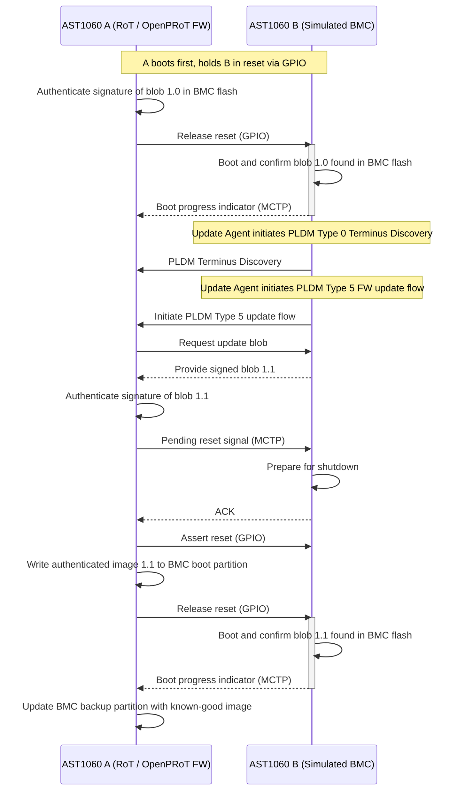
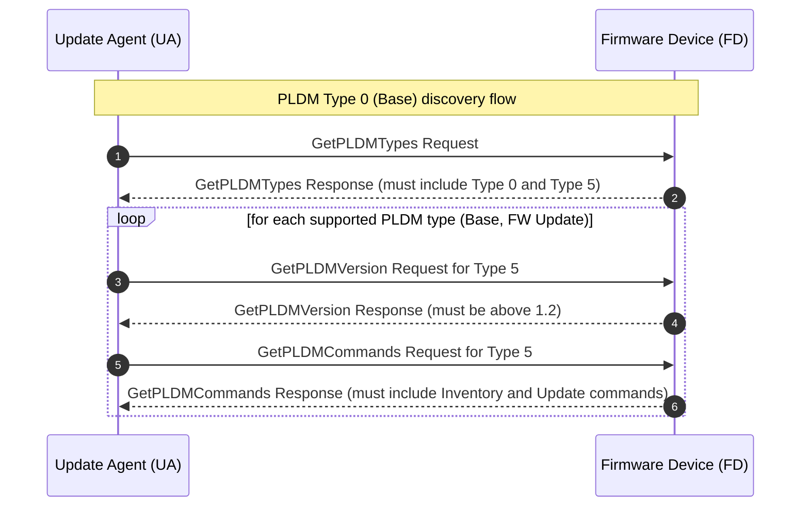
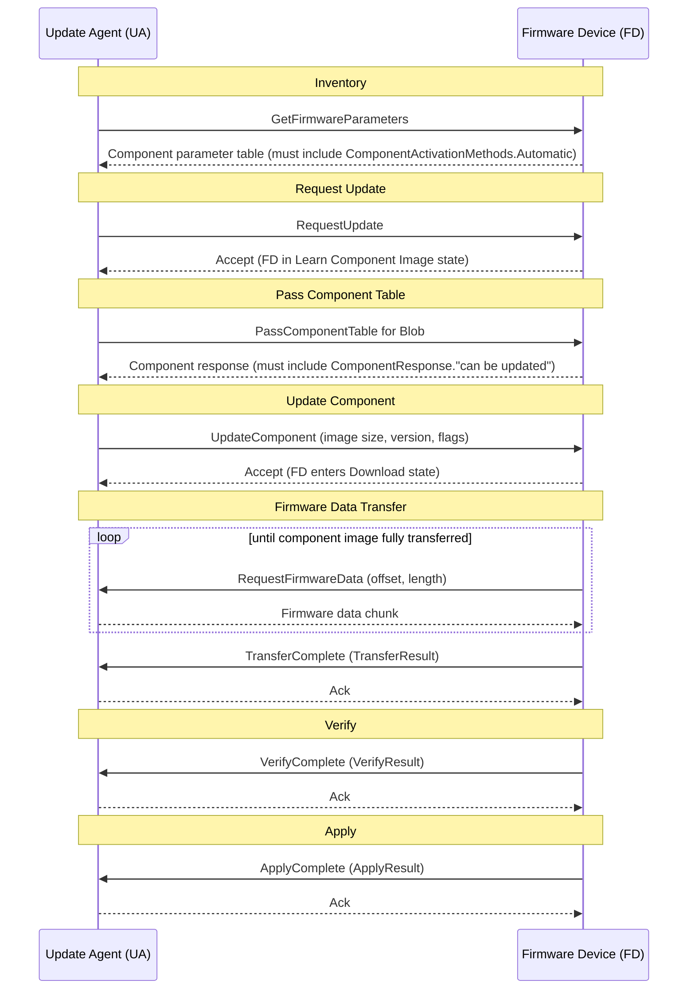

# OCP Demo: BMC Firmware Update Sequence

```mermaid
sequenceDiagram
    participant A as AST1060 A (RoT / OpenPRoT FW)
    participant B as AST1060 B (Simulated BMC)

    Note over A,B: A boots first, holds B in reset via GPIO
    A->>A: Authenticate signature of blob 1.0 in BMC flash

    A->>B: Release reset (GPIO)
    activate B
    B->>B: Boot and confirm blob 1.0 found in BMC flash
    B-->>A: Boot progress indicator (MCTP)
    deactivate B

    Note over B: Update Agent initiates PLDM Type 0 Terminus Discovery
    B->>A: PLDM Terminus Discovery 

    Note over B: Update Agent initiates PLDM Type 5 FW update flow
    B->>A: Initiate PLDM Type 5 update flow
    A->>B: Request update blob
    B-->>A: Provide signed blob 1.1
    A->>A: Authenticate signature of blob 1.1

    A->>B: Pending reset signal (MCTP)
    B->>B: Prepare for shutdown
    B-->>A: ACK

    A->>B: Assert reset (GPIO)
    A->>A: Write authenticated image 1.1 to BMC boot partition

    A->>B: Release reset (GPIO)
    activate B
    B->>B: Boot and confirm blob 1.1 found in BMC flash
    B-->>A: Boot progress indicator (MCTP)
    deactivate B

    A->>A: Update BMC backup partition with known-good image
```
# Type 0 Terminus Discovery

```mermaid
sequenceDiagram
    autonumber
    participant UA as Update Agent (UA)
    participant FD as Firmware Device (FD)

    Note over UA,FD: PLDM Type 0 (Base) discovery flow

    UA->>FD: GetPLDMTypes Request
    FD-->>UA: GetPLDMTypes Response (must include Type 0 and Type 5)

    loop for each supported PLDM type (Base, FW Update)
        UA->>FD: GetPLDMVersion Request for Type 5
        FD-->>UA: GetPLDMVersion Response (must be above 1.2)

        UA->>FD: GetPLDMCommands Request for Type 5 
        FD-->>UA: GetPLDMCommands Response (must include Inventory and Update commands)
    end
```
# PLDM Type 5 Firmware Update (Single Component)

```mermaid
sequenceDiagram
    participant UA as Update Agent (UA)
    participant FD as Firmware Device (FD)

    Note over UA,FD: Inventory
    UA->>FD: GetFirmwareParameters
    FD-->>UA: Component parameter table (must include ComponentActivationMethods.Automatic)

    Note over UA,FD: Request Update
    UA->>FD: RequestUpdate
    FD-->>UA: Accept (FD in Learn Component Image state)

    Note over UA,FD: Pass Component Table
    UA->>FD: PassComponentTable for Blob
    FD-->>UA: Component response (must include ComponentResponse."can be updated")

    Note over UA,FD: Update Component
    UA->>FD: UpdateComponent (image size, version, flags)
    FD-->>UA: Accept (FD enters Download state)

    Note over UA,FD: Firmware Data Transfer
    loop until component image fully transferred
        FD->>UA: RequestFirmwareData (offset, length)
        UA-->>FD: Firmware data chunk
    end

    FD->>UA: TransferComplete (TransferResult)
    UA-->>FD: Ack

    Note over UA,FD: Verify
    FD->>UA: VerifyComplete (VerifyResult)
    UA-->>FD: Ack

    Note over UA,FD: Apply
    FD->>UA: ApplyComplete (ApplyResult)
    UA-->>FD: Ack
```