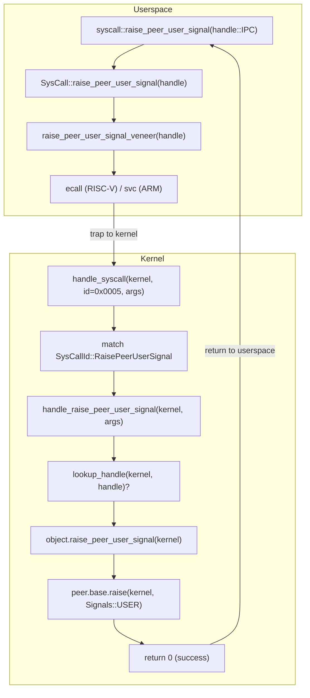

# Implementing `raise_peer_user_signal` Syscall

This document describes the kernel changes required to implement the
`raise_peer_user_signal` syscall, which enables async notifications between
channel peers (similar to Hubris's `sys_post()`).

> **Note:** This is an AI-assisted prototype implementation created to demonstrate
> the feasibility of porting Hubris I2C notification patterns to pw_kernel. The
> implementation serves as a proof-of-concept and reference for understanding the
> syscall architecture, but should undergo thorough review and testing before
> production use. See the [Safety Review](./appendix_sys_post_safety_review.md)
> for critical considerations.

**Status:** ✅ Prototype implemented and validated in QEMU

## Overview

The `raise_peer_user_signal` syscall allows one side of a channel to raise the
`USER` signal on its peer. This enables async notification patterns where a
handler can alert an initiator of events outside the normal request/response
flow (e.g., "slave data ready" in an I2C driver).

**Syscall ID:** `0x0005`

**Signature:**
```rust
fn raise_peer_user_signal(object_handle: u32) -> Result<()>
```

## Files Modified

| File | Purpose |
|------|---------|
| `pw_kernel/syscall/syscall_defs.rs` | Syscall ID and trait definition |
| `pw_kernel/syscall/syscall_user/riscv.rs` | RISC-V userspace veneer |
| `pw_kernel/syscall/syscall_user/arm_cortex_m.rs` | ARM userspace veneer |
| `pw_kernel/kernel/object.rs` | KernelObject trait method + `ObjectBase::raise()` |
| `pw_kernel/kernel/object/channel.rs` | Channel implementation |
| `pw_kernel/kernel/syscall.rs` | Kernel syscall handler |
| `pw_kernel/userspace/syscall.rs` | Safe userspace wrapper |

## Implementation Details

### 1. Syscall Definition (`syscall_defs.rs`)

Add the syscall ID to the `SysCallId` enum:

```rust
#[repr(u16)]
#[non_exhaustive]
pub enum SysCallId {
    ObjectWait = 0x0000,
    ChannelTransact = 0x0001,
    ChannelRead = 0x0002,
    ChannelRespond = 0x0003,
    InterruptAck = 0x0004,
    RaisePeerUserSignal = 0x0005,  // <-- NEW
    // ...
}
```

Add the method to the `SysCallInterface` trait:

```rust
pub trait SysCallInterface {
    // ... existing methods ...

    /// Raise the USER signal on the peer channel object.
    fn raise_peer_user_signal(object_handle: u32) -> Result<()>;
}
```

### 2. RISC-V Syscall Veneer (`riscv.rs`)

Add the assembly veneer that performs the `ecall`:

```rust
syscall_veneer!(RaisePeerUserSignal, raise_peer_user_signal(object_handle: u32));
```

The macro generates the assembly veneer and trait implementation automatically.

### 3. ARM Cortex-M Syscall Veneer (`arm_cortex_m.rs`)

Add the assembly veneer that performs the `svc` instruction:

```rust
syscall_veneer!(RaisePeerUserSignal, 1, raise_peer_user_signal(handle: u32));
```

The second argument (`1`) is the number of arguments passed in registers.
The macro generates the assembly veneer and trait implementation automatically.

### 4. KernelObject Trait (`object.rs`)

Add the method to the `KernelObject` trait with a default implementation
that returns `InvalidArgument` (not `Unimplemented`, since the syscall exists
but the object type doesn't support it):

```rust
pub trait KernelObject<K: Kernel>: Any + Send + Sync {
    // ... existing methods ...

    /// Raise the USER signal on the peer's object.
    ///
    /// For channel objects, this raises USER on the paired peer
    /// (initiator ↔ handler).
    ///
    /// # Errors
    /// - `InvalidArgument` if the object does not support peer signaling
    /// - `FailedPrecondition` if there is no active peer (e.g., no transaction)
    #[allow(unused_variables)]
    fn raise_peer_user_signal(&self, kernel: K) -> Result<()> {
        Err(Error::InvalidArgument)
    }
}
```

### 4a. ObjectBase `raise()` Method (`object.rs`)

Add a new `raise()` method to `ObjectBase` that **ORs** signals instead of
replacing them. This is critical to avoid clobbering existing signals like
`READABLE` or `WRITEABLE`:

```rust
impl<K: Kernel> ObjectBase<K> {
    /// Set signals on this object, replacing the current signal state.
    ///
    /// This replaces all signals. Use `raise()` to OR signals instead.
    pub fn signal(&self, kernel: K, active_signals: Signals) {
        let mut state = self.state.lock(kernel);
        state.active_signals = active_signals;
        // ... wake waiters ...
    }

    /// Raise additional signals on this object (OR with existing signals).
    ///
    /// Unlike `signal()`, this preserves existing signals and adds new ones.
    /// This is the correct method for raising USER or other notification signals
    /// without disturbing READABLE/WRITEABLE state.
    ///
    /// # Memory Ordering
    /// The spinlock provides acquire/release semantics, ensuring:
    /// - All writes before `raise()` are visible to the peer after they
    ///   observe the signal via `object_wait()`
    /// - Cross-core visibility is guaranteed on ARM Cortex-M and RISC-V
    pub fn raise(&self, kernel: K, signals_to_raise: Signals) {
        let mut state = self.state.lock(kernel);
        state.active_signals |= signals_to_raise;  // OR, not replace

        let _ = state.waiters.for_each(|waiter| -> Result<()> {
            if waiter.signal_mask.intersects(signals_to_raise) {
                unsafe { waiter.wait_result.set(Ok(state.active_signals)) };
                waiter.signaler.signal();
            }
            Ok(())
        });
    }
}
```

### 5. Channel Implementation (`channel.rs`)

Implement for `ChannelHandlerObject` (raises USER on initiator).
Uses `raise()` to OR the signal without disturbing other signals:

```rust
impl<K: Kernel> KernelObject<K> for ChannelHandlerObject<K> {
    // ... existing implementations ...

    fn raise_peer_user_signal(&self, kernel: K) -> Result<()> {
        // Handler raises USER signal on the initiator.
        // We use raise() to OR the USER signal without disturbing other signals.
        let active_transaction = self.active_transaction.lock();
        let Some(ref transaction) = *active_transaction else {
            // No active transaction means we don't know who the initiator is.
            return Err(Error::FailedPrecondition);
        };
        transaction.initiator.base.raise(kernel, Signals::USER);
        Ok(())
    }
}
```

Implement for `ChannelInitiatorObject` (raises USER on handler):

```rust
impl<K: Kernel> KernelObject<K> for ChannelInitiatorObject<K> {
    // ... existing implementations ...

    fn raise_peer_user_signal(&self, kernel: K) -> Result<()> {
        // Initiator raises USER signal on the handler.
        // We use raise() to OR the USER signal without disturbing other signals
        // (e.g., READABLE from a pending transaction).
        self.handler.base.raise(kernel, Signals::USER);
        Ok(())
    }
}
```

### 6. Kernel Syscall Handler (`syscall.rs`)

Add the handler function:

```rust
fn handle_raise_peer_user_signal<'a, K: Kernel>(
    kernel: K,
    mut args: K::SyscallArgs<'a>,
) -> Result<u64> {
    log_if::debug_if!(SYSCALL_DEBUG, "syscall: handling raise_peer_user_signal");
    let handle = args.next_u32()?;

    let object = lookup_handle(kernel, handle)?;
    let ret = object.raise_peer_user_signal(kernel);
    log_if::debug_if!(SYSCALL_DEBUG, "syscall: raise_peer_user_signal complete");
    ret.map(|_| 0)
}
```

Add the dispatch case in the syscall handler:

```rust
let res = match id {
    // ... existing cases ...
    SysCallId::RaisePeerUserSignal => handle_raise_peer_user_signal(kernel, args),
    // ...
};
```

### 7. Userspace Wrapper (`userspace/syscall.rs`)

Add the safe userspace API:

```rust
/// Raise the USER signal on the peer's channel object.
///
/// For initiators, this signals the handler.
/// For handlers, this signals the initiator (requires active transaction).
#[inline(always)]
pub fn raise_peer_user_signal(object_handle: u32) -> Result<()> {
    SysCall::raise_peer_user_signal(object_handle)
}
```

## Call Flow

The syscall follows a standard path from userspace through the kernel's syscall
dispatcher to the channel object implementation:

1. **Userspace Entry**: The application calls `syscall::raise_peer_user_signal()`
   with the IPC channel handle. This is a thin wrapper that delegates to the
   `SysCall` trait implementation.

2. **Syscall Veneer**: The `SysCall::raise_peer_user_signal()` method invokes the
   architecture-specific veneer generated by the `syscall_veneer!` macro. This
   veneer places the syscall ID (`0x0005`) and handle argument into the
   appropriate registers.

3. **Privilege Transition**: The veneer executes `ecall` (RISC-V) or `svc` (ARM)
   to trap into kernel mode. The CPU saves context and jumps to the kernel's
   exception vector.

4. **Syscall Dispatch**: The kernel's `handle_syscall()` function extracts the
   syscall ID from registers and dispatches to `handle_raise_peer_user_signal()`.

5. **Handle Resolution**: The handler calls `lookup_handle(kernel, handle)` which
   resolves the userspace handle to a kernel object reference. This walks through
   the scheduler to get the current thread, then looks up the object in the
   thread's handle table.

6. **Signal Delivery**: The resolved channel object's `raise_peer_user_signal()`
   method is called. For initiators (clients), this raises `Signals::USER` on the
   handler. For handlers (servers), this raises `Signals::USER` on the initiator
   (requires an active transaction).

7. **Return**: Success returns `0`, errors return the appropriate error code.
   The CPU restores userspace context and returns to the application.



## Usage Example

**Server (Handler) notifying Client (Initiator):**

```rust
// server.rs - Handler side
fn handle_notify_test(response: &mut [u8]) -> Result<usize> {
    // Raise USER signal on the initiator (client) before responding
    syscall::raise_peer_user_signal(handle::IPC)?;
    
    response[0] = 0; // Success
    Ok(1)
}
```

**Client (Initiator) waiting for notification:**

```rust
// client.rs - Initiator side
// Wait for USER signal from server
let signals = syscall::object_wait(
    handle::SERVER,
    Signals::USER | Signals::READABLE,
    Instant::MAX,
)?;

if signals.contains(Signals::USER) {
    // Server sent us a notification!
}
```

## Testing

The implementation is validated by multiple test suites using pw_kernel's
validation infrastructure.

### Validation Infrastructure

pw_kernel provides a three-tier test infrastructure:

1. **Unit Tests** (`pw_kernel/kernel/tests/`) - Kernel-internal tests using
   the `unittest` crate with `#[test]` attribute. Tests run in kernelspace
   with full access to kernel internals.

2. **System Image Tests** (`system_image_test` Bazel rule) - End-to-end tests
   that build a complete system image with kernel + userspace apps, then run
   it under QEMU. Uses semihosting for test output and exit codes.

3. **Cross-Target Validation** - Same tests run on multiple architectures
   (RISC-V, ARM Cortex-M) to verify portable behavior.

Key files:
- `pw_kernel/tooling/system_image.bzl` - `system_image_test` rule definition
- `pw_kernel/kernel/tests/lib.rs` - Unit test module registration
- `pw_kernel/lib/unittest/` - Test framework (`#[test]` macro, assertions)

### Unit Tests

```bash
bazel test //pw_kernel/target/qemu_virt_riscv32/unittest_runner:unittest_runner \
    --config=k_qemu_virt_riscv32
```

Unit tests in `pw_kernel/kernel/tests/object_signals.rs` (11 tests):
1. **signal_sets_exact_signals** - Verify signal() replaces all signals
2. **signal_empty_clears_all** - Verify signal(empty) clears signals
3. **raise_ors_with_existing_signals** - Verify raise() ORs with existing
4. **raise_accumulates_multiple_signals** - Multiple raise() calls accumulate
5. **raise_idempotent_for_existing_signal** - Raising same signal is idempotent
6. **raise_empty_is_noop** - raise(empty) doesn't change state
7. **signal_after_raise_replaces_all** - signal() after raise() replaces
8. **raise_after_signal_adds_signals** - raise() after signal() adds
9. **scenario_channel_notification** - IPC notification scenario
10. **scenario_ipc_flow_user_persists** - USER persists through IPC
11. **scenario_rapid_raise_sequence** - Stress test rapid raises

### System Tests (IPC Notification)

```bash
# RISC-V target
bazel test //pw_kernel/target/qemu_virt_riscv32/ipc_notification/user:ipc_notification_test \
    --config=k_qemu_virt_riscv32

# ARM Cortex-M33 target
bazel test //pw_kernel/target/mps2_an505/ipc_notification/user:ipc_notification_test \
    --config=k_qemu_mps2_an505
```

System tests in `pw_kernel/tests/ipc_notification/user/` (7 tests):
1. **Echo** - Basic IPC request/response
2. **Transform** - Data processing (uppercase conversion)
3. **Batch** - Sequential IPC operations
4. **Timeout** - Deadline handling
5. **NotifyTest** - Handler→initiator notification
6. **BidirectionalNotification** - Initiator→handler notification
7. **InvalidHandleError** - Error path with invalid handle

### Validation Results

| Target | Test Suite | Result |
|--------|-----------|--------|
| qemu_virt_riscv32 | Unit tests (11) | ✅ PASSED |
| qemu_virt_riscv32 | System tests (7) | ✅ PASSED |
| mps2_an505 (ARM Cortex-M33) | System tests (7) | ✅ PASSED |

## Design Notes

### Why Per-Object vs Per-Task?

Unlike Hubris's `sys_post()` which sends notifications to a task-wide bitmask,
pw_kernel's `raise_peer_user_signal()` raises `Signals::USER` on a specific
channel object. This:

- **Simplifies** the kernel (no need for task-level notification masks)
- **Provides finer granularity** (different channels can have different USER states)
- **Matches** pw_kernel's object-centric design

### Bidirectional Support

Both channel endpoints can raise USER on their peer:
- Handler → Initiator: Driver notifies client of async event
- Initiator → Handler: Client signals cancellation or priority change

### No-Copy Design

The signal is raised by directly modifying the peer's signal state in shared
kernel memory. No data is copied; it's just a bitmask OR operation.

### `signal()` vs `raise()` — Critical Distinction

The `ObjectBase` has two methods for modifying signals:

| Method | Behavior | Use Case |
|--------|----------|----------|
| `signal()` | **Replaces** all signals | Setting a complete signal state (e.g., `READABLE \| WRITEABLE`) |
| `raise()` | **ORs** with existing signals | Adding notification signals without disturbing existing state |

**Why this matters:** If we used `signal(USER)` instead of `raise(USER)`, it would
clobber any existing `READABLE` or `WRITEABLE` signals, breaking IPC correctness.

### Memory Ordering Guarantees

The implementation uses `SpinLock` for the signal state, which provides:

- **Acquire semantics** when taking the lock (reads after lock see prior writes)
- **Release semantics** when releasing the lock (writes before unlock visible to others)

This ensures that on multi-core systems (ARM Cortex-M7 with cache, RISC-V SMP),
any data written before `raise_peer_user_signal()` is visible to the peer after
it wakes from `object_wait()`.

### Channel Transaction Fix

The `channel_transact()` implementation was updated to use `raise(READABLE)`
instead of `signal(READABLE)` when notifying the handler. This ensures that
USER signals raised by the initiator before calling `channel_transact()` are
preserved and visible to the handler.

## References

- [Validation Plan](raise_peer_user_signal_validation_plan.md)
- [Safety Review](raise_peer_user_signal_safety_review.md)
- [pw_kernel Definitions](definitions.md)
