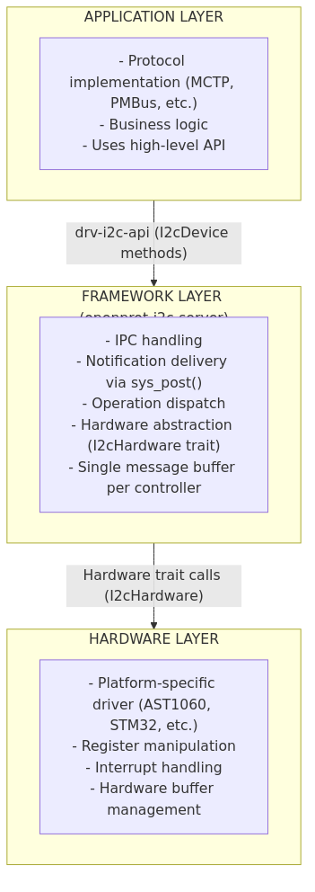
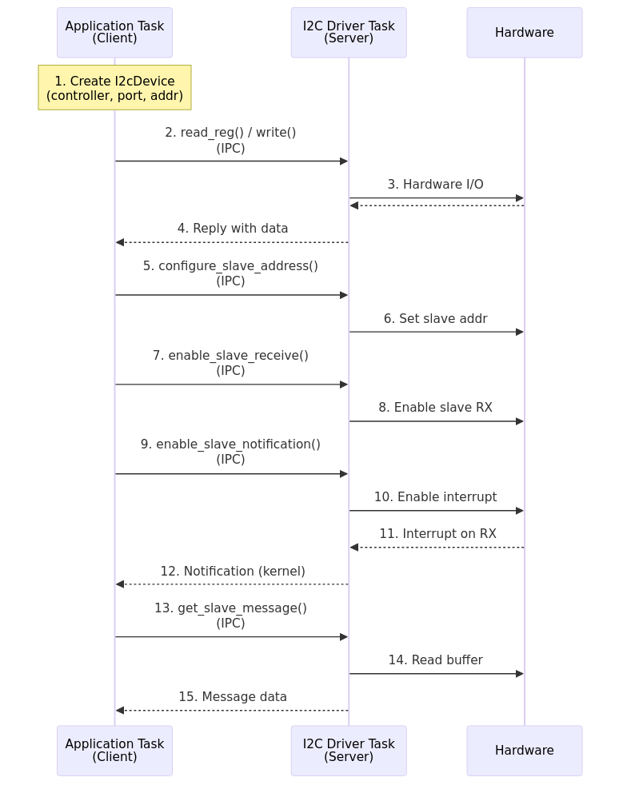

# Architecture

This section explains the internal design of the I2C subsystem.

## Three-Layer Design



The subsystem is structured into three distinct layers to maximize portability and safety:

1. **Client Layer (`drv-i2c-api`)**:
   Linked into application tasks, this library provides the high-level Rust API (`I2cDevice` struct) and manages the translation of high-level method calls into raw IPC messages sent to the kernel. It hides the details of the syscall interface from the developer.

2. **Server Layer (`i2c-server`)**:
   The logic executing within the driver's own task. This layer is completely generic and contains no hardware-specific code. It handles IPC request validation, manages client memory leases, and orchestrates the flow of data between the client and the hardware driver.

3. **Platform Layer (Trait Implementation)**:
   The bottom layer consists of platform-specific drivers (e.g., `drv-ast1060-i2c`) that implement the `I2cHardware` trait. These drivers handle register manipulation, interrupt clearing, and low-level bus protocol details, exposing a uniform interface to the Server Layer.

## Component Communication



## Key Design Principles

| Principle | Description |
|-----------|-------------|
| **Task Separation** | I2C drivers run as separate tasks with memory isolation |
| **Hybrid Communication** | Client operations use synchronous IPC; events use async notifications |
| **Manual IPC** | Handwritten protocol code instead of code-generated bindings for flexibility |
| **Type Safety** | Leverages Rust's type system and zero-copy serialization |
| **Interrupt-Driven** | Target mode uses notifications instead of polling |
| **Device Identification** | 5-tuple uniquely identifies each I2C device |

## I2cHardware Trait

Hardware drivers implement this trait to integrate with the framework:

```rust
pub trait I2cHardware {
    // Controller Mode
    fn write_read(
        &mut self,
        controller: Controller,
        port: PortIndex,
        addr: u8,
        wlen: usize,
        wbuf: impl Fn(usize) -> Option<u8>,
        rlen: usize,
        rbuf: impl FnMut(usize, u8) -> Option<()>,
    ) -> Result<usize, ResponseCode>;

    fn write_read_block(...) -> Result<usize, ResponseCode>;

    // Target Mode
    fn configure_slave_mode(&mut self, controller: Controller, config: &SlaveConfig) -> Result<(), ResponseCode>;
    fn enable_slave_receive(&mut self, controller: Controller) -> Result<(), ResponseCode>;
    fn disable_slave_receive(&mut self, controller: Controller) -> Result<(), ResponseCode>;
    fn check_slave_data(&self, controller: Controller) -> bool;
    fn read_slave_data(&mut self, controller: Controller) -> Result<SlaveMessage, ResponseCode>;
    fn clear_slave_interrupts(&mut self, controller: Controller);

    // Controller Management
    fn enable_controller(&mut self, controller: Controller) -> Result<(), ResponseCode>;
    fn disable_controller(&mut self, controller: Controller) -> Result<(), ResponseCode>;
    fn reset_bus(&mut self, controller: Controller) -> Result<(), ResponseCode>;
}
```
