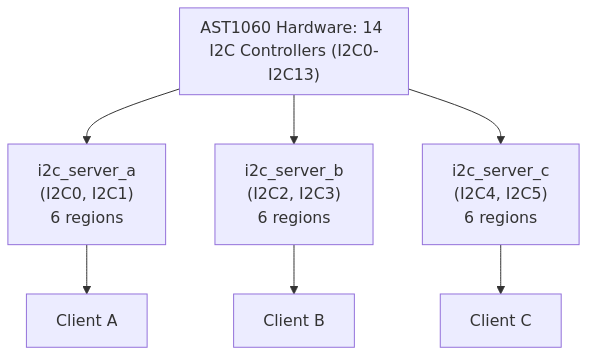

# AST1060 Integration

This section covers AST1060-specific integration details and constraints.

## MPU Region Budget

The AST1060 has 14 I2C controllers (I2C0-I2C13), but a single Hubris task **cannot** manage all of them due to ARMv7-M MPU constraints.

### The Constraint

ARMv7-M processors provide only **8 MPU regions** total:
- 1 region is reserved for the kernel
- **7 regions remain usable per task**

Each I2C controller requires **2 MPU regions**:

| Resource | Size | Purpose |
|----------|------|---------|
| i2cN registers | 0x80 bytes | Controller configuration, status, control |
| i2c_bufferN | 0x20 bytes | Hardware data buffer for transfers |

Additionally, shared resources require **2 more regions**:

| Resource | Regions | Purpose |
|----------|---------|---------|
| scu | 1 | Clock gating, reset control, pinmux |
| i2c_global | 1 | Global timing configuration |

### Region Calculation

```
Available regions:     7 (8 total - 1 kernel)
Shared resources:     -2 (scu + i2c_global)
Per-controller need:   2 (registers + buffer)
─────────────────────────────────────────────
Remaining for I2C:     5 regions
Max controllers:       5 ÷ 2 = 2 controllers per task
```

| Configuration | Regions Used | Status |
|---------------|--------------|--------|
| 1 controller | 2 + 2 = 4 | Works (3 spare) |
| 2 controllers | 2 + 4 = 6 | Works (1 spare) |
| 3 controllers | 2 + 6 = 8 | **Exceeds limit by 1** |
| 14 controllers | 2 + 28 = 30 | **Exceeds limit by 23** |

## Multi-Task Architecture for Many Controllers

To use more than 2 I2C controllers, deploy multiple `openprot-i2c-server` task instances:



**app.toml example for multiple I2C server instances:**

```toml
[tasks.i2c_server_a]
name = "drv-openprot-i2c-server"
priority = 2
features = ["ast1060"]
uses = ["i2c0", "i2c1", "scu", "i2c_global"]

[tasks.i2c_server_b]
name = "drv-openprot-i2c-server"
priority = 2
features = ["ast1060"]
uses = ["i2c2", "i2c3", "scu", "i2c_global"]
```

## Deployment Guidance

| Use Case | Controllers Needed | Task Instances Required |
|----------|-------------------|------------------------|
| Single MCTP endpoint | 1 | 1 |
| MCTP + PMBus monitoring | 2 | 1 |
| Multiple independent buses | 3-4 | 2 |
| Full I2C utilization (14) | 14 | 7 |

**Note:** Most RoT deployments use 1-2 I2C controllers for management communication, staying within the single-task limit.

## Driver Implementation

### Adapter Pattern

The low-level I2C driver for AST1060 (`Ast1060I2c`) manages **one controller** per instance:

```rust
pub struct Ast1060I2c<'a> {
    controller: &'a I2cController<'a>,  // Bound to ONE controller
    xfer_mode: I2cXferMode,
    multi_master: bool,
}
```

The `I2cHardware` trait expects **one object** to manage **all controllers**, so we use an adapter:

```rust
pub struct Ast1060I2cAdapter<'a> {
    controllers: [Option<Ast1060I2c<'a>>; 14],
    slave_states: [SlaveState; 14],
}
```

The adapter provides:
1. **Controller Routing**: Selects the right instance based on `Controller` enum
2. **Software Buffering**: Adds target message buffer
3. **State Management**: Tracks per-controller target configuration
4. **Unified Interface**: Matches the trait contract

### Transfer Modes

The AST1060 supports two transfer modes:

| Mode | Description | Use Case |
|------|-------------|----------|
| Byte Mode | Transfer one byte at a time | Small transfers |
| Buffer Mode | Use hardware 32-byte buffer | Larger payloads (default) |

### Implementation Files

| File | Purpose |
|------|---------|
| `drv/ast1060-i2c/src/server_driver.rs` | I2cHardware trait implementation |
| `drv/ast1060-i2c/src/slave.rs` | Target mode hardware operations |
| `drv/ast1060-i2c/src/master.rs` | Controller mode hardware operations |
| `drv/ast1060-i2c/src/transfer.rs` | Low-level transfer modes |

### Adapter Pattern

The low-level AST1060 driver (`Ast1060I2c`) manages **one controller** per instance:

```rust
pub struct Ast1060I2c<'a> {
    controller: &'a I2cController<'a>,  // Bound to ONE controller
    xfer_mode: I2cXferMode,
    multi_master: bool,
}
```

The `I2cHardware` trait expects **one object** to manage **all controllers**, so we use an adapter:

```rust
pub struct Ast1060I2cAdapter<'a> {
    controllers: [Option<Ast1060I2c<'a>>; 14],
    target_states: [TargetState; 14],
}
```

The adapter provides:
1. **Controller Routing**: Selects the right instance based on `Controller` enum
2. **Software Buffering**: Adds target message buffer
3. **State Management**: Tracks per-controller target configuration
4. **Unified Interface**: Matches the trait contract

### Transfer Modes

The AST1060 supports two transfer modes:

| Mode | Description | Use Case |
|------|-------------|----------|
| Byte Mode | Transfer one byte at a time | Small transfers |
| Buffer Mode | Use hardware 32-byte buffer | Larger payloads (default) |

### Implementation Files

| File | Purpose |
|------|---------|-----|
| `drv/ast1060-i2c/src/server_driver.rs` | I2cHardware trait implementation |
| `drv/ast1060-i2c/src/slave.rs` | Target mode hardware operations |
| `drv/ast1060-i2c/src/master.rs` | Controller mode hardware operations |
| `drv/ast1060-i2c/src/transfer.rs` | Low-level transfer modes |
