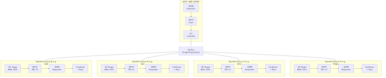
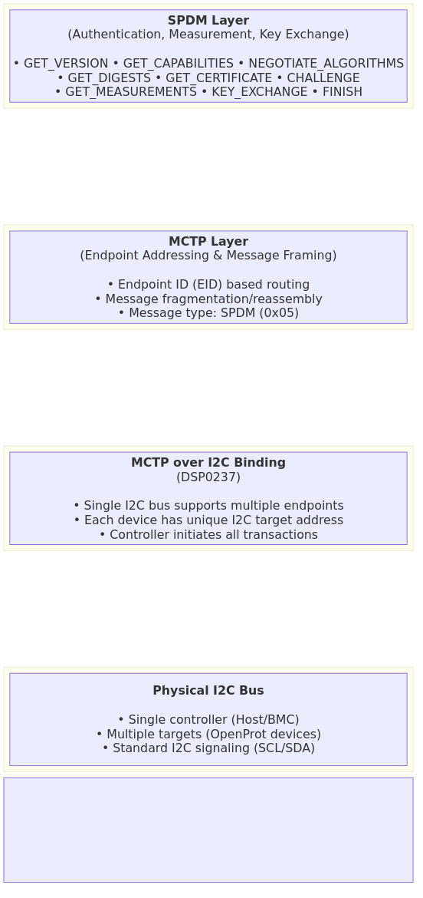
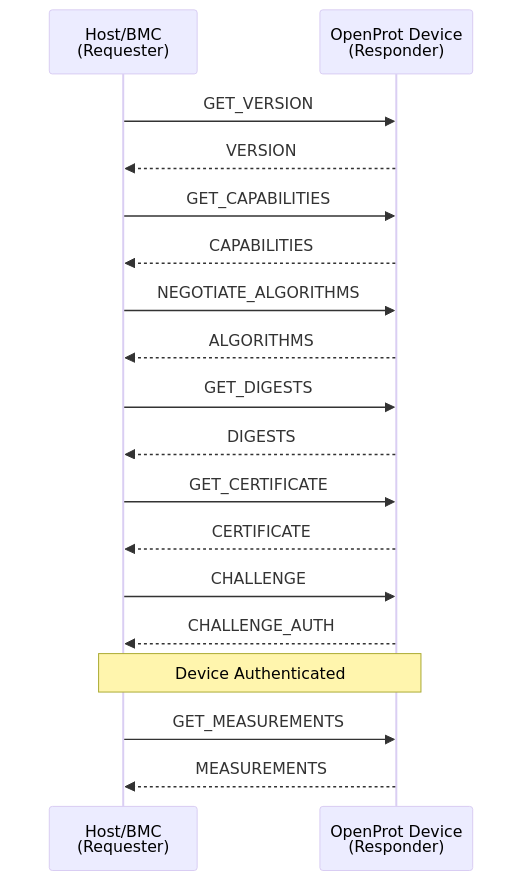
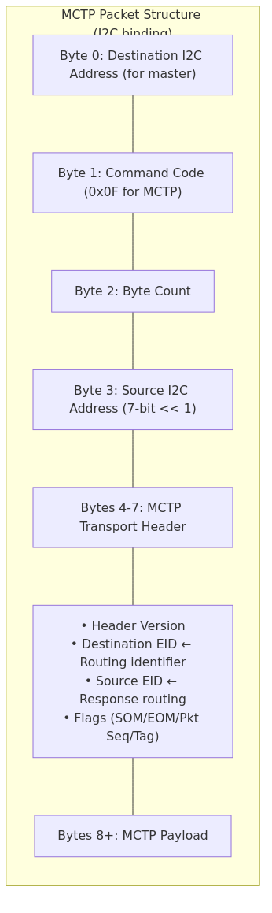

# MCTP Integration

This section provides comprehensive coverage of MCTP-over-I2C, including deployment topology, protocol stack, and implementation details.

## System Topology

A typical deployment uses SPDM authentication over MCTP-over-I2C:



## Protocol Stack



## SPDM Authentication Flow



## Key Deployment Points

| Aspect | Description |
|--------|-------------|
| **Single I2C Controller** | The Host/BMC uses ONE I2C controller to authenticate ALL OpenProt devices on the bus |
| **Multiple Endpoints** | Each device has a unique I2C address AND a unique MCTP Endpoint ID (EID) |
| **SPDM over MCTP** | SPDM messages are encapsulated in MCTP packets, which are transported over I2C |
| **No Multiple Controllers Needed** | MCTP's EID-based addressing allows a single physical bus to serve multiple logical endpoints |

## Addressing Scheme

Each device on the bus requires two identifiers:

| Identifier | Layer | Purpose | Example |
|------------|-------|---------|---------|
| I2C Address | Physical | Hardware addressing for bus transactions | 0x50, 0x51, 0x52 |
| MCTP EID | Transport | Logical endpoint for message routing | 10, 11, 12 |

## MCTP Message Types

| Message Type | Protocol | Description |
|--------------|----------|-------------|
| 0x00 | MCTP Control | Endpoint discovery, EID assignment |
| 0x01 | PLDM | Platform Level Data Model |
| 0x05 | SPDM | Security Protocol and Data Model |
| 0x7E-0x7F | Vendor-Defined | Custom protocols |

## MCTP Packet Structure



## Device Handle Setup

```rust
use drv_i2c_api::*;
use userlib::*;

const I2C_OWN_ADDR: u8 = 0x12; // Our I2C slave address

let i2c_recv = I2cDevice::new(
    I2C.get_task_id(),
    Controller::I2C1,
    PortIndex(0),
    None,
    0x00, // Address unused for slave mode
);

i2c_recv.configure_slave_address(I2C_OWN_ADDR).unwrap_lite();
i2c_recv.enable_slave_receive().unwrap_lite();
i2c_recv.enable_slave_notification(notifications::I2C_RX_BIT).unwrap_lite();
```

## Event Loop Integration

```rust
let mut msg_buf = [0u8; 256];
let notification_mask = notifications::I2C_RX_MASK | notifications::TIMER_MASK;

loop {
    let msg = sys_recv_open(&mut msg_buf, notification_mask);

    if msg.sender == TaskId::KERNEL {
        if (msg.operation & notifications::I2C_RX_MASK) != 0 {
            match i2c_recv.get_slave_message() {
                Ok(slave_msg) => {
                    let data = slave_msg.data();
                    match i2c_reader.recv(data) {
                        Ok(pkt) => {
                            server.stack.inbound(pkt)?;
                        }
                        Err(e) => {
                            log::warn!("I2C MCTP decode error: {:?}", e);
                        }
                    }
                }
                Err(ResponseCode::NoSlaveMessage) => {}
                Err(e) => {
                    log::warn!("I2C slave message error: {:?}", e);
                }
            }
        }

        if (msg.operation & notifications::TIMER_MASK) != 0 {
            server.update(sys_get_timer().now);
        }
    } else {
        handle_mctp_msg(&msg_buf, msg, &mut server);
    }
}
```

## Why Single Subscriber Works for MCTP

The I2C slave driver's "single subscriber" limitation does not affect MCTP deployments:

1. **Multiplexing happens at MCTP layer** - One MCTP server receives all I2C packets
2. **EID-based routing** - Responses routed via EID, not I2C controller
3. **Message type dispatch** - MCTP server routes to SPDM/PLDM/VDM tasks internally
