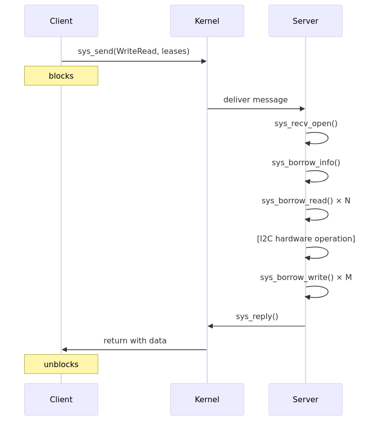
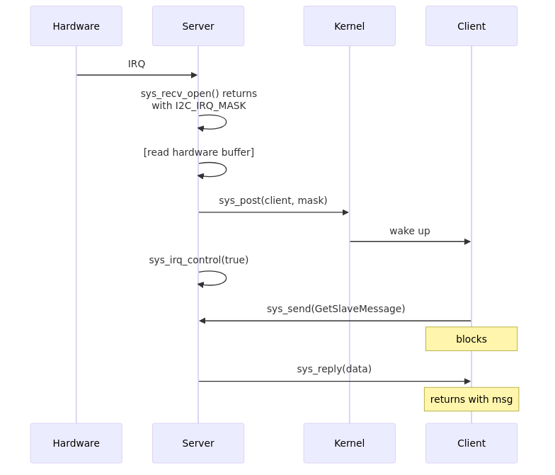

# OS Dependencies and Abstractions

This section documents all OS-level services required by the I2C subsystem. It serves as a guide for understanding the Hubris kernel abstractions and for porting to other platforms.

## Kernel Syscalls

The I2C subsystem uses 9 kernel syscalls:

| Syscall | Purpose | Used By |
|---------|---------|---------|
| `sys_send` | Send IPC request to another task | Client API |
| `sys_recv_open` | Receive IPC messages and notifications | Server |
| `sys_reply` | Reply to IPC request | Server |
| `sys_post` | Send asynchronous notification to task | Server (interrupt delivery) |
| `sys_irq_control` | Enable/disable hardware interrupts | Server |
| `sys_borrow_info` | Get lease metadata (size, permissions) | Server |
| `sys_borrow_read` | Read from client's leased memory | Server |
| `sys_borrow_write` | Write to client's leased memory | Server |
| `sys_get_timer` | Get monotonic system time | Client (timeouts) |

## IPC (Inter-Process Communication)

### Client Side: sys_send

The client uses `sys_send` to invoke operations on the I2C server:

```rust
// From drv/i2c-api/src/lib.rs
let (code, _) = sys_send(
    self.task,           // Target task ID
    Op::WriteRead as u16, // Operation code
    &request_bytes,      // Request payload (marshaled device info)
    &mut response,       // Response buffer
    &[                   // Leases (memory capabilities)
        Lease::from(wbuf),      // Write buffer (read-only to server)
        Lease::from(rbuf),      // Read buffer (writable by server)
    ],
);
```

**Key Parameters:**
- `task`: TaskId of the I2C server
- `operation`: 16-bit operation code (see Op enum)
- `request`: Serialized request data
- `response`: Buffer for response data
- `leases`: Array of memory capabilities shared with server

### Server Side: sys_recv_open

The server receives both IPC messages and kernel notifications in a single call:

```rust
// From drv/openprot-i2c-server/src/main.rs
let mut buffer = [0u8; 16];
loop {
    let msg = sys_recv_open(&mut buffer, I2C_IRQ_MASK);

    if msg.sender == TaskId::KERNEL {
        // Kernel notification (interrupt)
        if (msg.operation & I2C_IRQ_MASK) != 0 {
            handle_interrupt();
        }
    } else {
        // IPC from client task
        let op = Op::from_u16(msg.operation);
        match op {
            Some(Op::WriteRead) => handle_write_read(&msg),
            Some(Op::GetSlaveMessage) => handle_get_slave_message(&msg),
            // ...
        }
    }
}
```

**RecvMessage Fields:**
- `sender`: TaskId of sender (TaskId::KERNEL for notifications)
- `operation`: Operation code or notification mask
- `message_len`: Bytes copied to buffer
- `lease_count`: Number of leases provided

### Server Reply: sys_reply

```rust
// Success with data
sys_reply(msg.sender, ResponseCode::Success as u32, &response_data);

// Error
sys_reply(msg.sender, ResponseCode::NoDevice as u32, &[]);
```

## Notification System

### Asynchronous Task Wakeup: sys_post

Used to notify client tasks when interrupt-driven events occur:

```rust
// Server notifies client of slave message arrival
if let Some((client_task, mask)) = notification_client {
    sys_post(client_task, mask);
}
```

**Pattern:**
1. Client registers for notifications via `enable_slave_notification(mask)`
2. Server stores `(TaskId, mask)` tuple
3. On interrupt, server calls `sys_post(task, mask)`
4. Client's `sys_recv_open` returns with notification

### Interrupt Control: sys_irq_control

```rust
// Enable interrupt delivery
sys_irq_control(I2C_IRQ_MASK, true);

// Disable during processing (re-enable after handling)
sys_irq_control(I2C_IRQ_MASK, false);
// ... handle interrupt ...
sys_irq_control(I2C_IRQ_MASK, true);
```

### Notification Constants (Build-Time Generated)

Notifications are defined in `app.toml` and auto-generated at build time:

```toml
# app.toml
[tasks.i2c_driver]
notifications = ["i2c-irq"]

[tasks.mctp_server]
notifications = ["i2c-rx", "timer"]
```

```rust
// Generated in build.rs
include!(concat!(env!("OUT_DIR"), "/notifications.rs"));
// Provides: I2C_IRQ_MASK, I2C_RX_MASK, TIMER_MASK, etc.
```

## Memory Sharing (Leases)

Leases provide capability-based secure memory sharing between tasks.

### Client: Creating Leases

```rust
// Read-only lease (server can read, not write)
let write_lease = Lease::from(&write_buffer);

// Writable lease (server can read and write)
let read_lease = Lease::from(&mut read_buffer);

// Empty lease placeholder
let empty = Lease::read_only(&[]);
```

### Server: Accessing Leased Memory

```rust
// Get lease metadata
let info = sys_borrow_info(msg.sender, lease_index);
let buffer_len = info.len;
let can_write = info.attributes.contains(LeaseAttributes::WRITE);

// Read from client buffer (byte-by-byte)
for i in 0..len {
    let byte = sys_borrow_read(msg.sender, lease_index, i);
    process_byte(byte);
}

// Write to client buffer (byte-by-byte)
for (i, byte) in response.iter().enumerate() {
    sys_borrow_write(msg.sender, lease_index, i, *byte);
}
```

**LeaseAttributes:**
- `READ`: Server can read from lease
- `WRITE`: Server can write to lease

## Task Management

### Task Slot Macro

Compile-time task reference declaration:

```rust
// Declares a reference to the I2C driver task
task_slot!(I2C, i2c_driver);

// Usage
let task_id = I2C.get_task_id();
```

This maps to the task name in `app.toml`:
```toml
[tasks.mctp_server]
task-slots = ["i2c_driver"]  # Must match task_slot! name
```

### Task Generation Numbers

Hubris tracks task restarts via generation numbers. When a server task restarts, clients detect this through special error codes:

```rust
// Check for server restart
fn extract_new_generation(code: u32) -> Option<Generation> {
    if (code & 0xFFFF_FF00) == 0xFFFF_FF00 {
        Some(Generation::from((code & 0xFF) as u8))
    } else {
        None
    }
}

// In client code
let (code, _) = sys_send(task, op, &req, &mut resp, &leases);
if let Some(gen) = extract_new_generation(code) {
    // Server restarted - update our TaskId and retry
    self.task = self.task.with_generation(gen);
}
```

## Timer Services

```rust
// Get current monotonic time
let now = sys_get_timer().now;

// Set timeout (in MCTP server)
sys_set_timer(Some(deadline), TIMER_MASK);

// Check for timeout in event loop
if (msg.operation & TIMER_MASK) != 0 {
    handle_timeout(sys_get_timer().now);
}
```

## Diagnostic Tracing (Ringbuf)

Low-overhead circular event buffer for debugging:

```rust
// Declaration (typically 64 entries)
counted_ringbuf!(Trace, 64, Trace::None);

// Event types
#[derive(Copy, Clone, PartialEq)]
enum Trace {
    None,
    Transaction { addr: u8, write_len: usize, read_len: usize },
    SlaveMessage { source: u8, len: usize },
    Error(ResponseCode),
}

// Recording events
ringbuf_entry!(Trace::Transaction { addr, write_len, read_len });
```

## Data Marshaling

The I2C device is marshaled into a 4-byte encoding for IPC:

```rust
// Marshal format: [address, controller, port, mux_segment]
impl Marshal for I2cDevice {
    fn marshal(&self) -> [u8; 4] {
        [
            self.address,
            self.controller as u8,
            self.port.0,
            match self.segment {
                None => 0,
                Some((mux, seg)) => 0x80 | (mux.0 << 4) | seg.0,
            },
        ]
    }
}
```

## OS Abstraction Summary

For porting the I2C subsystem to another OS, these abstractions must be provided:

| Abstraction | Hubris Implementation | Required Semantics |
|-------------|----------------------|-------------------|
| **IPC Request** | `sys_send` | Synchronous call to another task with request/response |
| **IPC Receive** | `sys_recv_open` | Block waiting for IPC or notification |
| **IPC Reply** | `sys_reply` | Send response to waiting caller |
| **Async Notify** | `sys_post` | Wake task without blocking sender |
| **Interrupt Control** | `sys_irq_control` | Enable/disable hardware interrupt delivery |
| **Memory Sharing** | Leases + `sys_borrow_*` | Capability-based cross-task memory access |
| **Task Identity** | `TaskId` | Unique identifier for each task |
| **Task Restart Detection** | Generation numbers | Detect when server task has restarted |
| **Monotonic Time** | `sys_get_timer` | Non-decreasing time source |
| **Build-Time Config** | `task_slot!`, `notifications` | Static task references and notification masks |

## Syscall Flow Examples

### Master Write-Read Operation



### Slave Notification Flow


