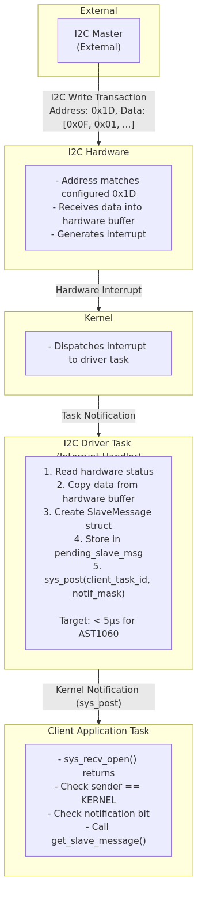
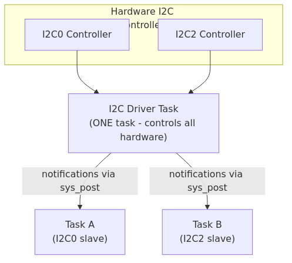
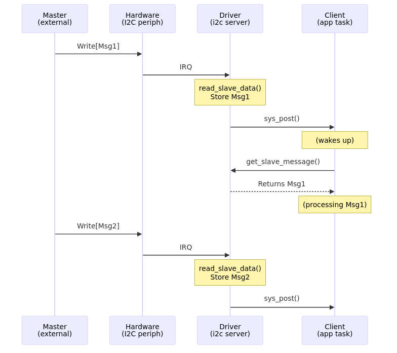

# Hubris I2C Subsystem Design

This document is the complete reference for the Hubris I2C subsystem—a vendor-agnostic driver framework supporting both master and slave modes, designed for Hubris's task-based architecture.

## Table of Contents

1. [Overview](#overview)
2. [I2C API](#i2c-api)
3. [Architecture](#architecture)
4. [OS Dependencies and Abstractions](#os-dependencies-and-abstractions)
5. [Error Handling](#error-handling)
6. [Slave Mode Deep Dive](#slave-mode-deep-dive)
7. [Hardware Implementations](#hardware-implementations)
8. [System Integration](#system-integration)
9. [MCTP Integration](#mctp-integration)
10. [Troubleshooting](#troubleshooting)
11. [Testing](#testing)
12. [Reference](#reference)

---

## Overview

The Hubris I2C subsystem provides a vendor-agnostic I2C driver framework supporting both master and slave modes. It is designed around Hubris's task-based architecture, using IPC to communicate with separate I2C driver tasks that control the actual hardware.

### Audience

This guide serves three primary audiences:

| Audience | Goal | Start Here |
|----------|------|------------|
| **Application Developer** | Use I2C to communicate with devices | [Quick Start](#quick-start), then [I2C API](#i2c-api) |
| **Driver Implementer** | Add support for new I2C hardware | [Architecture](#architecture), then [Hardware Implementations](#hardware-implementations) |
| **System Integrator** | Configure I2C in a Hubris deployment | [System Integration](#system-integration), then [MCTP Integration](#mctp-integration) |

### Quick Start

**Reading from an I2C device (master mode):**

```rust
use drv_i2c_api::*;

// Connect to driver task, controller 1, port 0, device at address 0x50
let device = I2cDevice::new(
    I2C.get_task_id(),
    Controller::I2C1,
    PortIndex(0),
    None,
    0x50,
);

// Read 2 bytes from register 0x00
let value: u16 = device.read_reg(0x00)?;

// Write-then-read: send [0x10], read 8 bytes back
let mut buffer = [0u8; 8];
device.write_read(&[0x10], &mut buffer)?;
```

**Receiving messages as an I2C slave:**

```rust
use drv_i2c_api::*;

const NOTIF_MASK: u32 = 0x0001;

let device = I2cDevice::new(I2C.get_task_id(), Controller::I2C1, PortIndex(0), None, 0x1D);

// Configure as slave at address 0x1D
device.configure_slave_address(0x1D)?;
device.enable_slave_receive()?;
device.enable_slave_notification(NOTIF_MASK)?;

// Wait for incoming message
loop {
    let msg = sys_recv_open(&mut buf, NOTIF_MASK);
    if msg.sender == TaskId::KERNEL {
        let slave_msg = device.get_slave_message()?;
        // Process slave_msg.data()
    }
}
```

### Key Features

| Feature | Description |
|---------|-------------|
| **Hardware Abstraction** | Single API works across AST1060, STM32, LPC55, and other I2C controllers |
| **Master + Slave Modes** | Initiate transactions or respond to external masters |
| **Interrupt-Driven** | Slave mode uses async notifications—no polling required |
| **Memory Efficient** | ~270 bytes driver state; zero-copy where possible |
| **Type Safe** | Rust's type system prevents common I2C programming errors |
| **Task Isolation** | MPU-enforced separation between driver and application tasks |

### Use Cases

| Use Case | Mode | Typical Protocol |
|----------|------|------------------|
| BMC/host management communication | Slave | MCTP-over-I2C |
| Sensor reading | Master | Raw I2C / SMBus |
| EEPROM access | Master | Raw I2C |
| Power management | Master | PMBus |
| Device authentication | Slave | SPDM over MCTP |
| Multi-board communication | Both | Custom / MCTP |

---

## I2C API

This section documents the complete client API for interacting with I2C devices.

### Device Identification

Each I2C device is identified by a 5-tuple:

```rust
pub struct I2cDevice {
    pub task: TaskId,              // I2C driver task
    pub controller: Controller,     // I2C peripheral (I2C0-I2C7)
    pub port: PortIndex,           // Pin configuration
    pub segment: Option<(Mux, Segment)>, // Optional multiplexer
    pub address: u8,               // 7-bit device address
}
```

### Data Types

#### Controller

```rust
pub enum Controller {
    I2C0 = 0,
    I2C1 = 1,
    I2C2 = 2,
    I2C3 = 3,
    I2C4 = 4,
    I2C5 = 5,
    I2C6 = 6,
    I2C7 = 7,
}
// Note: AST1060 supports I2C0-I2C13
```

#### SlaveMessage

```rust
pub struct SlaveMessage {
    /// The 7-bit I2C address of the master that sent this message
    pub source_address: u8,
    /// Length of the message data in bytes (0-255)
    pub data_length: u8,
    /// The message data (only first data_length bytes are valid)
    pub data: [u8; 255],
}

impl SlaveMessage {
    pub fn data(&self) -> &[u8] {
        &self.data[..self.data_length as usize]
    }
}
```

#### SlaveConfig

```rust
pub struct SlaveConfig {
    pub controller: Controller,  // Which I2C controller
    pub port: PortIndex,         // Port/pin configuration
    pub address: u8,             // 7-bit slave address (0x08-0x77)
}
```

### Master Mode Methods

```rust
impl I2cDevice {
    /// Write data then read response
    pub fn write_read(&self, wbuf: &[u8], rbuf: &mut [u8]) -> Result<usize, ResponseCode>;

    /// Write register address, read value
    pub fn read_reg<T: AsBytes + FromBytes>(&self, reg: u8) -> Result<T, ResponseCode>;

    /// Write data only
    pub fn write(&self, buf: &[u8]) -> Result<(), ResponseCode>;

    /// Read data only
    pub fn read_into(&self, buf: &mut [u8]) -> Result<(), ResponseCode>;

    /// SMBus block read (length byte first)
    pub fn read_block(&self, reg: u8, buf: &mut [u8]) -> Result<usize, ResponseCode>;
}
```

### Slave Mode Methods

```rust
impl I2cDevice {
    /// Configure this controller as a slave with the given address
    pub fn configure_slave_address(&self, addr: u8) -> Result<(), ResponseCode>;

    /// Start listening for incoming messages
    pub fn enable_slave_receive(&self) -> Result<(), ResponseCode>;

    /// Stop listening
    pub fn disable_slave_receive(&self) -> Result<(), ResponseCode>;

    /// Register for async notifications when messages arrive
    pub fn enable_slave_notification(&self, mask: u32) -> Result<(), ResponseCode>;

    /// Unregister from notifications
    pub fn disable_slave_notification(&self) -> Result<(), ResponseCode>;

    /// Retrieve a received message (call after notification)
    pub fn get_slave_message(&self) -> Result<SlaveMessage, ResponseCode>;
}
```

### Operation Types

#### Master Mode Operations

| Operation | Op Code | Description |
|-----------|---------|-------------|
| WriteRead | 1 | Standard I2C write-then-read operation |
| WriteReadBlock | 2 | SMBus block read with length byte |

#### Slave Mode Operations

| Operation | Op Code | Description |
|-----------|---------|-------------|
| ConfigureSlaveAddress | 3 | Set slave address |
| EnableSlaveReceive | 4 | Start listening for messages |
| DisableSlaveReceive | 5 | Stop listening |
| EnableSlaveNotification | 6 | Register for notifications |
| DisableSlaveNotification | 7 | Unregister notifications |
| GetSlaveMessage | 8 | Retrieve received message |

### Reserved I2C Addresses

Per I2C specification, certain addresses are reserved:

| Address (7-bit) | Binary | Purpose |
|-----------------|--------|---------|
| 0x00 | 0000000 | General Call |
| 0x01 | 0000001 | CBUS Address |
| 0x02 | 0000010 | Future Bus Reserved |
| 0x03 | 0000011 | Future Purposes |
| 0x04-0x07 | 000010x | High Speed Reserved |
| 0x78-0x7B | 111110x | 10-bit Addressing |
| 0x7C-0x7F | 111111x | Reserved |

---

## Architecture

This section explains the internal design of the I2C subsystem.

### Three-Layer Design


### Component Communication


### Key Design Principles

| Principle | Description |
|-----------|-------------|
| **Task Separation** | I2C drivers run as separate tasks with memory isolation |
| **Hybrid Communication** | Client operations use synchronous IPC; events use async `sys_post()` notifications |
| **No IDL** | Uses raw `sys_send` instead of Idol-generated code for flexibility |
| **Type Safety** | Leverages Rust's type system and zero-copy serialization |
| **Interrupt-Driven** | Slave mode uses notifications instead of polling |
| **Device Identification** | 5-tuple uniquely identifies each I2C device |

### I2cHardware Trait

Hardware drivers implement this trait to integrate with the framework:

```rust
pub trait I2cHardware {
    // Master Mode
    fn write_read(
        &mut self,
        controller: Controller,
        port: PortIndex,
        addr: u8,
        wlen: usize,
        wbuf: impl Fn(usize) -> Option<u8>,
        rlen: usize,
        rbuf: impl FnMut(usize, u8) -> Option<()>,
    ) -> Result<usize, ResponseCode>;

    fn write_read_block(...) -> Result<usize, ResponseCode>;

    // Slave Mode
    fn configure_slave_mode(&mut self, controller: Controller, config: &SlaveConfig) -> Result<(), ResponseCode>;
    fn enable_slave_receive(&mut self, controller: Controller) -> Result<(), ResponseCode>;
    fn disable_slave_receive(&mut self, controller: Controller) -> Result<(), ResponseCode>;
    fn check_slave_data(&self, controller: Controller) -> bool;
    fn read_slave_data(&mut self, controller: Controller) -> Result<SlaveMessage, ResponseCode>;
    fn clear_slave_interrupts(&mut self, controller: Controller);

    // Controller Management
    fn enable_controller(&mut self, controller: Controller) -> Result<(), ResponseCode>;
    fn disable_controller(&mut self, controller: Controller) -> Result<(), ResponseCode>;
    fn reset_bus(&mut self, controller: Controller) -> Result<(), ResponseCode>;
}
```

---

## OS Dependencies and Abstractions

This section documents all OS-level services required by the I2C subsystem. It serves as a guide for understanding the Hubris kernel abstractions and for porting to other platforms.

### Kernel Syscalls

The I2C subsystem uses 9 kernel syscalls:

| Syscall | Purpose | Used By |
|---------|---------|---------|
| `sys_send` | Send IPC request to another task | Client API |
| `sys_recv_open` | Receive IPC messages and notifications | Server |
| `sys_reply` | Reply to IPC request | Server |
| `sys_post` | Send asynchronous notification to task | Server (interrupt delivery) |
| `sys_irq_control` | Enable/disable hardware interrupts | Server |
| `sys_borrow_info` | Get lease metadata (size, permissions) | Server |
| `sys_borrow_read` | Read from client's leased memory | Server |
| `sys_borrow_write` | Write to client's leased memory | Server |
| `sys_get_timer` | Get monotonic system time | Client (timeouts) |

### IPC (Inter-Process Communication)

#### Client Side: sys_send

The client uses `sys_send` to invoke operations on the I2C server:

```rust
// From drv/i2c-api/src/lib.rs
let (code, _) = sys_send(
    self.task,           // Target task ID
    Op::WriteRead as u16, // Operation code
    &request_bytes,      // Request payload (marshaled device info)
    &mut response,       // Response buffer
    &[                   // Leases (memory capabilities)
        Lease::from(wbuf),      // Write buffer (read-only to server)
        Lease::from(rbuf),      // Read buffer (writable by server)
    ],
);
```

**Key Parameters:**
- `task`: TaskId of the I2C server
- `operation`: 16-bit operation code (see Op enum)
- `request`: Serialized request data
- `response`: Buffer for response data
- `leases`: Array of memory capabilities shared with server

#### Server Side: sys_recv_open

The server receives both IPC messages and kernel notifications in a single call:

```rust
// From drv/openprot-i2c-server/src/main.rs
let mut buffer = [0u8; 16];
loop {
    let msg = sys_recv_open(&mut buffer, I2C_IRQ_MASK);

    if msg.sender == TaskId::KERNEL {
        // Kernel notification (interrupt)
        if (msg.operation & I2C_IRQ_MASK) != 0 {
            handle_interrupt();
        }
    } else {
        // IPC from client task
        let op = Op::from_u16(msg.operation);
        match op {
            Some(Op::WriteRead) => handle_write_read(&msg),
            Some(Op::GetSlaveMessage) => handle_get_slave_message(&msg),
            // ...
        }
    }
}
```

**RecvMessage Fields:**
- `sender`: TaskId of sender (TaskId::KERNEL for notifications)
- `operation`: Operation code or notification mask
- `message_len`: Bytes copied to buffer
- `lease_count`: Number of leases provided

#### Server Reply: sys_reply

```rust
// Success with data
sys_reply(msg.sender, ResponseCode::Success as u32, &response_data);

// Error
sys_reply(msg.sender, ResponseCode::NoDevice as u32, &[]);
```

### Notification System

#### Asynchronous Task Wakeup: sys_post

Used to notify client tasks when interrupt-driven events occur:

```rust
// Server notifies client of slave message arrival
if let Some((client_task, mask)) = notification_client {
    sys_post(client_task, mask);
}
```

**Pattern:**
1. Client registers for notifications via `enable_slave_notification(mask)`
2. Server stores `(TaskId, mask)` tuple
3. On interrupt, server calls `sys_post(task, mask)`
4. Client's `sys_recv_open` returns with notification

#### Interrupt Control: sys_irq_control

```rust
// Enable interrupt delivery
sys_irq_control(I2C_IRQ_MASK, true);

// Disable during processing (re-enable after handling)
sys_irq_control(I2C_IRQ_MASK, false);
// ... handle interrupt ...
sys_irq_control(I2C_IRQ_MASK, true);
```

#### Notification Constants (Build-Time Generated)

Notifications are defined in `app.toml` and auto-generated at build time:

```toml
# app.toml
[tasks.i2c_driver]
notifications = ["i2c-irq"]

[tasks.mctp_server]
notifications = ["i2c-rx", "timer"]
```

```rust
// Generated in build.rs
include!(concat!(env!("OUT_DIR"), "/notifications.rs"));
// Provides: I2C_IRQ_MASK, I2C_RX_MASK, TIMER_MASK, etc.
```

### Memory Sharing (Leases)

Leases provide capability-based secure memory sharing between tasks.

#### Client: Creating Leases

```rust
// Read-only lease (server can read, not write)
let write_lease = Lease::from(&write_buffer);

// Writable lease (server can read and write)
let read_lease = Lease::from(&mut read_buffer);

// Empty lease placeholder
let empty = Lease::read_only(&[]);
```

#### Server: Accessing Leased Memory

```rust
// Get lease metadata
let info = sys_borrow_info(msg.sender, lease_index);
let buffer_len = info.len;
let can_write = info.attributes.contains(LeaseAttributes::WRITE);

// Read from client buffer (byte-by-byte)
for i in 0..len {
    let byte = sys_borrow_read(msg.sender, lease_index, i);
    process_byte(byte);
}

// Write to client buffer (byte-by-byte)
for (i, byte) in response.iter().enumerate() {
    sys_borrow_write(msg.sender, lease_index, i, *byte);
}
```

**LeaseAttributes:**
- `READ`: Server can read from lease
- `WRITE`: Server can write to lease

### Task Management

#### Task Slot Macro

Compile-time task reference declaration:

```rust
// Declares a reference to the I2C driver task
task_slot!(I2C, i2c_driver);

// Usage
let task_id = I2C.get_task_id();
```

This maps to the task name in `app.toml`:
```toml
[tasks.mctp_server]
task-slots = ["i2c_driver"]  # Must match task_slot! name
```

#### Task Generation Numbers

Hubris tracks task restarts via generation numbers. When a server task restarts, clients detect this through special error codes:

```rust
// Check for server restart
fn extract_new_generation(code: u32) -> Option<Generation> {
    if (code & 0xFFFF_FF00) == 0xFFFF_FF00 {
        Some(Generation::from((code & 0xFF) as u8))
    } else {
        None
    }
}

// In client code
let (code, _) = sys_send(task, op, &req, &mut resp, &leases);
if let Some(gen) = extract_new_generation(code) {
    // Server restarted - update our TaskId and retry
    self.task = self.task.with_generation(gen);
}
```

### Timer Services

```rust
// Get current monotonic time
let now = sys_get_timer().now;

// Set timeout (in MCTP server)
sys_set_timer(Some(deadline), TIMER_MASK);

// Check for timeout in event loop
if (msg.operation & TIMER_MASK) != 0 {
    handle_timeout(sys_get_timer().now);
}
```

### Diagnostic Tracing (Ringbuf)

Low-overhead circular event buffer for debugging:

```rust
// Declaration (typically 64 entries)
counted_ringbuf!(Trace, 64, Trace::None);

// Event types
#[derive(Copy, Clone, PartialEq)]
enum Trace {
    None,
    Transaction { addr: u8, write_len: usize, read_len: usize },
    SlaveMessage { source: u8, len: usize },
    Error(ResponseCode),
}

// Recording events
ringbuf_entry!(Trace::Transaction { addr, write_len, read_len });
```

### Data Marshaling

The I2C device is marshaled into a 4-byte encoding for IPC:

```rust
// Marshal format: [address, controller, port, mux_segment]
impl Marshal for I2cDevice {
    fn marshal(&self) -> [u8; 4] {
        [
            self.address,
            self.controller as u8,
            self.port.0,
            match self.segment {
                None => 0,
                Some((mux, seg)) => 0x80 | (mux.0 << 4) | seg.0,
            },
        ]
    }
}
```

### OS Abstraction Summary

For porting the I2C subsystem to another OS, these abstractions must be provided:

| Abstraction | Hubris Implementation | Required Semantics |
|-------------|----------------------|-------------------|
| **IPC Request** | `sys_send` | Synchronous call to another task with request/response |
| **IPC Receive** | `sys_recv_open` | Block waiting for IPC or notification |
| **IPC Reply** | `sys_reply` | Send response to waiting caller |
| **Async Notify** | `sys_post` | Wake task without blocking sender |
| **Interrupt Control** | `sys_irq_control` | Enable/disable hardware interrupt delivery |
| **Memory Sharing** | Leases + `sys_borrow_*` | Capability-based cross-task memory access |
| **Task Identity** | `TaskId` | Unique identifier for each task |
| **Task Restart Detection** | Generation numbers | Detect when server task has restarted |
| **Monotonic Time** | `sys_get_timer` | Non-decreasing time source |
| **Build-Time Config** | `task_slot!`, `notifications` | Static task references and notification masks |

### Syscall Flow Examples

#### Master Write-Read Operation


#### Slave Notification Flow


---

## Error Handling

This section covers error codes, handling patterns, and recovery strategies.

### Error Codes

| Error Code | Description | Common Cause |
|------------|-------------|--------------|
| `BadResponse` | Invalid response from server | Protocol mismatch |
| `BadArg` | Invalid argument in request | Bad address format |
| `NoDevice` | I2C device doesn't exist | Device not connected or wrong address |
| `BadController` | Invalid controller index | Controller not configured |
| `ReservedAddress` | Address is reserved by I2C spec | Using 0x00-0x07 or 0x78-0x7F |
| `BadPort` | Invalid port index | Port not configured |
| `NoRegister` | Device doesn't have requested register | Wrong register address |
| `BusReset` | I2C bus was reset during operation | Bus contention |
| `BusLocked` | I2C bus locked up and was reset | Device holding SDA low |
| `ControllerBusy` | Controller appeared busy and was reset | Incomplete previous transaction |
| `BusError` | General I2C bus error | Electrical issues |
| `OperationNotSupported` | Operation not supported on this hardware | Hardware limitation |
| `TooMuchData` | Data exceeds buffer capacity | Message too large |
| `SlaveAddressInUse` | Slave address already configured | Duplicate configuration |
| `SlaveNotSupported` | Slave mode not supported on controller | Hardware limitation |
| `SlaveNotEnabled` | Slave receive not enabled | Forgot to call enable_slave_receive() |
| `SlaveBufferFull` | Hardware buffer full, messages dropped | Too much traffic |
| `BadSlaveAddress` | Invalid slave address | Reserved or out of range |
| `SlaveConfigurationFailed` | Hardware failed to configure slave mode | Hardware error |
| `NoSlaveMessage` | No slave message available to retrieve | Spurious notification |
| `NotificationFailed` | Failed to register notification | System resource issue |

### Configuration Error Handling

```rust
match device.configure_slave_address(0x1D) {
    Ok(()) => {}
    Err(ResponseCode::BadSlaveAddress) => {
        // Address is reserved (0x00-0x07, 0x78-0x7F) or > 0x7F
    }
    Err(ResponseCode::SlaveAddressInUse) => {
        // Another task already configured this address
    }
    Err(ResponseCode::SlaveNotSupported) => {
        // This controller doesn't support slave mode
    }
    Err(e) => {
        // Other configuration error
    }
}
```

### Runtime Error Handling

```rust
match device.get_slave_message() {
    Ok(slave_msg) => {
        process_message(slave_msg.source_address, slave_msg.data());
    }
    Err(ResponseCode::NoSlaveMessage) => {
        // Normal: notification but message already retrieved
    }
    Err(ResponseCode::SlaveNotEnabled) => {
        // Slave mode was disabled, re-enable if needed
        device.enable_slave_receive()?;
    }
    Err(e) => {
        // Log and handle other errors
    }
}
```

### Reconfiguration After Error

```rust
// If communication becomes unreliable
device.disable_slave_notification()?;
device.disable_slave_receive()?;

// Re-initialize
device.configure_slave_address(addr)?;
device.enable_slave_receive()?;
device.enable_slave_notification(mask)?;
```

### Error Conversion (AST1060)

```rust
fn convert_error(err: I2cError) -> ResponseCode {
    match err {
        I2cError::NoAcknowledge => ResponseCode::NoDevice,
        I2cError::Timeout => ResponseCode::ControllerBusy,
        I2cError::Invalid => ResponseCode::BadArg,
        I2cError::InvalidAddress => ResponseCode::BadSlaveAddress,
        I2cError::BusError => ResponseCode::BusError,
        I2cError::ArbitrationLost => ResponseCode::BusError,
        I2cError::SlaveError => ResponseCode::SlaveConfigurationFailed,
        I2cError::InvalidController => ResponseCode::BadController,
        I2cError::BufferFull => ResponseCode::SlaveBufferFull,
    }
}
```

---

## Slave Mode Deep Dive

This section provides comprehensive coverage of I2C slave mode operation, which is the primary focus for MCTP-based RoT applications.

### Interrupt-Driven Receive Flow



### Single Subscriber Pattern

Each `openprot-i2c-server` instance has `notification_client: Option<(TaskId, u32)>`. Only one task can receive slave mode notifications from a given driver instance.

**Rationale:**
1. **Simplicity**: Single `Option<(TaskId, u32)>` per driver minimizes state
2. **Clear Ownership**: One task owns slave traffic for that driver instance
3. **Typical Usage**: Most systems have a single protocol handler per bus

### Complete Slave Mode Example

```rust
use drv_i2c_api::*;
use userlib::*;

task_slot!(I2C, i2c_driver);

const I2C_RX_NOTIF: u32 = 0x0001;

fn main() -> ! {
    // Setup slave mode
    let device = I2cDevice::new(
        I2C.get_task_id(),
        Controller::I2C1,
        PortIndex(0),
        None,
        0x1D,  // Our slave address
    );

    device.configure_slave_address(0x1D).unwrap_lite();
    device.enable_slave_receive().unwrap_lite();
    device.enable_slave_notification(I2C_RX_NOTIF).unwrap_lite();

    let mut msg_buf = [0u8; 256];

    loop {
        let msg = sys_recv_open(&mut msg_buf, I2C_RX_NOTIF);

        if msg.sender == TaskId::KERNEL
            && (msg.operation & I2C_RX_NOTIF) != 0
        {
            match device.get_slave_message() {
                Ok(slave_msg) => {
                    let source = slave_msg.source_address;
                    let data = slave_msg.data();
                    handle_message(source, data);
                }
                Err(ResponseCode::NoSlaveMessage) => {
                    // Spurious notification, continue
                }
                Err(e) => {
                    // Handle error
                }
            }
        }
    }
}
```

### Multiple I2C Controllers

Different tasks can use slave mode on different I2C controllers independently:



### Performance Characteristics

| Metric | Target | Notes |
|--------|--------|-------|
| Interrupt to buffer | < 5µs | Critical path, hardware dependent |
| Buffer to notification | < 1µs | sys_post() overhead |
| Notification to client | < 10µs | Kernel scheduling latency |
| IPC get_message | < 5µs | Buffer pop + IPC |
| **Total latency** | **< 25µs** | Interrupt to message in client |

### Buffer Management

#### Master Mode

Master mode operations are **synchronous** and use caller-provided buffers:

```rust
// Caller provides buffers - no driver allocation needed
let write_data = [0x42];
let mut read_data = [0u8; 16];
device.write_read(0x50, &write_data, &mut read_data)?;
```

#### Slave Mode: Single Message Buffer

The current implementation uses a **single message buffer** per driver instance:

```rust
// In openprot-i2c-server
let mut pending_slave_msg: Option<(u8, SlaveMessage)> = None;
let mut notification_client: Option<(TaskId, u32)> = None;
```

**Design Rationale:**
- Minimizes memory usage on resource-constrained platforms
- Matches the interrupt-driven model where each interrupt corresponds to one message
- Simplifies implementation and reduces stack usage
- Client must retrieve messages promptly before next interrupt

**Message Flow:**



**Important Constraint:** If a second message arrives before the client retrieves the first, the first message will be overwritten.

#### Memory Budget

```
Master Mode (synchronous - no buffering):
- 0 bytes (uses caller buffers)

Slave Mode (1 message buffer):
- SlaveMessage: 257 bytes (1 addr + 1 len + 255 data)
- State overhead: ~16 bytes
- Total: ~273 bytes per controller

Total driver state: ~270 bytes
```

#### Hardware Buffer Interaction

**Two-Level Buffering:**

1. **Hardware Buffer**: Temporary storage
   - AST1060: 32-byte packet buffer (NOT a FIFO)
   - STM32H7: 32-byte FIFO
   - LPC55: 16-byte FIFO
   - Must be read quickly in interrupt

2. **Software Buffer**: Our message queue
   - Holds complete message
   - Survives across interrupts
   - Required for all architectures

---

## Hardware Implementations

This section covers platform-specific driver implementations.

### AST1060

#### Adapter Pattern

The low-level AST1060 driver (`Ast1060I2c`) manages **one controller** per instance:

```rust
pub struct Ast1060I2c<'a> {
    controller: &'a I2cController<'a>,  // Bound to ONE controller
    xfer_mode: I2cXferMode,
    multi_master: bool,
}
```

The `I2cHardware` trait expects **one object** to manage **all controllers**, so we use an adapter:

```rust
pub struct Ast1060I2cAdapter<'a> {
    controllers: [Option<Ast1060I2c<'a>>; 14],
    slave_states: [SlaveState; 14],
}
```

The adapter provides:
1. **Controller Routing**: Selects the right instance based on `Controller` enum
2. **Software Buffering**: Adds slave message buffer
3. **State Management**: Tracks per-controller slave configuration
4. **Unified Interface**: Matches the trait contract

#### Transfer Modes

The AST1060 supports two transfer modes:

| Mode | Description | Use Case |
|------|-------------|----------|
| Byte Mode | Transfer one byte at a time | Small transfers |
| Buffer Mode | Use hardware 32-byte buffer | Larger payloads (default) |

#### Implementation Files

| File | Purpose |
|------|---------|
| `drv/ast1060-i2c/src/server_driver.rs` | I2cHardware trait implementation |
| `drv/ast1060-i2c/src/slave.rs` | Slave mode hardware operations |
| `drv/ast1060-i2c/src/master.rs` | Master mode hardware operations |
| `drv/ast1060-i2c/src/transfer.rs` | Low-level transfer modes |

### Adding New Hardware Support

To add support for a new I2C controller:

1. Create a new driver crate (e.g., `drv/newchip-i2c/`)
2. Implement the `I2cHardware` trait
3. Handle hardware-specific initialization and interrupt management
4. Add feature flag to `openprot-i2c-server`

---

## System Integration

This section covers how to configure and deploy I2C in a Hubris system.

### Task Configuration (app.toml)

#### Basic I2C Driver Task

```toml
[tasks.i2c_driver]
name = "drv-openprot-i2c-server"
priority = 2
max-sizes = {flash = 16384, ram = 4096}
notifications = ["i2c-irq"]
features = ["ast1060"]
uses = ["i2c0", "i2c1", "scu", "i2c_global"]
```

#### MCTP Server Task (using I2C)

```toml
[tasks.mctp_server]
name = "mctp-server"
priority = 3
max-sizes = {flash = 32867, ram = 16384}
task-slots = ["uart_driver", "i2c_driver"]
notifications = ["rx-data", "i2c-rx", "timer"]
features = ["serial_log", "transport_i2c"]
```

### Hubris Per-Task Device Isolation

Hubris enforces strict hardware peripheral isolation using the ARM Memory Protection Unit (MPU). Each task can **only** access the specific memory regions explicitly assigned to it.

#### How Device Isolation Works

**1. Configuration (app.toml)**

Tasks declare which peripherals they need via the `uses` field:

```toml
[tasks.i2c_driver]
name = "drv-openprot-i2c-server"
priority = 2
uses = ["i2c0", "i2c1", "scu", "i2c_global"]  # Only these peripherals accessible
```

**2. Build Time Processing**

The build system converts the `uses` list into MPU region descriptors.

**3. Context Switch Enforcement**

On every context switch, the kernel loads the new task's region table into the MPU.

**4. Hardware Enforcement**

If a task attempts to access a peripheral not in its `uses` list, the MPU raises a **MemManageFault**.

#### Isolation Example

```toml
# Task A can only access I2C0 and I2C1
[tasks.i2c_server_a]
uses = ["i2c0", "i2c1", "scu", "i2c_global"]

# Task B can only access I2C2 and I2C3
[tasks.i2c_server_b]
uses = ["i2c2", "i2c3", "scu", "i2c_global"]
```

With this configuration:
- Task A accessing I2C2 registers → **MemManageFault** (access denied)
- Task B accessing I2C0 registers → **MemManageFault** (access denied)
- Task A accessing I2C0 registers → Allowed
- Task B accessing I2C2 registers → Allowed

### MPU Region Budget

The AST1060 has 14 I2C controllers (I2C0-I2C13), but a single Hubris task **cannot** manage all of them due to ARMv7-M MPU constraints.

#### The Constraint

ARMv7-M processors provide only **8 MPU regions** total:
- 1 region is reserved for the kernel
- **7 regions remain usable per task**

Each I2C controller requires **2 MPU regions**:

| Resource | Size | Purpose |
|----------|------|---------|
| i2cN registers | 0x80 bytes | Controller configuration, status, control |
| i2c_bufferN | 0x20 bytes | Hardware data buffer for transfers |

Additionally, shared resources require **2 more regions**:

| Resource | Regions | Purpose |
|----------|---------|---------|
| scu | 1 | Clock gating, reset control, pinmux |
| i2c_global | 1 | Global timing configuration |

#### Region Calculation

```
Available regions:     7 (8 total - 1 kernel)
Shared resources:     -2 (scu + i2c_global)
Per-controller need:   2 (registers + buffer)
─────────────────────────────────────────────
Remaining for I2C:     5 regions
Max controllers:       5 ÷ 2 = 2 controllers per task
```

| Configuration | Regions Used | Status |
|---------------|--------------|--------|
| 1 controller | 2 + 2 = 4 | Works (3 spare) |
| 2 controllers | 2 + 4 = 6 | Works (1 spare) |
| 3 controllers | 2 + 6 = 8 | **Exceeds limit by 1** |
| 14 controllers | 2 + 28 = 30 | **Exceeds limit by 23** |

#### Multi-Task Architecture for Many Controllers

To use more than 2 I2C controllers, deploy multiple `openprot-i2c-server` task instances:


**app.toml example for multiple I2C server instances:**

```toml
[tasks.i2c_server_a]
name = "drv-openprot-i2c-server"
priority = 2
features = ["ast1060"]
uses = ["i2c0", "i2c1", "scu", "i2c_global"]

[tasks.i2c_server_b]
name = "drv-openprot-i2c-server"
priority = 2
features = ["ast1060"]
uses = ["i2c2", "i2c3", "scu", "i2c_global"]
```

#### Deployment Guidance

| Use Case | Controllers Needed | Task Instances Required |
|----------|-------------------|------------------------|
| Single MCTP endpoint | 1 | 1 |
| MCTP + PMBus monitoring | 2 | 1 |
| Multiple independent buses | 3-4 | 2 |
| Full I2C utilization (14) | 14 | 7 |

**Note:** Most RoT deployments use 1-2 I2C controllers for management communication, staying within the single-task limit.

---

## MCTP Integration

This section provides comprehensive coverage of MCTP-over-I2C, including deployment topology, protocol stack, and implementation details.

### System Topology

A typical deployment uses SPDM authentication over MCTP-over-I2C:


### Protocol Stack


### SPDM Authentication Flow


### Key Deployment Points

| Aspect | Description |
|--------|-------------|
| **Single I2C Controller** | The Host/BMC uses ONE I2C controller to authenticate ALL OpenProt devices on the bus |
| **Multiple Endpoints** | Each device has a unique I2C address AND a unique MCTP Endpoint ID (EID) |
| **SPDM over MCTP** | SPDM messages are encapsulated in MCTP packets, which are transported over I2C |
| **No Multiple Controllers Needed** | MCTP's EID-based addressing allows a single physical bus to serve multiple logical endpoints |

### Addressing Scheme

Each device on the bus requires two identifiers:

| Identifier | Layer | Purpose | Example |
|------------|-------|---------|---------|
| I2C Address | Physical | Hardware addressing for bus transactions | 0x50, 0x51, 0x52 |
| MCTP EID | Transport | Logical endpoint for message routing | 10, 11, 12 |

### MCTP Message Types

| Message Type | Protocol | Description |
|--------------|----------|-------------|
| 0x00 | MCTP Control | Endpoint discovery, EID assignment |
| 0x01 | PLDM | Platform Level Data Model |
| 0x05 | SPDM | Security Protocol and Data Model |
| 0x7E-0x7F | Vendor-Defined | Custom protocols |

### MCTP Packet Structure


### Device Handle Setup

```rust
use drv_i2c_api::*;
use userlib::*;

const I2C_OWN_ADDR: u8 = 0x12; // Our I2C slave address

let i2c_recv = I2cDevice::new(
    I2C.get_task_id(),
    Controller::I2C1,
    PortIndex(0),
    None,
    0x00, // Address unused for slave mode
);

i2c_recv.configure_slave_address(I2C_OWN_ADDR).unwrap_lite();
i2c_recv.enable_slave_receive().unwrap_lite();
i2c_recv.enable_slave_notification(notifications::I2C_RX_BIT).unwrap_lite();
```

### Event Loop Integration

```rust
let mut msg_buf = [0u8; 256];
let notification_mask = notifications::I2C_RX_MASK | notifications::TIMER_MASK;

loop {
    let msg = sys_recv_open(&mut msg_buf, notification_mask);

    if msg.sender == TaskId::KERNEL {
        if (msg.operation & notifications::I2C_RX_MASK) != 0 {
            match i2c_recv.get_slave_message() {
                Ok(slave_msg) => {
                    let data = slave_msg.data();
                    match i2c_reader.recv(data) {
                        Ok(pkt) => {
                            server.stack.inbound(pkt)?;
                        }
                        Err(e) => {
                            log::warn!("I2C MCTP decode error: {:?}", e);
                        }
                    }
                }
                Err(ResponseCode::NoSlaveMessage) => {}
                Err(e) => {
                    log::warn!("I2C slave message error: {:?}", e);
                }
            }
        }

        if (msg.operation & notifications::TIMER_MASK) != 0 {
            server.update(sys_get_timer().now);
        }
    } else {
        handle_mctp_msg(&msg_buf, msg, &mut server);
    }
}
```

### Why Single Subscriber Works for MCTP

The I2C slave driver's "single subscriber" limitation does not affect MCTP deployments:

1. **Multiplexing happens at MCTP layer** - One MCTP server receives all I2C packets
2. **EID-based routing** - Responses routed via EID, not I2C controller
3. **Message type dispatch** - MCTP server routes to SPDM/PLDM/VDM tasks internally

---

## Troubleshooting

This section covers common problems and their solutions.

### Bus Issues

| Symptom | Likely Cause | Solution |
|---------|--------------|----------|
| `BusLocked` error | Device holding SDA low | Power cycle the device, or use bus recovery sequence |
| `NoDevice` on known device | Address mismatch | Verify 7-bit vs 8-bit address format |
| Intermittent `BusError` | Electrical noise | Check pull-up resistor values, reduce bus speed |
| `ControllerBusy` | Incomplete transaction | Reset controller, check for interrupt conflicts |

### Slave Mode Issues

| Symptom | Likely Cause | Solution |
|---------|--------------|----------|
| No notifications received | Notification not enabled | Call `enable_slave_notification()` |
| `NoSlaveMessage` after notification | Message already retrieved | Normal if multiple notifications queued |
| `SlaveNotEnabled` error | Forgot setup step | Call `enable_slave_receive()` first |
| Messages getting dropped | Buffer overflow | Process messages faster, check for blocking calls |

### Configuration Issues

| Symptom | Likely Cause | Solution |
|---------|--------------|----------|
| `BadController` error | Controller not in `uses` list | Update app.toml `uses` field |
| `MemManageFault` | MPU region violation | Check peripheral assignments in app.toml |
| `SlaveAddressInUse` | Duplicate configuration | Only configure slave address once per controller |
| Task crashes on I2C access | Missing peripheral | Verify `uses` includes required peripherals |

### Debugging Tips

1. **Enable logging**: Use `serial_log` feature for debug output
2. **Check hardware**: Use logic analyzer to verify I2C signals
3. **Verify addresses**: I2C uses 7-bit addresses; some tools show 8-bit
4. **Test incrementally**: Verify master mode works before slave mode
5. **Monitor timing**: Use `sys_get_timer()` to measure latencies

### Bus Recovery

If the bus becomes locked (device holding SDA low):

```rust
// Attempt bus recovery
match device.reset_bus() {
    Ok(()) => {
        // Re-initialize
        device.configure_slave_address(addr)?;
        device.enable_slave_receive()?;
    }
    Err(e) => {
        // Hardware intervention may be needed
        log::error!("Bus recovery failed: {:?}", e);
    }
}
```

---

## Testing

### Hardware Validation with Aardvark

I2C slave mode requires an external master device for testing. The codebase includes support for testing with an Aardvark I2C adapter:

| File | Purpose |
|------|---------|
| `drv/ast1060-i2c/aardvark_test.py` | Python test automation |
| `drv/ast1060-i2c/TEST-PLAN.md` | Hardware validation test cases |
| `drv/ast1060-i2c/AARDVARK-BRINGUP.md` | Hardware setup guide |

```bash
# Run slave receive test with Aardvark
python3 aardvark_test.py --test slave_receive --address 0x1D
```

### Example Test Application

```rust
// In app/ast1060-i2c-test/src/main.rs

#[export_name = "main"]
fn main() -> ! {
    let device = I2cDevice::new(
        i2c_task,
        Controller::I2C0,
        PortIndex(0),
        None,
        0x50,
    );

    // Test master mode
    let mut buffer = [0u8; 16];
    device.read_reg(0x00u8, &mut buffer).unwrap_lite();

    // Test slave mode
    device.configure_slave_address(0x1D).unwrap_lite();
    device.enable_slave_receive().unwrap_lite();
    device.enable_slave_notification(0x0001).unwrap_lite();

    loop {
        let msg = sys_recv_open(&mut buffer, 0x0001);
        if msg.sender == TaskId::KERNEL {
            if let Ok(slave_msg) = device.get_slave_message() {
                // Process message
            }
        }
    }
}
```

### Test Checklist

- [ ] Master mode read from known device
- [ ] Master mode write to known device
- [ ] Master mode write-then-read sequence
- [ ] Slave address configuration
- [ ] Slave mode receive single message
- [ ] Slave mode receive multiple messages
- [ ] Notification delivery and timing
- [ ] Error handling for reserved addresses
- [ ] Bus recovery after lockup

---

## Reference

### Implementation Files

| File | Description |
|------|-------------|
| `drv/i2c-api/src/lib.rs` | Client API with `I2cDevice` methods |
| `drv/i2c-types/src/lib.rs` | Type definitions (`SlaveMessage`, `SlaveConfig`, `ResponseCode`) |
| `drv/i2c-types/src/traits.rs` | `I2cHardware` trait for hardware abstraction |
| `drv/openprot-i2c-server/src/main.rs` | IPC server handling slave operations |
| `drv/ast1060-i2c/src/slave.rs` | AST1060-specific slave mode implementation |
| `drv/ast1060-i2c/src/server_driver.rs` | AST1060 I2cHardware trait implementation |
| `task/mctp-server/src/main.rs` | MCTP server with I2C transport |

### Build System Files

| File | Purpose |
|------|---------|
| `build/xtask/src/dist.rs` | Processes `uses` field, creates region configs |
| `sys/kern/build.rs` | Generates region table with MPU encodings |
| `sys/kern/src/descs.rs` | RegionDesc and TaskDesc structures |
| `sys/kern/src/arch/arm_m.rs` | MPU configuration on context switch |

### Current Limitations

| Limitation | Current State | Notes |
|------------|---------------|-------|
| Notification subscribers | 1 per driver instance | Per-controller subscribers may be needed |
| Message buffer | 1 message per driver | Overwrites on overflow |
| Overflow handling | Silent overwrite | No error signaling |
| SlaveMessage controller ID | Not included | Cannot identify source controller |

### Comparison with OpenTitan

OpenTitan's I2C IP represents a more mature design:

| Feature | Hubris | OpenTitan |
|---------|--------|-----------|
| Message Buffer | Single `Option<SlaveMessage>` | Dual FIFOs (ACQ + TX) |
| Overflow Handling | Silent overwrite | Clock stretching prevents overflow |
| Data Loss | Possible on burst traffic | Prevented by hardware flow control |
| Interrupt Model | Single notification per message | Granular (threshold, empty, complete, error) |
| Flow Control | None | Hardware clock stretching |
| ACK/NACK Control | Automatic ACK | Software-controlled per byte |

### Future Enhancements

1. **Message Queuing**: Replace single buffer with `heapless::Deque<SlaveMessage, N>`
2. **Buffer Overflow Signaling**: Add `ResponseCode::SlaveBufferFull`
3. **Per-Controller Notification**: Separate subscriber per controller
4. **Multiple Transports**: Concurrent I2C + SPI transports for MCTP
5. **Hardware Flow Control**: Leverage clock stretching where available
6. **DMA Support**: Large transfer optimization

### Implementation Status

| Component | Status |
|-----------|--------|
| AST1060 slave mode driver | ✅ Complete |
| Client API | ✅ Complete |
| Server framework | ✅ Complete |
| Hardware trait | ✅ Complete |
| Example applications | ✅ Complete |

---

## Conclusion

The Hubris I2C subsystem provides a robust, type-safe interface for I2C communication. Key design decisions prioritize:

- **Safety**: Memory isolation and type safety
- **Performance**: Interrupt-driven operation with < 25µs latency
- **Flexibility**: Support for both master and slave modes
- **Maintainability**: Clear three-layer architecture
- **Compatibility**: Hardware-agnostic API via `I2cHardware` trait

The current single-buffer design works well for MCTP-based RoT deployments where protocol-level retransmission handles occasional message loss. For systems requiring higher throughput or burst tolerance, the architecture supports enhancement to ring buffers without API changes.