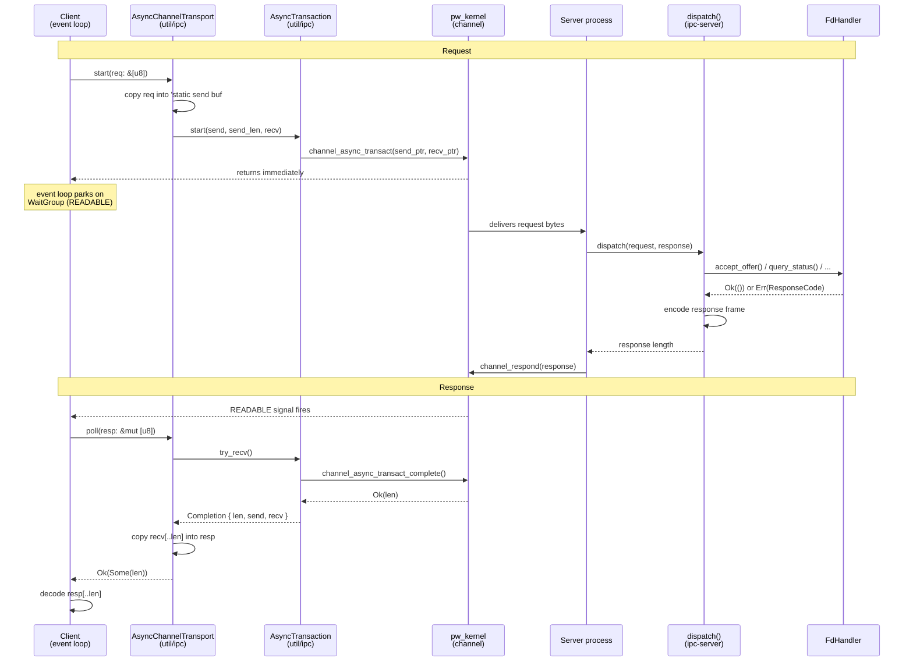
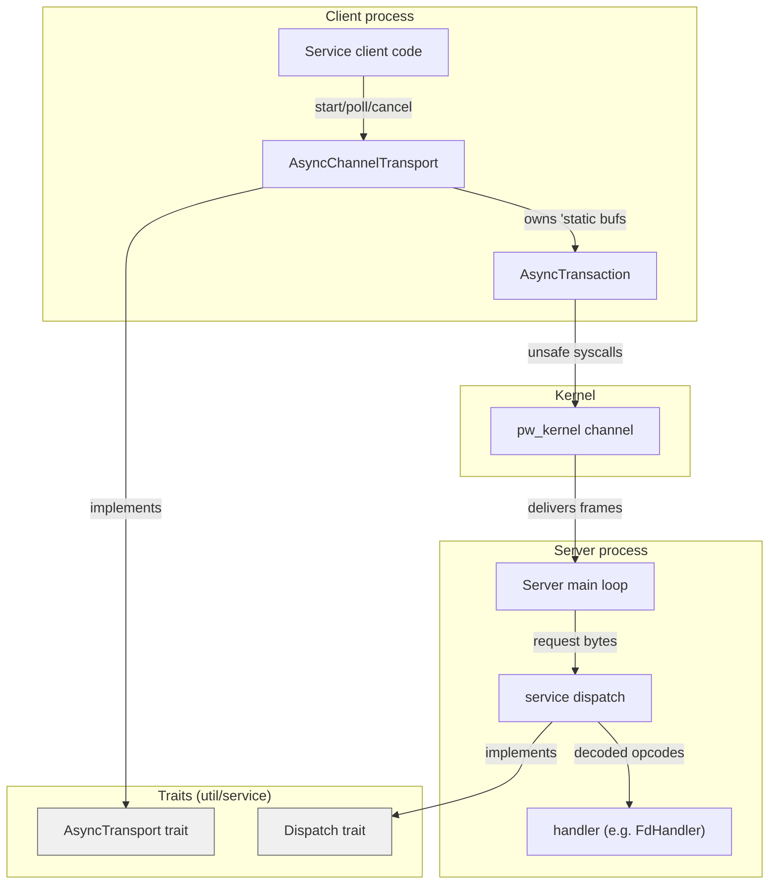

# IPC service stack

How a service request travels from a client, through the kernel, to a
server and back. Two paths: the production kernel channel path and the
in-process loopback for host tests.

## Production path (kernel channel)



## Loopback path (host tests)

A loopback answers on the first poll, so it cannot test a client's
not-ready path. `Delayed` wraps any transport and returns `Ok(None)` for a
set number of polls before forwarding, which is how a host test reaches that
path.

```mermaid
sequenceDiagram
    participant C as Client<br/>(test code)
    participant L as Loopback&lt;D, N&gt;<br/>(util/service)
    participant D as dispatch()<br/>(ipc-server)
    participant H as FdHandler

    C->>L: start(req: &[u8])
    L->>D: dispatch(req, held_buf)
    D->>H: accept_offer() / query_status() / ...
    H-->>D: Ok(()) or Err(ResponseCode)
    D-->>L: response length
    Note over L: response stored in held_buf,<br/>ready immediately

    C->>L: poll(resp: &mut [u8])
    L->>L: copy held_buf[..len] into resp
    L-->>C: Ok(Some(len))
    C->>C: decode resp[..len]
```

## Layer map



## Buffer copies

The async path copies twice per direction:

| Step | What | Where |
|------|------|-------|
| 1 | req slice into 'static send buf | `AsyncChannelTransport::start()` |
| 2 | send buf to server process | kernel internal |
| 3 | server response to 'static recv buf | kernel internal |
| 4 | recv buf into caller's resp slice | `AsyncChannelTransport::poll()` |

Copies 1 and 4 exist because the kernel needs `'static` buffers (it holds
raw pointers for the duration of the transaction), but callers work with
ordinary stack slices. The loopback skips steps 2 and 3 since everything
runs in one process.
