# PLDM-FD as IPC Server

How the PLDM Firmware Device (FD) and the orchestrator communicate when the FD
runs as an IPC server and the orchestrator is its client. Modeled on the MCTP
server/client split: the FD process owns a dispatch loop that decodes IPC
requests and routes them to the firmware-device state machine. The orchestrator
talks to it through `ServiceCall` requests, each one signalling the caller's
`WaitGroup` when it completes.

The FD drives the PLDM protocol and executes firmware operations through FdOps
callbacks: `download_fw_data` writes chunks to flash via the device server.
`verify` delegates to the crypto service, which reads the staged image from the
device server itself. `apply` and `activate` take the board-specific logic from
the platform driver trait and run it through the device server. The platform
driver is a trait linked at build time, not a service; board-specific behavior
enters via trait implementations. Before download via AcceptOffer, before
verify and before apply, the FD nudges the orchestrator and waits for a grant;
activation is decided one step earlier, see below. The orchestrator is a
gatekeeper: it can block any phase (e.g. deny verify for an isolated component
with DenyVerify; the FD reports it to the UA as a verify failure), but it does
not execute the operations itself. The orchestrator never blocks: it must stay
responsive to async events (e.g. CompromiseDetected). All outbound operations
(IPC to FD, SVN bump, write filter) go through ServiceCall, and their
completion signals sit in the orchestrator's WaitGroup alongside event signals.
FdOps callbacks must not block for long because the UA can send CancelUpdate
asynchronously, and the FD's responder path needs to stay live to handle it.

Out-of-transport, a third party writes the image to staging, and it has to be
there before GrantVerify. The platform driver knows the staging address, and
how the third party learns it is open. The FD does not pull firmware bytes but
still runs verify and apply through FdOps.

Design decisions:

- ServiceCall is the universal IPC primitive. Every cross-process request
  (FdOps to device server, FdOps to crypto, orchestrator to FD) goes
  through `ServiceCall<Req, Resp>`: `start()` is `channel_async_transact`,
  `signal()` is READABLE on the initiator handle, which `start()` clears and
  the handler's response raises, and `try_recv()` is
  `channel_async_transact_complete`. The caller adds that handle to its
  `WaitGroup`. No process ever blocks on another; `object_wait` on the
  WaitGroup sleeps the thread until any signal fires. A handler that dies
  never raises READABLE, which is the same hole as the missing peer-closed
  signal in the FD-death answer below.
- The kernel puts two constraints on ServiceCall. The send and receive
  buffers must stay valid until the transaction completes or is cancelled.
  That is why `channel_async_transact` is unsafe. ServiceCall owns Req and
  Resp for the call's lifetime, and owning them is what lets it wrap the
  unsafe call safely. So no borrowed stack buffer, and no scratch buffer
  shared between channels: each in-flight channel needs its own. Separately,
  a channel carries one transaction at a time and a second `start()` on a
  busy channel returns `Unavailable`, so one outstanding ServiceCall per
  channel is the kernel's rule rather than ours. The same `Unavailable`
  comes back from `try_recv()` when the transaction is still pending or
  was already cancelled, so the caller keys off which call returned it,
  not the error value alone. `channel_async_cancel` drops a pending
  transaction. A blocking `transact()` never queues behind an in-flight
  async one; it fails immediately with `Unavailable` via the same path.
  Nothing in this tree uses the async calls yet, i2c and mctp both block
  in `channel_transact`, so the contract is spelled out here rather than
  pointed at.
- The orchestrator never blocks. Its WaitGroup multiplexes FD nudge signals,
  ServiceCall completions (SVN bump, write filter), CompromiseDetected, and
  timers. Any event gets handled on the next wake, regardless of what else
  is in flight. The FD never parks either. A polled FdOps callback returns at
  once whether or not the grant has arrived, reporting 0% progress until it
  has, so the dispatch loop and the MCTP responder stay live through the
  wait.
- The FD executes download, verify, and apply through FdOps callbacks. Our
  verification code goes in FdOps::verify, which calls the crypto service
  over IPC (a separate process holds the keys). The crypto service reads
  the staged image directly from the device server, so the FD never
  relays image data. The orchestrator does not read flash or check
  signatures itself.
- Gatekeeper pattern: before verify and apply the FD nudges the orchestrator
  and waits for a grant or deny, and for activation it asks as soon as apply
  finishes. The orchestrator can reject
  any phase (e.g. component is isolated, update policy violation) and the FD
  returns the rejection to the UA via FdOps return value. This keeps the
  orchestrator lightweight and non-blocking.
- Grant gates add no PLDM states. The FD enters Verify and Apply
  automatically per DSP0267. The gate lives inside the polled FdOps
  callback: pldm-lib calls verify/apply repeatedly via `fd_progress`, and
  our implementation returns success with 0% progress until the orchestrator
  grants. Between polls the dispatch loop and MCTP responder stay live, so
  there is no deadlock and no spec violation.
- Delegated verification. FdOps::verify sends a single "verify this image"
  request to the crypto service on the first poll, then checks for the
  completion signal on each subsequent poll. The crypto service owns the
  full pipeline (read from device server, hash, check signature) in its
  own process. The FD never touches image data or hash state, and there
  is no accumulated state to lose on cancel.
- Nudges are FD to orchestrator only, level-triggered USER signals. Same
  mechanism the i2c server-runtime uses to announce a latched slave receive
  (services/i2c/server-runtime/src/lib.rs:18). The FD raises the signal
  when the orchestrator needs to act (offer ready, grant needed, phase
  complete). The FD clears it when it answers the orchestrator's QueryStatus.
- All orchestrator-to-FD IPC ops get an immediate `Reply`, no
  `DispatchOutcome::Pending`.
- Dispatch follows the MCTP server pattern: `dispatch_pldm_op` decodes a
  request header, calls the appropriate method, encodes the response.
- In-transport vs out-of-transport is the transfer mechanism, not the IPC
  protocol. The IPC ops are the same; what differs is who writes firmware
  bytes to flash.
- Minimal copies: firmware lands in its final staging region and is verified
  in place. FdOps::download_fw_data writes directly to the staging address;
  FdOps::verify reads from there. No intermediate buffers or extra copies
  between download, verify, and apply.

## In-transport image transfer

The FD pulls firmware chunks from the UA over MCTP. Each chunk is written to
the staging region by FdOps::download_fw_data, which calls the flash device
server over IPC. Firmware bytes do not pass through the orchestrator. After
transfer, the FD asks the orchestrator for permission to verify, then runs
FdOps::verify (which delegates to the crypto service; the crypto service
reads the staged image directly from the device server). The orchestrator
also grants apply before the FD commits the image. The orchestrator handles
activation. It does not touch the security revision here; that is a separate
command the UA sends later, see "Security revision commit" below.

```mermaid
sequenceDiagram
    participant UA as UA (BMC)<br/>remote, over MCTP
    participant FD as PLDM-FD (server)<br/>dispatch loop + run_terminus
    participant Orch as Orchestrator (client)<br/>ServiceCall
    participant DevSrv as Device Server<br/>manages the SPI flash
    participant Crypto as Crypto Service<br/>hash + signature verification

    Note over UA, Crypto: Blue background: orchestrator IPC. Green background: FdOps service IPC.

    Note over UA, Orch: NEGOTIATION (PLDM protocol, MCTP only)

    UA->>FD: RequestUpdate (MCTP)
    FD-->>UA: RequestUpdate response (accepted)
    UA->>FD: PassComponentTable (MCTP)
    FD-->>UA: PassComponentTable response
    UA->>FD: UpdateComponent (MCTP)
    FD-->>UA: UpdateComponent response

    Note over FD, Orch: FD has an offer, nudge the orchestrator

    FD->>Orch: USER signal (nudge: offer ready)

    rect rgb(230, 240, 255)
    activate Orch
    Orch->>FD: ServiceCall: QueryStatus
    FD-->>Orch: Status::OfferPending { target, total, mode: InTransport }
    Note right of Orch: validate target + total,<br/>platform driver picks<br/>staging address,<br/>reserve staging,<br/>open staging window
    Orch->>FD: ServiceCall: AcceptOffer { base: FlashAddress }
    FD-->>Orch: Ok
    deactivate Orch
    end

    Note over UA, DevSrv: TRANSFER (FD pulls from UA, FdOps writes to flash)

    rect rgb(230, 255, 230)
    loop FdOps::download_fw_data per chunk
        FD->>UA: RequestFirmwareData (MCTP)
        UA-->>FD: firmware chunk
        FD->>DevSrv: ServiceCall: write chunk
        DevSrv-->>FD: signal: Ok
    end
    end

    Note over FD, Orch: transfer done, ask orchestrator to grant verify

    FD->>UA: TransferComplete (MCTP)
    FD->>Orch: USER signal (nudge: verify pending)

    rect rgb(230, 240, 255)
    activate Orch
    Orch->>FD: ServiceCall: QueryStatus
    FD-->>Orch: Status::VerifyPending
    Note right of Orch: check isolation, update policy,<br/>close staging window
    Orch->>FD: ServiceCall: GrantVerify
    FD-->>Orch: Ok
    deactivate Orch
    end

    Note over FD, Crypto: FdOps::verify

    rect rgb(230, 255, 230)
    FD->>Crypto: ServiceCall::start(VerifyRequest { addr, size })
    Crypto->>DevSrv: read staged image
    DevSrv-->>Crypto: image data
    loop fd_progress poll
        Note over FD: verify() returns 0%, no signal yet
    end
    Crypto-->>FD: signal: Verdict
    Note over FD: verify() poll: try_recv -> 100% + verdict
    end
    FD->>UA: VerifyComplete (MCTP)

    Note over FD, Orch: verify done, ask orchestrator to grant apply

    FD->>Orch: USER signal (nudge: apply pending)

    rect rgb(230, 240, 255)
    activate Orch
    Orch->>FD: ServiceCall: QueryStatus
    FD-->>Orch: Status::ApplyPending
    Orch->>FD: ServiceCall: GrantApply
    FD-->>Orch: Ok
    deactivate Orch
    end

    Note over FD, DevSrv: FdOps::apply

    rect rgb(230, 255, 230)
    FD->>DevSrv: ServiceCall::start(apply: commit staged image)
    loop fd_progress poll
        Note over FD: apply() returns 0%, no signal yet
    end
    DevSrv-->>FD: signal: Ok
    Note over FD: apply() poll: try_recv -> 100%
    end
    FD->>UA: ApplyComplete (MCTP)

    Note over FD, Orch: apply done, decide activation before the UA asks

    FD->>Orch: USER signal (nudge: activation decision)

    rect rgb(230, 240, 255)
    activate Orch
    Orch->>FD: ServiceCall: QueryStatus
    FD-->>Orch: Status::ActivationPending
    Note right of Orch: check isolation, update policy
    Orch->>FD: ServiceCall: GrantActivate
    FD-->>Orch: Ok
    deactivate Orch
    end

    Note over UA, Orch: ACTIVATION (FdOps::activate, any time later)

    UA->>FD: ActivateFirmware (MCTP)
    FD-->>UA: ActivateFirmware response (accepted, from the stored grant)

    rect rgb(230, 255, 230)
    FD->>DevSrv: ServiceCall: FdOps::activate: set boot preference
    DevSrv-->>FD: signal: Ok
    end

    FD->>Orch: USER signal (nudge: activated)

    rect rgb(230, 240, 255)
    activate Orch
    Orch->>FD: ServiceCall: QueryStatus
    FD-->>Orch: Status::Idle { reason: ActivateFw }
    Note right of Orch: release staging,<br/>start judging the boot
    deactivate Orch
    end

    Note over UA, DevSrv: SVN COMMIT (later, FD back in IDLE, new image running)

    Note right of Orch: judge the boot, then<br/>TrialBoot::confirm or revert
    UA->>FD: UpdateSecurityRevision (MCTP, 0x22)
    FD->>Orch: USER signal (nudge: SVN commit requested)

    rect rgb(230, 240, 255)
    activate Orch
    Orch->>FD: ServiceCall: QueryStatus
    FD-->>Orch: Status::SvnCommitPending { component }
    Note right of Orch: a confirmed trial only,<br/>else DenySvnCommit
    Orch->>DevSrv: ServiceCall: SvnFloor::advance
    DevSrv-->>Orch: signal: Ok
    Orch->>FD: ServiceCall: GrantSvnCommit
    FD-->>Orch: Ok
    deactivate Orch
    end

    FD-->>UA: UpdateSecurityRevision response (success)

    Note over UA, Orch: CANCEL (between AcceptOffer and activation)
    UA->>FD: CancelUpdate (MCTP)
    rect rgb(230, 255, 230)
    FD->>DevSrv: ServiceCall: FdOps::cancel_update_component
    DevSrv-->>FD: signal: Ok
    end
    FD-->>UA: CancelUpdate response
    FD->>Orch: USER signal (nudge: cancelled)
    rect rgb(230, 240, 255)
    activate Orch
    Orch->>FD: ServiceCall: QueryStatus
    FD-->>Orch: Status::Cancelled
    Note right of Orch: release staging,<br/>close staging window
    Orch->>FD: ServiceCall: AckCancel
    FD-->>Orch: Ok
    deactivate Orch
    end
```



## Out-of-transport image transfer

A third party writes the firmware image into the staging region, and it has to
be there before GrantVerify. The platform driver knows where each component's
image belongs. Two things are open: whether that address is fixed per
component, so the writer knows it without asking, or handed over at AcceptOffer
while the session is already running, and what tells the orchestrator the copy
finished. The FD does not pull firmware bytes. The verify and apply phases
still run through FdOps with the same gatekeeper pattern.

```mermaid
sequenceDiagram
    participant UA as UA (BMC)<br/>remote, over MCTP
    participant FD as PLDM-FD (server)<br/>dispatch loop + run_terminus
    participant Orch as Orchestrator (client)<br/>ServiceCall
    participant DevSrv as Device Server<br/>manages the SPI flash
    participant Crypto as Crypto Service<br/>hash + signature verification

    Note over UA, Crypto: Blue background: orchestrator IPC. Green background: FdOps service IPC.

    Note over UA, Orch: NEGOTIATION (same as in-transport)

    UA->>FD: RequestUpdate (MCTP)
    FD-->>UA: RequestUpdate response (accepted)
    UA->>FD: PassComponentTable (MCTP)
    FD-->>UA: PassComponentTable response
    UA->>FD: UpdateComponent (MCTP, out-of-transport)
    FD-->>UA: UpdateComponent response

    Note over FD, Orch: FD has an offer, nudge the orchestrator

    FD->>Orch: USER signal (nudge: offer ready)

    rect rgb(230, 240, 255)
    activate Orch
    Orch->>FD: ServiceCall: QueryStatus
    FD-->>Orch: Status::OfferPending { target, total, mode: OutOfTransport }
    Note right of Orch: validate target + total,<br/>platform driver picks<br/>staging address
    Orch->>FD: ServiceCall: AcceptOffer { base: FlashAddress }
    Note left of FD: FD does not write in<br/>out-of-transport. A third party<br/>pre-stages the image, and how it<br/>learns the address is open
    FD-->>Orch: Ok
    deactivate Orch
    end

    Note over FD, Orch: no transfer phase, image already staged

    FD->>UA: TransferComplete (MCTP)

    Note over FD, Orch: ask orchestrator to grant verify

    FD->>Orch: USER signal (nudge: verify pending)

    rect rgb(230, 240, 255)
    activate Orch
    Orch->>FD: ServiceCall: QueryStatus
    FD-->>Orch: Status::VerifyPending
    Note right of Orch: check isolation, update policy,<br/>close staging window
    Orch->>FD: ServiceCall: GrantVerify
    FD-->>Orch: Ok
    deactivate Orch
    end

    Note over FD, Crypto: FdOps::verify

    rect rgb(230, 255, 230)
    FD->>Crypto: ServiceCall::start(VerifyRequest { addr, size })
    Crypto->>DevSrv: read staged image
    DevSrv-->>Crypto: image data
    loop fd_progress poll
        Note over FD: verify() returns 0%, no signal yet
    end
    Crypto-->>FD: signal: Verdict
    Note over FD: verify() poll: try_recv -> 100% + verdict
    end
    FD->>UA: VerifyComplete (MCTP)

    Note over FD, Orch: verify done, ask orchestrator to grant apply

    FD->>Orch: USER signal (nudge: apply pending)

    rect rgb(230, 240, 255)
    activate Orch
    Orch->>FD: ServiceCall: QueryStatus
    FD-->>Orch: Status::ApplyPending
    Orch->>FD: ServiceCall: GrantApply
    FD-->>Orch: Ok
    deactivate Orch
    end

    Note over FD, DevSrv: FdOps::apply

    rect rgb(230, 255, 230)
    FD->>DevSrv: ServiceCall::start(apply: commit staged image)
    loop fd_progress poll
        Note over FD: apply() returns 0%, no signal yet
    end
    DevSrv-->>FD: signal: Ok
    Note over FD: apply() poll: try_recv -> 100%
    end
    FD->>UA: ApplyComplete (MCTP)

    Note over FD, Orch: apply done, decide activation before the UA asks

    FD->>Orch: USER signal (nudge: activation decision)

    rect rgb(230, 240, 255)
    activate Orch
    Orch->>FD: ServiceCall: QueryStatus
    FD-->>Orch: Status::ActivationPending
    Note right of Orch: check isolation, update policy
    Orch->>FD: ServiceCall: GrantActivate
    FD-->>Orch: Ok
    deactivate Orch
    end

    Note over UA, Orch: ACTIVATION (same as in-transport)

    UA->>FD: ActivateFirmware (MCTP)
    FD-->>UA: ActivateFirmware response (accepted, from the stored grant)

    rect rgb(230, 255, 230)
    FD->>DevSrv: ServiceCall: FdOps::activate: set boot preference
    DevSrv-->>FD: signal: Ok
    end

    FD->>Orch: USER signal (nudge: activated)

    rect rgb(230, 240, 255)
    activate Orch
    Orch->>FD: ServiceCall: QueryStatus
    FD-->>Orch: Status::Idle { reason: ActivateFw }
    Note right of Orch: release staging,<br/>start judging the boot
    deactivate Orch
    end

    Note over UA, DevSrv: SVN COMMIT (later, FD back in IDLE, new image running)

    Note right of Orch: judge the boot, then<br/>TrialBoot::confirm or revert
    UA->>FD: UpdateSecurityRevision (MCTP, 0x22)
    FD->>Orch: USER signal (nudge: SVN commit requested)

    rect rgb(230, 240, 255)
    activate Orch
    Orch->>FD: ServiceCall: QueryStatus
    FD-->>Orch: Status::SvnCommitPending { component }
    Note right of Orch: a confirmed trial only,<br/>else DenySvnCommit
    Orch->>DevSrv: ServiceCall: SvnFloor::advance
    DevSrv-->>Orch: signal: Ok
    Orch->>FD: ServiceCall: GrantSvnCommit
    FD-->>Orch: Ok
    deactivate Orch
    end

    FD-->>UA: UpdateSecurityRevision response (success)

    Note over UA, Orch: CANCEL (between AcceptOffer and activation)
    UA->>FD: CancelUpdate (MCTP)
    rect rgb(230, 255, 230)
    FD->>DevSrv: ServiceCall: FdOps::cancel_update_component
    DevSrv-->>FD: signal: Ok
    end
    FD-->>UA: CancelUpdate response
    FD->>Orch: USER signal (nudge: cancelled)
    rect rgb(230, 240, 255)
    activate Orch
    Orch->>FD: ServiceCall: QueryStatus
    FD-->>Orch: Status::Cancelled
    Note right of Orch: discard the accepted offer
    Orch->>FD: ServiceCall: AckCancel
    FD-->>Orch: Ok
    deactivate Orch
    end
```



## Write-access containment

The FD never holds a flash handle. It writes through the device server, one
ServiceCall per chunk, so the containment is the device server's to enforce.

First layer, in software. The orchestrator arms the device server at
AcceptOffer with the base address and total it just handed the FD, and disarms
it when the staging window closes, by the rule below. Writes outside that
range are rejected. This catches offset bugs in the FD. It does not catch a
compromised FD, which can still ask the device server to write anywhere inside
the window. Arming and disarming are orchestrator-to-device-server calls the
diagrams do not show yet.

Second layer, in hardware. The SMC write filter raises
`SmcInterrupt::WriteProtected` on writes outside the allowed region
(target/ast10x0/peripherals/smc/interrupts.rs). It sits in the eRoT's own
controller, so it checks every write that reaches flash through that controller
and cannot tell one eRoT-side writer from another. Whether the host can reach
staging at all depends on how the board is wired, and this filter does not
answer that. The orchestrator opens the region at AcceptOffer and closes it by
the same rule. What this needs from the hardware is one thing: whoever drives
erase and program must not reach the write-protect registers. How to get that
is open. Three candidates: a separate chip select for staging, a separate MPU
region over the filter registers, or lock-until-reset bits. The separate chip
select is the current preference, and it is also what keeps the host off
staging. Picking one needs the AST10x0 register layout, and it does not block
the rest of this design.

Both windows close before GrantVerify and stay closed until the next
AcceptOffer. Verify hashes what is on flash, and the verdict has to match the
image that apply later commits, so nothing may write staging from the grant
onward. The window closes on the verify-pending nudge, on DenyVerify, on
Cancelled, on PhaseFailed, and when the backstop timer from the FD-death answer
fires. Closing twice is harmless.
Disarming the device server is itself a ServiceCall, so GrantVerify goes out
after its completion signal arrives, not after start(). A board whose apply
writes into the staging slot would break that rule, and how to handle one is
left until such a board exists.

Both layers cover staging only. Apply and activate are a separate problem: the
FD initiates both as ServiceCalls to the device server, and the grant gate for
them lives inside the FD's own FdOps callback. A compromised FD skips its own
gate and calls the device server directly. Closing that means the device server
refuses apply and activate without a grant it got from the orchestrator, not
from the FD. Open, and not covered by the write filter, which spans staging
only.

So the two layers buy this much: an offset bug hits the window check, and a
compromised FD writing outside staging hits the filter. A compromised FD can
still corrupt staging, which verify then fails, and can still attempt apply and
activate until the gap above is closed.

Out-of-transport is different. The FD writes nothing, so the first layer does
not apply to it. The writer is the third party the orchestrator handed the
staging address to, and the same two questions land on that path: what bounds
its writes, and who opens the filter for it. Not answered here. The same close
applies: whatever window that writer has shuts before GrantVerify. The
orchestrator closes it when it learns the copy finished, and how it learns that
is the open question above.

## Activation reporting

The orchestrator decides activation before the UA asks for it. FdOps::activate
is synchronous, and what it returns is the completion code in the
ActivateFirmware response. fd_progress never polls Activate either, so the FD
cannot report 0% and wait there the way it does for verify and apply. Instead
the FD nudges when apply completes, the orchestrator checks its policy while
nothing is waiting on it, and sends GrantActivate or DenyActivate. The FD
stores that verdict and answers ActivateFirmware from it: a grant returns
success and starts the boot-preference ServiceCall, a denial returns
INCOMPLETE_UPDATE, which per DSP0267 leaves the FD in READY XFER without
activating. The gap before the UA asks is unbounded, so the grant is revocable:
a DenyActivate arriving later overrides a stored grant, so CompromiseDetected
can still stop an activation the UA has not asked for yet. Once the UA does
ask, the FD has answered and the boot-preference call is running, so a deny
racing that request loses. Closing that race needs the device server to refuse
activate without an orchestrator-side grant, which is the containment gap
above. A session that ends any way but activation, a cancel or an FD_T1 timeout
alike, invalidates a stored grant, and the FD nudges again when activation is
done so the orchestrator can release staging and start judging the boot.

CancelUpdate answers immediately too, from the FD's own state, the way pldm-lib
already does it. AckCancel is the orchestrator's bookkeeping, not permission.

Activation reports, it does not roll back. The ActivateFirmware response means
accepted, not done. The UA learns the outcome from GetStatus AuxStateStatus and
from GetFirmwareParameters, which shows which version is actually active. The
diagrams do not show that poll.

A failed activation leaves the boot preference unchanged, so the old image
keeps booting and the UA can retry. A bad new image is the trial boot's problem
instead: the floor stays where it is until UpdateSecurityRevision, so the
superseded image stays bootable and TrialBoot can revert to it. That is the
window the security revision commit section describes, seen from the failure
side.

## Security revision commit

Activation does not raise the anti-rollback floor. If it did, a trial boot
could never be reverted: the superseded image would sit below the new floor
and refuse to run. DSP0267 1.3.0 keeps the two apart. The UA sets the
Security Revision Number Delayed Update option (`UpdateOptionFlags` bit 2) on
UpdateComponent, the FD applies and activates without touching the revision,
and the UA sends UpdateSecurityRevision (command 0x22, section 12.19) once it
is satisfied with the image. Until that command arrives a downgrade is still
allowed, which is the window the trial boot lives in.

The FD accepts 0x22 only in the IDLE state, so it arrives outside update mode,
minutes or days after activation. It acts on the active running image, not a
pending one, which is what makes it safe to gate on the boot verdict.

The orchestrator owns the write. On a confirmed trial it advances `SvnFloor`
for that component, then sends GrantSvnCommit so the FD can answer the UA. The
FD relays the request and the answer and never touches the floor, the same
split the rest of this design uses for anything irreversible. On an
unconfirmed or absent trial the orchestrator denies with PolicyViolation and
the FD returns UPDATE_SECURITY_REVISION_NOT_PERMITTED. DSP0267 has no code for
a policy refusal, so that capability code is the nearest fit.

## IPC operations

The orchestrator's IPC vocabulary. Each one is a `ServiceCall`: request in,
response out, nothing kept on the wire between them. The FD answers every op
from state it already holds, so the answer is back by the orchestrator's next
wake.

A blocking `channel_transact` would work here too, and is less machinery, but
only with a timeout small enough to keep the orchestrator reactive. A transact
in flight delays every boot watchdog by up to that timeout, because
`BootWatchdogs::wait_deadline` is what feeds `object_wait`
(services/orchestrator/server/src/runtime.rs). Going that way means a named
const sized against the tightest watchdog, not a round number.

| Op | Direction | Purpose |
|---|---|---|
| AcceptOffer | orch -> FD | Accept with a staging base address |
| RejectOffer | orch -> FD | Reject (FD tells UA in the next response) |
| GrantVerify | orch -> FD | Authorize FD to run FdOps::verify |
| DenyVerify | orch -> FD | Block verify (e.g. isolated component); FD returns failure to UA |
| GrantApply | orch -> FD | Authorize FD to run FdOps::apply |
| DenyApply | orch -> FD | Block apply; FD returns failure to UA |
| QueryStatus | orch -> FD | Read current FD state (phase, result, error); when OfferPending, includes offer data (target, total, transfer mode, SVN delayed) |
| GrantActivate | orch -> FD | Authorize activation ahead of the UA's request; the FD stores it |
| DenyActivate | orch -> FD | Refuse activation, or revoke a stored grant; FD answers the UA with INCOMPLETE_UPDATE |
| AckCancel | orch -> FD | Acknowledge cancel, release orchestrator-side resources |
| GrantSvnCommit | orch -> FD | Tell the FD the floor is raised, so it can answer the UA |
| DenySvnCommit | orch -> FD | Block the commit, reason PolicyViolation (no confirmed trial); FD answers the UA with UPDATE_SECURITY_REVISION_NOT_PERMITTED |

A rejected offer ends with TransferComplete. The diagrams answer
UpdateComponent before the orchestrator's QueryStatus, so by the time the
orchestrator rejects there is no pending UA command to fail. The FD sends
TransferComplete with FdAbortedTransfer (0x03) instead of waiting for the
protocol to time out, and calls FdOps::cancel_update_component on its way
out.

## Status

QueryStatus answers with the condition the FD is really in. Some of those are
DSP0267 states: Idle carries the reason the FD went idle, one of the
GetStatusReasonCode values, ActivateFw after an activation, a cancel reason, a
timeout reason like VerifyTimeout, and nothing at all on a fresh start, which
is how a restarted FD is told apart from one that finished; ReadyXfer is the
spec state of the same name. Some are conditions the implementation has without
a spec name for them: PhaseFailed is a phase plus a failed request, and it
carries the phase and the DSP0267 result code the FD already sent the UA. The
rest are decisions the orchestrator owes the FD, the pending phases and
SvnCommitPending.

PhaseFailed is a real place to sit, not an error flag. A failed verify or apply
leaves the FD in that phase with its request marked failed, waiting for the UA
to cancel (process_verify_complete_rsp in
pldm-interface/src/firmware_device/fd_context.rs), and FD_T1 resets on every
message, so a polling UA can hold it there for as long as it likes. The
orchestrator therefore releases staging and closes the window on PhaseFailed
rather than on the cancel that may follow much later; a retry re-enters through
a new offer and reserves again. How the session continues is the UA's choice,
not a field: a CancelUpdateComponent puts the FD in ReadyXfer, a CancelUpdate
puts it in Idle.

Cancelled is a session condition with a lifetime. The FD reports it from the
UA's CancelUpdate until the orchestrator's AckCancel, and afterwards reports
Idle or ReadyXfer depending on which cancel command arrived. That is what
AckCancel does to the FD's state; it grants nothing.

A QueryStatus between nudges answers with the phase in flight, which is what
the orchestrator's backstop timer probes for. Any well-formed answer means the
FD is alive, so the probe tells a slow transfer apart from a dead FD without
needing a separate liveness signal.

ApplyPending carries no verify verdict. The FD enters Apply only from a
successful verify, in the success branch of process_verify_complete_rsp, so a
flag there would always be true. A verify that fails shows up as PhaseFailed
with the VerifyResult code instead.

## Wire format

Fixed 8-byte header. Most ops carry no payload.

```text
Request:
+----+-------+-----+----------+
| op | flags | gen | reserved |  + [args]
| 1B |  1B   | 2B  |    4B    |
+----+-------+-----+----------+

Response:
+------+-------+-----+-------------+
| code | flags | gen | payload_len |  + [payload]
|  1B  |  1B   | 2B  |    2B LE    |
+------+-------+-----+-------------+
```

`op` decodes through `TryFrom<u8>` and an unknown value is a decode error, not
a panic. Decode failures get their own type: Truncated, InvalidOpcode,
BufferTooSmall, PayloadTooLarge. MAX_REQUEST_SIZE and MAX_RESPONSE_SIZE live in
the api crate and size the buffers on both sides.

`code` is the on-wire result. The error type the orchestrator's client hands
back is a separate type that wraps it, the way MctpError wraps ResponseCode. A
deny carries its reason: Isolated, PolicyViolation, UnknownTarget, Busy. The FD
maps each one onto a DSP0267 completion code for the UA.

The FD answers RequestUpdate from its own state machine: an update already in
progress gets ALREADY_IN_UPDATE_MODE and the UA retries. No nudge.

`gen` is the FD's phase generation, still open. See the open question on
whether a grant carries a token.

## Nudges

The FD raises a USER signal on the orchestrator's `WaitGroup` when state
changes. Level-triggered (OR'd into active_signals, persists until lowered).
Every Signals::USER in this tree is i2c's: the server raises it on a bus
channel and the client answers with SlaveReceive. The MCTP server raises no
USER signal, and its drive_pending is a deferred channel_respond rather than a
wake.

The FD clears the signal when it answers QueryStatus, and raises it again on the
next state change. The orchestrator has no call to clear its own signal:
pw_kernel's one USER call, `object_set_peer_user_signal`, acts on the peer. i2c
does the same thing, the server raises on its bus channel and clears it when it
answers the client's SlaveReceive (services/i2c/server-runtime/src/lib.rs:192
and 252).

The FD clears first, before it reads out the state it returns. In one thread the
order cannot matter, since nothing can change between the two. It is the order
that stays right if the loop ever yields mid-reply, and it is what i2c does.

Events that trigger a nudge:
- Offer ready (UA sent UpdateComponent, FD has target + total)
- Verify pending (transfer complete, FD waiting for GrantVerify)
- Apply pending (verify complete, FD waiting for GrantApply)
- Activation decision needed (apply complete)
- Activated (FdOps::activate done, boot preference set, FD back in Idle)
- SVN commit requested (UA sent UpdateSecurityRevision)
- Cancelled (UA sent CancelUpdate)
- Idle on timeout (a request the FD sent went unanswered for FD_T1)
- Phase failed (verify or apply failed, FD waiting for the UA to cancel)

The nudge is dataless. The orchestrator always follows up with QueryStatus
to learn what happened. One bit, no framing, no lost
messages. The parentheticals in the diagrams (e.g. "nudge: offer ready")
name the state the orchestrator will find via QueryStatus, not data on the
signal.

## Crate layout

Five crates, split so the protocol path builds and tests on the host. Same
split as services/i2c.

| Crate | Builds on | Holds |
|---|---|---|
| pldm-ipc-api | host | wire format, opcodes, error types, the seam trait |
| pldm-ipc-server | host | `dispatch_pldm_op`, pure, plus the loopback transport |
| pldm-ipc-server-runtime | kernel | object_wait, channel_read, channel_respond |
| orchestrator-pldm-client | host | all the marshalling, generic over a Transport |
| orchestrator-pldm-client-ipc | kernel | Transport over the kernel call, around 40 lines |

Two crates are kernel-tagged and neither holds protocol logic. That is what
lets the loopback run the real client encoders against the real dispatch with
no kernel, the way services/i2c/server/src/loopback.rs does. It is also the
debugging seam for interfacing problems between the two processes: malformed
frames, reserved bits set, a grant with no offer, an op in the wrong phase.

The FD's runtime is not an i2c clone. It multiplexes the orchestrator channel
with the MCTP responder and run_terminus in one WaitGroup, where i2c's
multiplexes bus channels and an IRQ.

Each side treats the other as untrusted, since they are separate processes.
Every fault, a malformed frame included, comes back as a well-formed rejection
and neither dispatch panics. The FD holds the live PLDM session, so a panic
there loses the update.

## FdOps and IPC services

The table below lists only the callbacks this design routes over IPC; the
trait has more. FdOps callbacks run inside the FD process and make outbound
ServiceCalls
to the services they need. The platform driver trait (linked at build time)
determines the board-specific details of each operation; the actual I/O
goes through the device server. The orchestrator does not sit in any of
these data paths.

The FD does not look up the services it calls. Its channels to the device
server and the crypto service are channel_initiator objects declared in the
board's system.json5 and fixed at build time, so nothing is discovered at
runtime and AcceptOffer carries the staging address only, not a device
identity. Another service the FD calls means another declared channel, not a
lookup. This is also what lets a restarted FD come back without rediscovering
anything: the channel is the same object.

| Callback | ServiceCall to | Purpose |
|---|---|---|
| download_fw_data | device server | Write a firmware chunk to the staging region |
| verify | crypto service | Hash and signature check; crypto reads the staged image directly from the device server |
| apply | device server | Commit the staged image (platform driver trait determines what to write) |
| activate | device server | Set boot preference (platform driver trait determines the operation) |
| cancel_update_component | device server | Abort in-flight operations, discard FD transfer state |

pldm-lib decides when cancel_update_component runs, not this design. It calls
the callback before answering either cancel command, and again when a request
the FD sent goes unanswered for FD_T1, which is the one path where the FD
cancels itself with no UA involvement. That last one leaves the FD idle with a
per-state reason, DownloadTimeout or VerifyTimeout and so on, so the
orchestrator sees it as a nudge and an Idle status rather than a Cancelled one.
Once apply has succeeded the CancelUpdate handler refuses the cancel outright
and the callback never runs, so the session ends at activation or not at all.

The crypto service runs in a separate process because it holds the
verification keys. Verification is a single ServiceCall: the crypto
service owns the full read-hash-check pipeline.

## Comparison with the notify/intake design (PR #458)

| Aspect | PR #458 (PLDM as client) | This design (PLDM-FD as server) |
|---|---|---|
| IPC initiator | PLDM | Orchestrator |
| Blocking direction | PLDM blocks on channel_transact | Nobody blocks; all IPC via ServiceCall + WaitGroup |
| Who runs verify/apply | Polled via poll_stage (one step per call) | FD runs both through FdOps callbacks |
| Orchestrator role | Drives verify/apply | Gatekeeper: grants or denies each phase |
| Nudge direction | Orchestrator -> PLDM | FD -> Orchestrator |
| Transfer (in-transport) | PLDM writes via FdOps | FdOps::download_fw_data writes via device server |
| Transfer (out-of-transport) | Not covered | Image pre-staged by a third party (platform decides where) |
| Crypto | Inline | Separate service; reads staged image directly from device server |
| Channel count | 2 (notify + intake) | 1 orchestrator-FD channel (device server + crypto channels are separate) |
| MCTP responsiveness | PLDM free after Complete | FD keeps MCTP responder live; polled callbacks report 0% until granted |
| Orchestrator responsiveness | Always responsive | Never blocks; WaitGroup multiplexes ServiceCalls + async events |

## Open questions

Whether GrantVerify/GrantApply should carry additional data (e.g. a nonce,
a policy token) or just be bare ok/deny signals.

What the orchestrator does when the UA omits SVNDelayedUpdate. The DSP0267
default is an automatic bump during the update, which spends the floor before
any boot is judged and makes revert useless. Either the FD refuses to enable
a non-delayed update for a component that carries a security revision, or the
orchestrator accepts the automatic path and its risk. Refusing needs a
completion code DSP0267 does not have for UpdateComponent, the same problem the
0x22 path solved by picking the nearest capability code. The refusal also has to
land in the UpdateComponent response, not later: by the time the orchestrator
sees the offer over QueryStatus, the FD has already answered the UA.

What the orchestrator does if the UA never sends UpdateSecurityRevision. The
trial confirms, the image runs, and the floor stays where it was, so the
superseded image remains bootable indefinitely. Per DSP0267 this is the UA's
call, and nothing in the protocol says a commit is outstanding:
CapabilitiesDuringUpdate bit 9 in GetFirmwareParameters only says the FD
supports the delayed update at all. Open whether the orchestrator should
surface the outstanding commit itself.

Whether FdOps callbacks need priv_data for fw_download/verify/apply.

How the orchestrator finds out the FD died. Right now it does not. The
orchestrator sleeps until the FD nudges it, a dead FD never nudges, and there
is no "the other side went away" signal to wait on instead: the set is
READABLE, WRITEABLE, ERROR, JOINABLE, USER and the interrupt bits (the
`Signals` bitflags in pw_kernel/syscall/syscall_defs.rs). That matters because
the staging reservation stays held from AcceptOffer until the activated nudge,
a cancel, or PhaseFailed. It is released by orchestrator code that only runs
when the FD sends something, so nothing releases it until the chip resets.

The plan is to let the FD tell us after the fact. A supervisor restarts it, the
fresh FD nudges, and QueryStatus comes back Idle, or with a fresh offer, while
the orchestrator still believes an update is in flight. That mismatch is the
signal, and the orchestrator then closes the filter and frees staging. The
kernel supports the restart: a process can be terminated, joined and started
again, and the channel survives (`test_object_reset_basic` in
pw_kernel/tests/process_termination). A nudge from the old FD is cleared when
the supervisor joins it, before the restart
(`test_peer_user_signal_cleared_on_terminate`). No `gen` field is needed for
this, because a restarted FD starts Idle and a new UA session cannot get past
OfferPending without an AcceptOffer from the orchestrator.

Two gaps remain. There is no supervisor: nothing in this tree calls
`process_start` or `task_terminate`, and target/ast10x0/erot/system.json5 has
no apps yet. Without one the stale nudge is never cleared either, so the
orchestrator can wake on a nudge from an FD that is already gone. And an FD
that dies and never restarts never nudges, so the orchestrator still needs a
plain timer as a backstop. That timer has to exceed worst-case transfer plus
FD_T1 (120s, `DEFAULT_FD_T1_TIMEOUT` in pldm-interface/src/config.rs) so a live
FD always cancels first. FD_T1 is an idle timer the FD resets on every message,
not a bound on transfer time, so a polling UA can keep a live FD from ever
cancelling; that is harmless here only because staging is already released at
PhaseFailed.

What bounds the FD's wait for a grant. FD death has an answer above, a wedged
or dead orchestrator does not: the FD sits in its polled callback at 0% and
nothing FD-side ends that. The backstop is the UA giving up and sending
CancelUpdate, which the FD answers on its own. FD_T1 only bounds an abandoned
session: it resets on every message, so a UA that keeps polling holds the FD
parked indefinitely.

Whether a corruption runtime scanner should exist as a separate service, and
if so, how it signals the orchestrator (sync or async).

What happens when the crypto service dies or never answers. FdOps::verify
sends one ServiceCall and polls for the completion signal. If that signal never
arrives the FD polls forever, the UA gets no VerifyComplete, and nothing in the
design notices. The FD needs a deadline on that call and a DSP0267 code for the
timeout. The FD's other ServiceCalls to the device server have the same shape
and need the same answer. The mirror case is crypto answering late: CancelUpdate
reaches cancel_update_component, which talks to the device server only, so a
Verdict for the cancelled session can still arrive and must not be read as the
next session's answer. `channel_async_cancel` is the mechanism, and cancelling
before the channel is reused has to be part of that callback. It does not
settle the race where crypto responds just as the cancel goes in: the syscall
returns Unavailable when no transaction is pending, and the docs do not say
whether a response that already landed counts.

How the orchestrator opens and closes the SMC write filter: an IPC op on
the device server (which already manages the SPI flash), or a register it
writes directly. Currently the diagrams show it as an orchestrator note at
AcceptOffer and Activate/Cancel.
