# PLDM-FD as IPC Server

How the PLDM Firmware Device (FD) and the orchestrator communicate when the
FD runs as an IPC server and the orchestrator is its client. Modeled on the
MCTP server/client split: the FD process owns a dispatch loop that decodes
IPC requests and routes them to the firmware-device state machine, and the
orchestrator talks to it through `ServiceCall` requests that return a signal
via the caller's `WaitGroup`.

The FD drives the PLDM protocol and executes firmware operations through
FdOps callbacks: `fw_data_download` writes chunks to flash via the device
server, `verify` delegates to the crypto service (which reads the staged
image directly from the device server), `apply` and `activate` use
board-specific logic from the platform driver trait to determine the
operation, then execute it via the device server. The platform driver is a
trait linked at build time, not a service; board-specific behavior enters
via trait implementations. Before each phase (download via AcceptOffer,
verify, apply, activate), the FD nudges the orchestrator and waits for a
grant. The orchestrator is a gatekeeper: it can block any phase (e.g. deny
verify for an isolated component with DenyVerify; the FD surfaces it to
the UA as a verify failure), but it does not execute the operations itself.
The orchestrator never blocks: it must stay responsive to async events
(e.g. CompromiseDetected). All outbound operations (IPC to FD, SVN bump,
write filter) go through ServiceCall, and their completion signals sit in
the orchestrator's WaitGroup alongside event signals. FdOps callbacks must
not block for long because the UA can send CancelUpdate asynchronously, and
the FD's responder path needs to stay live to handle it.

Out-of-transport, a third party writes the image to staging before the PLDM
session begins. The platform driver knows the staging address; the orchestrator
communicates it to the third party. The FD does not pull
firmware bytes but still runs verify and apply through FdOps.

Design decisions:

- ServiceCall is the universal IPC primitive. Every cross-process request
  (FdOps to device server, FdOps to crypto, orchestrator to FD) goes
  through `ServiceCall<Req, Resp>`: `start()` sends the request
  non-blocking, the caller adds the completion `signal()` to its
  `WaitGroup`, and `try_recv()` picks up the result after wake. No process
  ever blocks on another; `object_wait` on the WaitGroup sleeps the thread
  until any signal fires.
- The orchestrator never blocks. Its WaitGroup multiplexes FD nudge signals,
  ServiceCall completions (SVN bump, write filter), CompromiseDetected, and
  timers. Any event gets handled on the next wake, regardless of what else
  is in flight. While awaiting a grant the FD keeps servicing its dispatch
  loop and MCTP responder (the polled FdOps callback reports 0% progress
  until granted).
- The FD executes download, verify, and apply through FdOps callbacks. Our
  verification code goes in FdOps::verify, which calls the crypto service
  over IPC (a separate process holds the keys). The crypto service reads
  the staged image directly from the device server, so the FD never
  relays image data. The orchestrator does not read flash or check
  signatures itself.
- Gatekeeper pattern: before verify, apply, and activate, the FD nudges the
  orchestrator and waits for a grant or deny. The orchestrator can reject
  any phase (e.g. component is isolated, update policy violation) and the FD
  returns the rejection to the UA via FdOps return value. This keeps the
  orchestrator lightweight and non-blocking.
- Grant gates add no PLDM states. The FD enters Verify and Apply
  automatically per DSP0267. The gate lives inside the polled FdOps
  callback: pldm-lib calls verify/apply repeatedly via `fd_progress`, and
  our implementation returns success with 0% progress until the orchestrator
  grants. Between polls the dispatch loop and MCTP responder stay live, so
  there is no deadlock and no spec violation.
- Delegated verification. FdOps::verify sends a single "verify this image"
  request to the crypto service on the first poll, then checks for the
  completion signal on each subsequent poll. The crypto service owns the
  full pipeline (read from device server, hash, check signature) in its
  own process. The FD never touches image data or hash state, and there
  is no accumulated state to lose on cancel.
- Nudges are FD to orchestrator only, level-triggered USER signals. Same
  mechanism the i2c server-runtime uses to announce a latched slave receive
  (services/i2c/server-runtime/src/lib.rs:18). The FD raises the signal
  when the orchestrator needs to act (offer ready, grant needed, phase
  complete). The orchestrator lowers it after reading the current state.
- All orchestrator-to-FD IPC ops get an immediate `Reply`, no
  `DispatchOutcome::Pending`.
- Dispatch follows the MCTP server pattern: `dispatch_pldm_op` decodes a
  request header, calls the appropriate method, encodes the response.
- In-transport vs out-of-transport is the transfer mechanism, not the IPC
  protocol. The IPC ops are the same; what differs is who writes firmware
  bytes to flash.
- Minimal copies: firmware lands in its final staging region and is verified
  in place. FdOps::fw_data_download writes directly to the staging address;
  FdOps::verify reads from there. No intermediate buffers or extra copies
  between download, verify, and apply.

## In-transport image transfer

The FD pulls firmware chunks from the UA over MCTP. Each chunk is written to
the staging region by FdOps::fw_data_download, which calls the flash device
server over IPC. Firmware bytes do not pass through the orchestrator. After
transfer, the FD asks the orchestrator for permission to verify, then runs
FdOps::verify (which delegates to the crypto service; the crypto service
reads the staged image directly from the device server). The orchestrator
also grants apply before the FD commits the image. The orchestrator handles
activation. It does not touch the security revision here; that is a separate
command the UA sends later, see "Security revision commit" below.

```mermaid
sequenceDiagram
    participant UA as UA (BMC)<br/>remote, over MCTP
    participant FD as PLDM-FD (server)<br/>dispatch loop + run_terminus
    participant Orch as Orchestrator (client)<br/>ServiceCall
    participant DevSrv as Device Server<br/>manages the SPI flash
    participant Crypto as Crypto Service<br/>hash + signature verification

    Note over UA, Crypto: Blue background: orchestrator IPC. Green background: FdOps service IPC.

    Note over UA, Orch: NEGOTIATION (PLDM protocol, MCTP only)

    UA->>FD: RequestUpdate (MCTP)
    FD-->>UA: RequestUpdate response (accepted)
    UA->>FD: PassComponentTable (MCTP)
    FD-->>UA: PassComponentTable response
    UA->>FD: UpdateComponent (MCTP)
    FD-->>UA: UpdateComponent response

    Note over FD, Orch: FD has an offer, nudge the orchestrator

    FD->>Orch: USER signal (nudge: offer ready)

    rect rgb(230, 240, 255)
    activate Orch
    Orch->>FD: ServiceCall: QueryStatus
    FD-->>Orch: Status::OfferPending { target, total, mode: InTransport }
    Note right of Orch: validate target + total,<br/>platform driver picks<br/>staging address,<br/>reserve staging,<br/>open SMC write filter
    Orch->>FD: ServiceCall: AcceptOffer { base: FlashAddress }
    FD-->>Orch: Ok
    deactivate Orch
    end

    Note over UA, DevSrv: TRANSFER (FD pulls from UA, FdOps writes to flash)

    rect rgb(230, 255, 230)
    loop FdOps::fw_data_download per chunk
        FD->>UA: RequestFirmwareData (MCTP)
        UA-->>FD: firmware chunk
        FD->>DevSrv: ServiceCall: write chunk
        DevSrv-->>FD: signal: Ok
    end
    end

    Note over FD, Orch: transfer done, ask orchestrator to grant verify

    FD->>UA: TransferComplete (MCTP)
    FD->>Orch: USER signal (nudge: verify pending)

    rect rgb(230, 240, 255)
    activate Orch
    Orch->>FD: ServiceCall: QueryStatus
    FD-->>Orch: Status::VerifyPending
    Note right of Orch: check isolation, update policy
    Orch->>FD: ServiceCall: GrantVerify
    FD-->>Orch: Ok
    deactivate Orch
    end

    Note over FD, Crypto: FdOps::verify

    rect rgb(230, 255, 230)
    FD->>Crypto: ServiceCall::start(VerifyRequest { addr, size })
    Note over FD: verify() polls return 0% until signal
    Crypto->>DevSrv: read staged image
    DevSrv-->>Crypto: image data
    Crypto-->>FD: signal: Verdict
    Note over FD: verify() poll: try_recv -> 100% + verdict
    end
    FD->>UA: VerifyComplete (MCTP)

    Note over FD, Orch: verify done, ask orchestrator to grant apply

    FD->>Orch: USER signal (nudge: apply pending)

    rect rgb(230, 240, 255)
    activate Orch
    Orch->>FD: ServiceCall: QueryStatus
    FD-->>Orch: Status::ApplyPending { verify_ok: true }
    Orch->>FD: ServiceCall: GrantApply
    FD-->>Orch: Ok
    deactivate Orch
    end

    Note over FD, DevSrv: FdOps::apply

    rect rgb(230, 255, 230)
    FD->>DevSrv: ServiceCall: FdOps::apply: commit staged image
    DevSrv-->>FD: signal: Ok
    end
    FD->>UA: ApplyComplete (MCTP)

    Note over FD, Orch: ACTIVATION (FdOps::activate)

    UA->>FD: ActivateFirmware (MCTP)
    FD->>Orch: USER signal (nudge: activation requested)

    rect rgb(230, 240, 255)
    activate Orch
    Orch->>FD: ServiceCall: QueryStatus
    FD-->>Orch: Status::ActivationPending
    Note right of Orch: close SMC write filter
    Orch->>FD: ServiceCall: Activate
    FD-->>Orch: Ok
    deactivate Orch
    end

    rect rgb(230, 255, 230)
    FD->>DevSrv: ServiceCall: FdOps::activate: set boot preference
    DevSrv-->>FD: signal: Ok
    end

    FD-->>UA: ActivateFirmware response (accepted)

    Note over UA, DevSrv: SVN COMMIT (later, FD back in IDLE, new image running)

    Note right of Orch: judge the boot, then<br/>TrialBoot::confirm or revert
    UA->>FD: UpdateSecurityRevision (MCTP, 0x22)
    FD->>Orch: USER signal (nudge: SVN commit requested)

    rect rgb(230, 240, 255)
    activate Orch
    Orch->>FD: ServiceCall: QueryStatus
    FD-->>Orch: Status::SvnCommitPending { component }
    Note right of Orch: a confirmed trial only,<br/>else DenySvnCommit
    Orch->>DevSrv: ServiceCall: SvnFloor::advance
    DevSrv-->>Orch: signal: Ok
    Orch->>FD: ServiceCall: GrantSvnCommit
    FD-->>Orch: Ok
    deactivate Orch
    end

    FD-->>UA: UpdateSecurityRevision response (success)

    Note over UA, Orch: CANCEL (between AcceptOffer and Activate)
    UA->>FD: CancelUpdate (MCTP)
    FD->>Orch: USER signal (nudge: cancelled)
    rect rgb(230, 240, 255)
    activate Orch
    Orch->>FD: ServiceCall: QueryStatus
    FD-->>Orch: Status::Cancelled
    Note right of Orch: release staging,<br/>close SMC write filter
    Orch->>FD: ServiceCall: AckCancel
    FD-->>Orch: Ok
    deactivate Orch
    end
    FD-->>UA: CancelUpdate response
```



## Out-of-transport image transfer

The firmware image is already in the staging region before the PLDM session
starts (written by a third party). The platform driver knows where each
component's image belongs; the orchestrator communicates the staging
address to the third party service that does the copy. The FD does not pull firmware bytes. The verify
and apply phases still run through FdOps with the same gatekeeper pattern.

```mermaid
sequenceDiagram
    participant UA as UA (BMC)<br/>remote, over MCTP
    participant FD as PLDM-FD (server)<br/>dispatch loop + run_terminus
    participant Orch as Orchestrator (client)<br/>ServiceCall
    participant DevSrv as Device Server<br/>manages the SPI flash
    participant Crypto as Crypto Service<br/>hash + signature verification

    Note over UA, Crypto: Blue background: orchestrator IPC. Green background: FdOps service IPC.

    Note over UA, Orch: NEGOTIATION (same as in-transport)

    UA->>FD: RequestUpdate (MCTP)
    FD-->>UA: RequestUpdate response (accepted)
    UA->>FD: PassComponentTable (MCTP)
    FD-->>UA: PassComponentTable response
    UA->>FD: UpdateComponent (MCTP, out-of-transport)
    FD-->>UA: UpdateComponent response

    Note over FD, Orch: FD has an offer, nudge the orchestrator

    FD->>Orch: USER signal (nudge: offer ready)

    rect rgb(230, 240, 255)
    activate Orch
    Orch->>FD: ServiceCall: QueryStatus
    FD-->>Orch: Status::OfferPending { target, total, mode: OutOfTransport }
    Note right of Orch: validate target + total,<br/>platform driver picks<br/>staging address
    Orch->>FD: ServiceCall: AcceptOffer { base: FlashAddress }
    Note left of FD: FD does not write in<br/>out-of-transport, but the<br/>orchestrator communicates the<br/>base address to the third party<br/>that pre-stages the image
    FD-->>Orch: Ok
    deactivate Orch
    end

    Note over FD, Orch: no transfer phase, image already staged

    FD->>UA: TransferComplete (MCTP)

    Note over FD, Orch: ask orchestrator to grant verify

    FD->>Orch: USER signal (nudge: verify pending)

    rect rgb(230, 240, 255)
    activate Orch
    Orch->>FD: ServiceCall: QueryStatus
    FD-->>Orch: Status::VerifyPending
    Note right of Orch: check isolation, update policy
    Orch->>FD: ServiceCall: GrantVerify
    FD-->>Orch: Ok
    deactivate Orch
    end

    Note over FD, Crypto: FdOps::verify

    rect rgb(230, 255, 230)
    FD->>Crypto: ServiceCall::start(VerifyRequest { addr, size })
    Note over FD: verify() polls return 0% until signal
    Crypto->>DevSrv: read staged image
    DevSrv-->>Crypto: image data
    Crypto-->>FD: signal: Verdict
    Note over FD: verify() poll: try_recv -> 100% + verdict
    end
    FD->>UA: VerifyComplete (MCTP)

    Note over FD, Orch: verify done, ask orchestrator to grant apply

    FD->>Orch: USER signal (nudge: apply pending)

    rect rgb(230, 240, 255)
    activate Orch
    Orch->>FD: ServiceCall: QueryStatus
    FD-->>Orch: Status::ApplyPending { verify_ok: true }
    Orch->>FD: ServiceCall: GrantApply
    FD-->>Orch: Ok
    deactivate Orch
    end

    Note over FD, DevSrv: FdOps::apply

    rect rgb(230, 255, 230)
    FD->>DevSrv: ServiceCall: FdOps::apply: commit staged image
    DevSrv-->>FD: signal: Ok
    end
    FD->>UA: ApplyComplete (MCTP)

    Note over FD, Orch: ACTIVATION (FdOps::activate, same as in-transport)

    UA->>FD: ActivateFirmware (MCTP)
    FD->>Orch: USER signal (nudge: activation requested)

    rect rgb(230, 240, 255)
    activate Orch
    Orch->>FD: ServiceCall: QueryStatus
    FD-->>Orch: Status::ActivationPending
    Orch->>FD: ServiceCall: Activate
    FD-->>Orch: Ok
    deactivate Orch
    end

    rect rgb(230, 255, 230)
    FD->>DevSrv: ServiceCall: FdOps::activate: set boot preference
    DevSrv-->>FD: signal: Ok
    end

    FD-->>UA: ActivateFirmware response (accepted)

    Note over UA, DevSrv: SVN COMMIT (later, FD back in IDLE, new image running)

    Note right of Orch: judge the boot, then<br/>TrialBoot::confirm or revert
    UA->>FD: UpdateSecurityRevision (MCTP, 0x22)
    FD->>Orch: USER signal (nudge: SVN commit requested)

    rect rgb(230, 240, 255)
    activate Orch
    Orch->>FD: ServiceCall: QueryStatus
    FD-->>Orch: Status::SvnCommitPending { component }
    Note right of Orch: a confirmed trial only,<br/>else DenySvnCommit
    Orch->>DevSrv: ServiceCall: SvnFloor::advance
    DevSrv-->>Orch: signal: Ok
    Orch->>FD: ServiceCall: GrantSvnCommit
    FD-->>Orch: Ok
    deactivate Orch
    end

    FD-->>UA: UpdateSecurityRevision response (success)

    Note over UA, Orch: CANCEL (between AcceptOffer and Activate)
    UA->>FD: CancelUpdate (MCTP)
    FD->>Orch: USER signal (nudge: cancelled)
    rect rgb(230, 240, 255)
    activate Orch
    Orch->>FD: ServiceCall: QueryStatus
    FD-->>Orch: Status::Cancelled
    Note right of Orch: discard the accepted offer
    Orch->>FD: ServiceCall: AckCancel
    FD-->>Orch: Ok
    deactivate Orch
    end
    FD-->>UA: CancelUpdate response
```



## Security revision commit

Activation does not raise the anti-rollback floor. If it did, a trial boot
could never be reverted: the superseded image would sit below the new floor
and refuse to run. DSP0267 1.3.0 keeps the two apart. The UA sets the
Security Revision Number Delayed Update option (`UpdateOptionFlags` bit 2) on
UpdateComponent, the FD applies and activates without touching the revision,
and the UA sends UpdateSecurityRevision (command 0x22, section 12.19) once it
is satisfied with the image. Until that command arrives a downgrade is still
allowed, which is the window the trial boot lives in.

The FD accepts 0x22 only in the IDLE state, so it arrives outside update mode,
minutes or days after activation. It acts on the active running image, not a
pending one, which is what makes it safe to gate on the boot verdict.

The orchestrator owns the write. On a confirmed trial it advances `SvnFloor`
for that component, then sends GrantSvnCommit so the FD can answer the UA. The
FD relays the request and the answer and never touches the floor, the same
split the rest of this design uses for anything irreversible. On an
unconfirmed or absent trial the orchestrator denies with PolicyViolation and
the FD returns UPDATE_SECURITY_REVISION_NOT_PERMITTED. DSP0267 has no code for
a policy refusal, so that capability code is the nearest fit.

## IPC operations

The orchestrator's IPC vocabulary. Each one is a `ServiceCall`: request in,
response out, nothing kept on the wire between them. The FD answers every op
from state it already holds, so the answer is back by the orchestrator's next
wake.

A blocking `channel_transact` would work here too, and is less machinery, but
only with a timeout small enough to keep the orchestrator reactive. A transact
in flight delays every boot watchdog by up to that timeout, because
`BootWatchdogs::wait_deadline` is what feeds `object_wait`
(services/orchestrator/server/src/runtime.rs). Going that way means a named
const sized against the tightest watchdog, not a round number.

| Op | Direction | Purpose |
|---|---|---|
| AcceptOffer | orch -> FD | Accept with a staging base address |
| RejectOffer | orch -> FD | Reject (FD tells UA in the next response) |
| GrantVerify | orch -> FD | Authorize FD to run FdOps::verify |
| DenyVerify | orch -> FD | Block verify (e.g. isolated component); FD returns failure to UA |
| GrantApply | orch -> FD | Authorize FD to run FdOps::apply |
| DenyApply | orch -> FD | Block apply; FD returns failure to UA |
| QueryStatus | orch -> FD | Read current FD state (phase, result, error); when OfferPending, includes offer data (target, total, transfer mode, SVN delayed) |
| Activate | orch -> FD | Authorize activation |
| AckCancel | orch -> FD | Acknowledge cancel, release orchestrator-side resources |
| GrantSvnCommit | orch -> FD | Tell the FD the floor is raised, so it can answer the UA |
| DenySvnCommit | orch -> FD | Block the commit, reason PolicyViolation (no confirmed trial); FD answers the UA with UPDATE_SECURITY_REVISION_NOT_PERMITTED |

## Wire format

Fixed 8-byte header. Most ops carry no payload.

```text
Request:
+----+-------+-----+----------+
| op | flags | gen | reserved |  + [args]
| 1B |  1B   | 2B  |    4B    |
+----+-------+-----+----------+

Response:
+------+-------+-----+-------------+
| code | flags | gen | payload_len |  + [payload]
|  1B  |  1B   | 2B  |    2B LE    |
+------+-------+-----+-------------+
```

`op` decodes through `TryFrom<u8>` and an unknown value is a decode error, not
a panic. Decode failures get their own type: Truncated, InvalidOpcode,
BufferTooSmall, PayloadTooLarge. MAX_REQUEST_SIZE and MAX_RESPONSE_SIZE live in
the api crate and size the buffers on both sides.

`code` is the on-wire result. The error type the orchestrator's client hands
back is a separate type that wraps it, the way MctpError wraps ResponseCode. A
deny carries its reason: Isolated, PolicyViolation, UnknownTarget, Busy. The FD
maps each one onto a DSP0267 completion code for the UA.

`gen` is the FD's phase generation, still open. See the open question on
whether a grant carries a token.

## Nudges

The FD raises a USER signal on the orchestrator's `WaitGroup` when state
changes. Level-triggered (OR'd into active_signals, persists until lowered).
Every Signals::USER in this tree is i2c's: the server raises it on a bus
channel and the client answers with SlaveReceive. The MCTP server raises no
USER signal, and its drive_pending is a deferred channel_respond rather than a
wake. The
orchestrator lowers the signal after reading the new state via QueryStatus.

Events that trigger a nudge:
- Offer ready (UA sent UpdateComponent, FD has target + total)
- Verify pending (transfer complete, FD waiting for GrantVerify)
- Apply pending (verify complete, FD waiting for GrantApply)
- Activation requested (UA sent ActivateFirmware)
- SVN commit requested (UA sent UpdateSecurityRevision)
- Cancelled (UA sent CancelUpdate)
- Error (FD entered an error state)

The nudge is dataless. The orchestrator always follows up with QueryStatus
to learn what happened. One bit, no framing, no lost
messages. The parentheticals in the diagrams (e.g. "nudge: offer ready")
name the state the orchestrator will find via QueryStatus, not data on the
signal.

## Crate layout

Five crates, split so the protocol path builds and tests on the host. Same
split as services/i2c.

| Crate | Builds on | Holds |
|---|---|---|
| pldm-ipc-api | host | wire format, opcodes, error types, the seam trait |
| pldm-ipc-server | host | `dispatch_pldm_op`, pure, plus the loopback transport |
| pldm-ipc-server-runtime | kernel | object_wait, channel_read, channel_respond |
| orchestrator-pldm-client | host | all the marshalling, generic over a Transport |
| orchestrator-pldm-client-ipc | kernel | Transport over the kernel call, around 40 lines |

Two crates are kernel-tagged and neither holds protocol logic. That is what
lets the loopback run the real client encoders against the real dispatch with
no kernel, the way services/i2c/server/src/loopback.rs does. It is also the
debugging seam for interfacing problems between the two processes: malformed
frames, reserved bits set, a grant with no offer, an op in the wrong phase.

The FD's runtime is not an i2c clone. It multiplexes the orchestrator channel
with the MCTP responder and run_terminus in one WaitGroup, where i2c's
multiplexes bus channels and an IRQ.

Each side treats the other as untrusted, since they are separate processes.
Every fault, a malformed frame included, comes back as a well-formed rejection
and neither dispatch panics. The FD holds the live PLDM session, so a panic
there loses the update.

## FdOps and IPC services

FdOps callbacks run inside the FD process and make outbound ServiceCalls
to the services they need. The platform driver trait (linked at build time)
determines the board-specific details of each operation; the actual I/O
goes through the device server. The orchestrator does not sit in any of
these data paths.

| Callback | ServiceCall to | Purpose |
|---|---|---|
| fw_data_download | device server | Write a firmware chunk to the staging region |
| verify | crypto service | Hash and signature check; crypto reads the staged image directly from the device server |
| apply | device server | Commit the staged image (platform driver trait determines what to write) |
| activate | device server | Set boot preference (platform driver trait determines the operation) |
| cancel_update_component | device server | Abort in-flight operations, discard FD transfer state |

The crypto service runs in a separate process because it holds the
verification keys. Verification is a single ServiceCall: the crypto
service owns the full read-hash-check pipeline.

## Comparison with the notify/intake design (PR #458)

| Aspect | PR #458 (PLDM as client) | This design (PLDM-FD as server) |
|---|---|---|
| IPC initiator | PLDM | Orchestrator |
| Blocking direction | PLDM blocks on channel_transact | Nobody blocks; all IPC via ServiceCall + WaitGroup |
| Who runs verify/apply | Polled via poll_stage (one step per call) | FD runs both through FdOps callbacks |
| Orchestrator role | Drives verify/apply | Gatekeeper: grants or denies each phase |
| Nudge direction | Orchestrator -> PLDM | FD -> Orchestrator |
| Transfer (in-transport) | PLDM writes via FdOps | FdOps::fw_data_download writes via device server |
| Transfer (out-of-transport) | Not covered | Image pre-staged by a third party (platform decides where) |
| Crypto | Inline | Separate service; reads staged image directly from device server |
| Channel count | 2 (notify + intake) | 1 orchestrator-FD channel (device server + crypto channels are separate) |
| MCTP responsiveness | PLDM free after Complete | FD keeps MCTP responder live; polled callbacks report 0% until granted |
| Orchestrator responsiveness | Always responsive | Never blocks; WaitGroup multiplexes ServiceCalls + async events |

## Open questions

Whether PLDM-FD should respond to ActivateFirmware immediately from its own
state rather than waiting for the orchestrator's Activate IPC call. The
current diagram has the FD wait, which means a slow orchestrator could cause
a DSP0267 response timeout. Responding immediately and letting the
orchestrator activate off the nudge would avoid that, at the cost of the UA
seeing "accepted" before activation actually happens.

Same question applies to CancelUpdate: should the FD respond to the UA
immediately, or wait for the orchestrator's AckCancel?

Whether GrantVerify/GrantApply should carry additional data (e.g. a nonce,
a policy token) or just be bare ok/deny signals.

Whether the orchestrator needs the verify/apply result reported back via
IPC, or if querying FD status after the nudge is enough. Currently the
orchestrator learns the result via QueryStatus after the phase-complete
nudge.

How the FD discovers which device server to open a channel to. Either
AcceptOffer also carries the device identity, or the FD is statically wired
to the staging device at init time.

What the orchestrator does when the UA omits SVNDelayedUpdate. The DSP0267
default is an automatic bump during the update, which spends the floor before
any boot is judged and makes revert useless. Either the FD refuses to enable
a non-delayed update for a component that carries a security revision, or the
orchestrator accepts the automatic path and its risk.

What the orchestrator does if the UA never sends UpdateSecurityRevision. The
trial confirms, the image runs, and the floor stays where it was, so the
superseded image remains bootable indefinitely. Per DSP0267 this is the UA's
call, and GetFirmwareParameters bit 4 tells it a commit is outstanding. Open
whether the orchestrator should surface that anywhere else.

Whether FdOps callbacks need priv_data for fw_download/verify/apply.

What happens on the UA side after RejectOffer. The diagrams answer
UpdateComponent before the orchestrator's QueryStatus, so when the
orchestrator rejects there is no pending UA command to fail. The FD needs an
abort path: either send TransferComplete with an error code, or let the
protocol time out per DSP0267.

How the orchestrator learns that the FD process died mid-update, and what
cleanup path it takes (release staging, close write filter, reset state).

Whether a corruption runtime scanner should exist as a separate service, and
if so, how it signals the orchestrator (sync or async).

How the orchestrator opens and closes the SMC write filter: an IPC op on
the device server (which already manages the SPI flash), or a register it
writes directly. Currently the diagrams show it as an orchestrator note at
AcceptOffer and Activate/Cancel.
