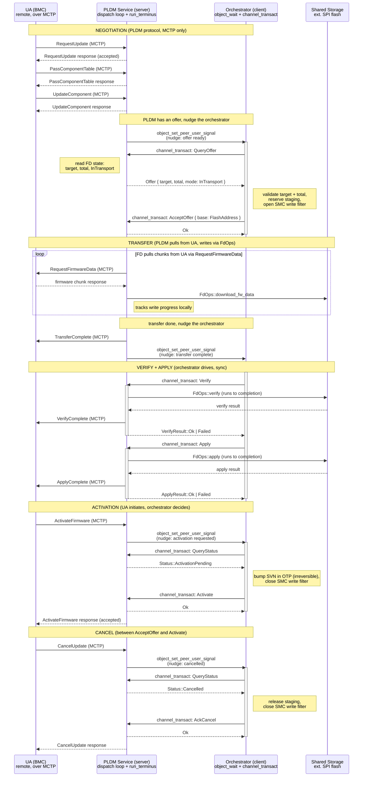
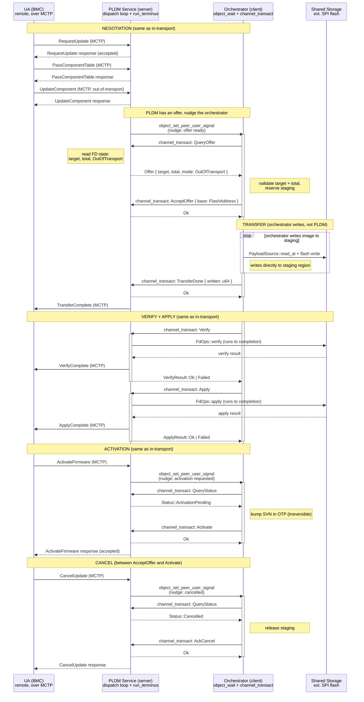

# PLDM Service as IPC Server

How the PLDM service and the orchestrator communicate when the PLDM service
runs as an IPC server and the orchestrator is its client. Modeled on the MCTP
server/client split: the PLDM process owns a dispatch loop that decodes IPC
requests and routes them to the firmware-device state machine, and the
orchestrator talks to it through synchronous `channel_transact` calls.

The orchestrator is synchronous: verify and apply are blocking calls that
return when the operation completes, not polled in steps. In-transport, PLDM
pulls chunks from the UA and writes them to flash through `FdOps`.
Out-of-transport, the orchestrator writes the image to the staging region
itself and tells PLDM when done.
PLDM nudges the orchestrator with a USER signal when state changes; the
orchestrator wakes and queries the server for details.

Design decisions:

- Blocking direction: orchestrator to PLDM. The orchestrator blocks on
  `channel_transact`; PLDM never blocks on the orchestrator. The reverse of
  the notify/intake design in PR #458, and the same direction as MCTP
  client-to-server.
- Nudges are PLDM to orchestrator, level-triggered USER signals (same Pigweed
  kernel mechanism as #458, reversed). PLDM raises the signal when something
  the orchestrator cares about has happened (offer ready, transfer done,
  activation requested). The orchestrator lowers it after reading the current
  state.
- Verify and Apply are synchronous IPC calls. The orchestrator issues one
  `channel_transact` for Verify; the PLDM dispatch returns `Pending`, and
  PLDM's main loop advances `FdOps::verify` in slices interleaved with MCTP
  polls; `drive_pending` sends the deferred reply when verify finishes. Same
  for Apply. While a Verify or Apply is pending, the orchestrator's
  `object_wait` loop is blocked and services nothing: corruption reports,
  boot events, and other signals queue until the call returns. That is the
  deliberate trade for sync simplicity vs the polled approach in #458.
- Dispatch follows the MCTP server pattern: `dispatch_pldm_op` decodes a
  request header, calls the appropriate method, encodes the response. Pending
  operations (Verify, Apply) use `DispatchOutcome::Pending` and
  `drive_pending` delivers the result when the operation completes.
- In-transport vs out-of-transport is the transfer mechanism, not the IPC
  protocol. The IPC ops are the same; what differs is who writes firmware bytes
  to flash and when the orchestrator issues Verify.

## In-transport image transfer

PLDM pulls firmware chunks from the UA over MCTP and writes them to the
staging region via `FdOps::download_fw_data`. The orchestrator does not see
firmware bytes. After the transfer completes, the orchestrator drives verify,
apply, and activation through synchronous IPC calls.

## Out-of-transport image transfer

The firmware image arrives outside the PLDM protocol (delivered to the staging
region by another channel, e.g. the orchestrator itself, a separate file
transfer, or an image already resident on flash). PLDM handles the PLDM
protocol signaling with the UA but does not pull firmware bytes. The
orchestrator writes the image to flash, then drives verify and apply through
PLDM's FdOps.

## IPC operations

The orchestrator's IPC vocabulary, modeled on the MCTP server's `MctpOp` enum.
Each is a `channel_transact` call: request in, response out, no state kept on
the wire.

| Op | Direction | Blocks? | Purpose |
|---|---|---|---|
| QueryOffer | orch -> pldm | no | Read the pending offer (target, total, transfer mode) |
| AcceptOffer | orch -> pldm | no | Accept with a staging base address |
| RejectOffer | orch -> pldm | no | Reject (PLDM tells UA in the next response) |
| TransferDone | orch -> pldm | no | Out-of-transport only: orchestrator finished writing |
| Verify | orch -> pldm | yes | Run FdOps::verify to completion, return result |
| Apply | orch -> pldm | yes | Run FdOps::apply to completion, return result |
| QueryStatus | orch -> pldm | no | Read current FD state |
| Activate | orch -> pldm | no | Mark the staged image as the boot candidate |
| AckCancel | orch -> pldm | no | Acknowledge a cancel, release orchestrator-side resources |

Verify and Apply are the only blocking operations. The dispatch loop uses
`DispatchOutcome::Pending` for them (same as the MCTP server's deferred Recv),
and `drive_pending` delivers the result when `FdOps` completes. While pending,
PLDM's main loop continues to advance MCTP polls interleaved with `FdOps`
slices.

## Nudges

PLDM raises a USER signal on the orchestrator's `WaitGroup` when state changes.
Level-triggered (OR'd into active_signals, persists until lowered), same
mechanism as the MCTP server uses for drive_pending notifications. The
orchestrator lowers the signal after reading the new state via QueryStatus or
QueryOffer.

Events that trigger a nudge:
- Offer ready (UA sent UpdateComponent, PLDM has target + total)
- Transfer complete (in-transport: all chunks written to flash)
- Activation requested (UA sent ActivateFirmware)
- Cancelled (UA sent CancelUpdate)
- Error (FD entered an error state)

The nudge is dataless. The orchestrator always follows up with a QueryOffer or
QueryStatus to learn what happened. One bit, no framing, no lost messages. The
orchestrator reads current state from the server, not from a stale event.

## Comparison with the notify/intake design (PR #458)

| Aspect | PR #458 (PLDM as client) | This design (PLDM as server) |
|---|---|---|
| IPC initiator | PLDM | Orchestrator |
| Blocking direction | PLDM blocks on channel_transact | Orchestrator blocks on channel_transact |
| Verify/Apply | Polled via poll_stage (one step per call) | Sync (one blocking call, runs to completion) |
| Nudge direction | Orchestrator -> PLDM | PLDM -> Orchestrator |
| Transfer (in-transport) | PLDM writes via FdOps, zero-IPC | Same |
| Transfer (out-of-transport) | Not covered | Orchestrator writes, then tells PLDM |
| Channel count | 2 (notify + intake) | 1 (all ops on one channel) |
| MCTP responsiveness | PLDM free after Complete | PLDM interleaves MCTP polls with pending FdOps |

## Open questions

Whether Verify and Apply should share one pending slot or have separate ones.
The MCTP server caps outstanding pending recvs per handle; the PLDM server
could do the same, or use a single slot since the orchestrator issues them
sequentially.

Whether RejectOffer needs a reason code. The orchestrator knows why it rejected
(wrong target, update already running, locked), but the PLDM service only needs
to know "rejected" to tell the UA. A reason code would help diagnostics but
adds nothing to the protocol.

How the orchestrator learns that PLDM died (same open question as #458). The
timeout approach works here too: if PLDM stops nudging and the orchestrator's
pending Verify/Apply never completes, the orchestrator times out the IPC call.
