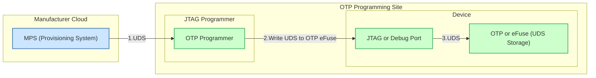

# Threat Model

## Assets and Desired Security Properties

| Asset                                  | Security Property         | Description |
|----------------------------------------|---------------------------|-------------|
| OpenPRoT Firmware                      | Integrity, Authenticity, Non-Repudiation | Ensure firmware is unmodified, from a trusted source, and the origin cannot de denied.|
| Cryptographic Operations               | Integrity, Authorization  | Ensure operations are performed as intended, only by authorized entities. |
| Cryptographic Configuration            | Integrity, Authorization, Auditability | Ensure cryptographic configurations (key size, algorithms, key lifetime, POST) are secure, unaltered, auditable, and only modifiable by authorized entities. |
| Anti-Rollback Counters                 | Integrity                 | Prevent manipulation of monotonic counter to protect against rollback/replay attacks. |
| Symmetric Keys managed by OpenPRoT     | Integrity, Confidentiality| Protect key material from unauthorized modification or disclosure. |
| Private Asymmetric Keys                | Integrity, Confidentiality| Prevent unauthorized modification or exposure to unauthorized parties. |
| Keys Lifecycle                         | Integrity, Availability   | Ensure that authorized users and processes can perform generation, storage, distribution/provisioning, rotation, and destruction. |
| Boot Measurements                      | Integrity, Availability   | Guarantee measurements are available on-demand, accurately reflect the boot state, and are unaltered. |
| Firmware Update Payloads               | Integrity, Authenticity, Non-Repudiation | Ensure updates are untampered, originate from valid sources, and the origin cannot be denied. |
| OpenPRoT Policies                      | Integrity, Authenticity, Auditability | Ensure policy settings are unaltered, published by trusted authorities, and changes are recorded for accountability. |

## Attacker Profile

The attack profile definition is based on the [JIL](https://www.sogis.eu/documents/mra/JIL-AC-Interpretation-v1.0.pdf) Application of Attack
Potential to Smartcards and Similar Devices [Specification](https://www.sogis.eu/documents/cc/domains/sc/JIL-Application-of-Attack-Potential-to-Smartcards-v3.2.1.pdf) version 3.2.1.

-   **Type of access**: Physical, Remote
-   **Attacker Proficiency Levels**: Expert, Proficient, Laymen
-   **Knowledge of the TOE**: Public (Open source), Critical for signing keys
-   **Equipment**: None, Standard, Specialized, Bespoke

### Attacks within Scope

Following attacks are considered to be in scope. A detailed breakdown of these attacks can be found in [JIL specification](https://www.sogis.eu/documents/cc/domains/sc/JIL-Application-of-Attack-Potential-to-Smartcards-v3.2.1.pdf).

-   **Physical attacks**: Tampering with hardware, invasive probing, or extraction of secrets through physical access.
-   **Perturbation attacks**: Inducing faults (e.g., voltage glitching, clock manipulation, etc.) to alter device behavior.
-   **Side-channel attacks**: Leveraging information leakage through side-channels (e.g., timing, power, EM emission, acoustic, etc.) to infer sensitive data.
-   **Exploitation of debug/test features**: Abusing test interfaces or leftover debug functionalities to bypass security.
-   **Attacks on RNG**: Weakening or exploiting the random number generator to predict or manipulate cryptographic operations like key generation, nonce generation, etc.
-   **Software attacks**: Exploiting firmware vulnerabilities, code injection, privilege escalation, or misuse of exposed APIs/ABIs.
-   **Application isolation failures**: Attacks aiming to bypass isolation boundaries and access other application privileges, resources, or secrets.
-   **Supply chain attacks**: Compromising firmware, hardware component, or provisioning process prior to or during deployment.
-   **Insider threat**: Malicious actions by individuals with legitimate access during development or deployment.

## Threat Modeling

To provide a transparent view of the security posture for a given OpenPRoT +
hardware implementation, integrators are required to perform a threat modeling
analysis. This analysis must evaluate the specific implementation against the
assets and attacker profile defined in this document.

The results of this analysis must be documented in table format, with the
following columns:

-   **Threat ID**: Unique identifier which can be referenced in documentation and
    security audits
-   **Threat Description**: Definition of the attack profile and potential attack.
-   **Target Assets**: List of impacted assets
-   **Mitigation(s)**: List of countermeasures implemented in hardware and/or
    software to mitigate the potential attack
-   **Verification**: Results of verification plan used to gain confidence in the
    mitigation strategy.

Integrators should use the JIL specification as a guideline to identify relevant
attacks and must detail the specific mitigation strategies implemented in their
design. The table must be populated for the target hardware implementation to
allow for a comprehensive security review.

### Threat Modeling Example
In this section, we will provide an example threat modeling of TCG DICE Unique Device Secret (UDS) provisioing flow.

#### Data Flow Diagram of UDS Provisioning

#### Example Threat Modeling Table as Per this Specification
| Threat ID | Threat Description | Target Assets | Mitigation(s) | Verification |
|-----------|-------------------|---------------|---------------|--------------|
| T1 | Interception or eavesdropping of UDS during transfer from MPS to OTP Programmer | UDS | Use secure communication channel (e.g., encrypted link, physical air-gapping), access control on programming environment | Test TLS implementation using tools like testssl.sh, review of communication logs, physical inspection, periodic security audits |
| T2 | Unauthorized modification or injection of malicious UDS value by or in OTP Programmer | UDS, Device OTP/eFuse | Programmer authentication, integrity/authenticity checks of received UDS by programmer, tamper-evident hardware, logging of operations | Security test of OTP Programmer, code/firmware reviews, tamper audit logs |
| T3 | Interception or snooping of UDS on debug/JTAG lines during programming | UDS | Shielded cables, restricted physical access, operation in secure/tested facilities, session monitoring | Physical inspection, penetration testing of facility, cable audits |
| T4 | Replay or multiple programming of UDS to OTP/eFuse (e.g., cloning) | Device OTP/eFuse | Programmer software to verify the uniqueness of OTP being programmed, Hardware-enforced one-time programming (OTP) logic, anti-replay mechanism in OTP Programmer, fuse-status verification | Functional test of OTP lock, review of programming logs, destructive inspection (sampled units) |
| T5 | Extraction of UDS from JTAG/debug after programming is completed | UDS | Automatically and irreversibly disable/latch debug/JTAG after provisioning; fuse or burn-off control signals | Inspection of fuse/disabling mechanism, attempt post-provisioning access tests |
| T6 | Insider threat at OTP provisioning site (e.g., extraction or misuse of UDS) | UDS | Fully automated so that there is no human in the loop accessing the UDS, strict role-based access, continuous logging and monitoring, video surveillance | Audit of access policies and logs, red team exercises, review of monitoring records |
| T7 | Physical tampering or side-channel attacks during UDS programming | UDS | Tamper-detection hardware, timing/power balancing, secure facility design, minimal exposure time | Physical security reviews, side-channel analysis, facility audits |
