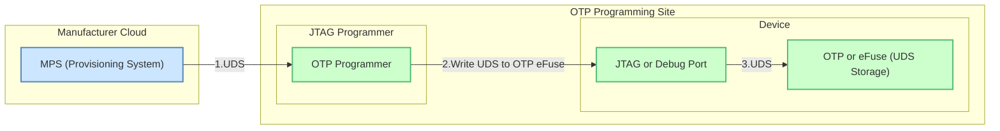

# Threat Model

## Assets and Desired Security Properties
There are multiple broad class of assets that a PRoT must maintain to provide as a RoT for the platform. The following subsection go through all those classes of assets and desired security properties.

### Startup and Boot Chain

| Asset                                           | Desired Security Property | Description                                                                                                                   |
| ----------------------------------------------- | ------------------------- | ----------------------------------------------------------------------------------------------------------------------------- |
| **Immutable PRoT ROM / First Stage Bootloader** | **Integrity**             | Must be unmodifiable once provisioned (ROM or OTP-locked). Acts as the immutable anchor of trust for all subsequent firmware. |
|                                                 | **Authenticity**          | Code and data verified by embedded root key before execution.                                                  |
|                                                 | **Availability**          | Must always execute after power-on to enable recovery; protected from fault-injection-induced bypass.                         |
| **Boot Measurement Logic / PCR Extension**      | **Integrity**             | Accurately measures each stage of firmware and configuration.                                                                 |
|                                                 | **Freshness**             | Measurements include nonces to prevent replay.                                                                                |
|                                                 | **Availability**          | Stored measurements remain retrievable for attestation even after reboot.                                                     |
| **Secure Boot Configuration / Policy**          | **Integrity**             | Defines allowed images, signing keys, rollback counters, and update policies.                                                 |
|                                                 | **Authorization**         | Only authorized entities may update or disable secure-boot policy.                                                            |
|                                                 | **Auditability**          | All configuration changes are logged and signed for accountability.                                                           |

### PRoT Firmware and Firmware Update Service

| Asset                                      | Desired Security Property | Description                                                                         |
| ------------------------------------------ | ------------------------- | ----------------------------------------------------------------------------------- |
| **OpenPRoT Firmware and Trusted Services** | **Integrity**             | PRoT firmware verified before execution via digital signature.                      |
|                                            | **Authenticity**          | Firmware origin must trace to trusted build pipeline with signing authority.        |
|                                            | **Non-repudiation**       | Firmware image and signer identity provable post-deployment.                        |
| **Firmware Update Payloads**               | **Integrity**             | Update images protected by signature and hash verification.                         |
|                                            | **Authenticity**          | Only accepted if signed by authorized vendor key and passes anti-rollback checks.   |
|                                            | **Availability**          | Recovery images remain accessible even if normal update path is corrupted.          |
| **Recovery Agent & Golden Images**         | **Integrity**             | Immutable fallback images verified before activation.                               |
|                                            | **Authenticity**          | Distributed via authenticated recovery channel.                                     |
|                                            | **Availability**          | Always present in protected storage to ensure recover function per NIST SP 800-193. |
| **Reference Integrity Manifests (RIMs)**   | **Integrity**             | Baseline measurement set for comparison during detect phase.                        |
|                                            | **Authenticity**          | Signed by platform manufacturer or authorized root.                                 |
|                                            | **Availability**          | Retained securely for on-demand attestation.                                        |
| **Attestation Evidence & Event Logs**      | **Integrity**             | Logs protected against modification; include cryptographic hash chains or digital signature.             |
|                                            | **Freshness**             | Timestamped and bound to device identity and nonces.                                |
|                                            | **Auditability**          | Signed, exportable records for incident forensics.                                  |

### Cryptographic Materials and Operations

| Asset                                                 | Desired Security Property | Description                                                           |
| ----------------------------------------------------- | ------------------------- | --------------------------------------------------------------------- |
| **Symmetric Keys (Managed by PRoT)**                  | **Integrity**             | Keys never altered without authorization. |
|                                                       | **Confidentiality**       | Stored in hardware-isolated memory, wrapped by KEK or PUF that is tied to the hardware. |
| **Private Asymmetric Keys**                           | **Integrity**             | Protected from unauthorized generation, replacement, or modification. |
|                                                       | **Confidentiality**       | Never exported in plaintext; destroyed on tamper event.               |
| **Keys Lifecycle (Gen/Storage/Rotation/Destruction)** | **Integrity**             | Lifecycle events enforced by policy and logged.                       |
|                                                       | **Availability**          | Authorized entities can access keys when operationally required.      |
|                                                       | **Auditability**          | All key operations recorded for non-repudiation.                      |
| **Cryptographic Operations (Encrypt/Sign/Verify)**    | **Integrity**             | Operations follow approved algorithms and parameters only.            |
|                                                       | **Authorization**         | Executed solely by authenticated firmware components.                 |
|                                                       | **Availability**          | Crypto services continue in degraded mode under resource constraints. |
| **Entropy Source and DRBG State**                     | **Integrity**             | POST and continuous tests detect faults or bias.                      |
|                                                       | **Availability**          | Entropy accessible when required for keygen / protocols.              |
|                                                       | **Auditability**          | Failures logged per FIPS 140 requirements.                            |

### Configuration, Policy, and LIfecycle Control

| Asset                                                 | Desired Security Property | Description                                                                     |
| ----------------------------------------------------- | ------------------------- | ------------------------------------------------------------------------------- |
| **OpenPRoT Policies & Security Configuration**        | **Integrity**             | Define and protect global security posture of the platform.                     |
|                                                       | **Authenticity**          | Signed by authorized policy issuer; verified by PRoT.                           |
|                                                       | **Auditability**          | Changes are versioned, logged, and timestamped.                                 |
| **Lifecycle State Machine & Debug /Test Controls**    | **Integrity**             | Prevent illegal transitions or downgrade to insecure state.                     |
|                                                       | **Authorization**         | Only authenticated manufacturing or RMA authorities may modify lifecycle fuses. |
|                                                       | **Auditability**          | State changes recorded to event log.                                            |
| **Anti-Rollback Counters and Secure Timebase**        | **Integrity**             | Monotonic and tamper-resistant to prevent firmware replay.                      |
|                                                       | **Freshness**             | Counters bound to secure clock; not rewritable.                                 |
| **Platform Trust Anchors (CA Certs, Pins, CRL/OCSP)** | **Integrity**             | Trust store validated at boot and update.                                       |
|                                                       | **Authenticity**          | Provisioned from verified supply-chain source.                                  |
|                                                       | **Availability**          | Revocation and renewal processes ensured through redundant copies.              |

### Communication and External Interface

| Asset                                            | Desired Security Property | Description                                                                     |
| ------------------------------------------------ | ------------------------- | ------------------------------------------------------------------------------- |
| **Secure Communications (PRoT ↔ Host ↔ Remote)** | **Confidentiality**       | Channels (e.g., TLS/SPDM) provide encryption for command and update traffic.    |
|                                                  | **Integrity**             | Messages protected against tampering and replay.                                |
|                                                  | **Mutual Authentication** | Both peers verified before data exchange.                                       |
| **Component Inventory and Scope of Control**     | **Integrity**             | PRoT maintains signed inventory of all managed components (UEFI, BMC, devices). |
|                                                  | **Completeness**          | Ensures no unmanaged firmware escapes protect/detect/recover.                   |
|                                                  | **Availability**          | Inventory accessible to attestation and incident-response tooling.              |

### Physical and Environmental Protections

| Asset                                             | Desired Security Property | Description                                                        |
| ------------------------------------------------- | ------------------------- | ------------------------------------------------------------------ |
| **Tamper Sensors and Active Mesh**                | **Integrity**             | Detect invasive probing, package opening, or voltage/clock glitch. |
|                                                   | **Availability**          | On tamper, trigger key zeroization or lockdown mode.               |
| **Environmental Monitors (Voltage, Temp, Clock)** | **Integrity**             | Guard against fault-injection; ensure stable operating envelope.   |
|                                                   | **Auditability**          | Sensor events logged with timestamps for forensic analysis.        |

## Protect-Detect-Recover Mapping (NIST SP 800-193 Alignment)
The above lists of asset is inspired by NIST SP 800-193 Platform Firmware Resiliency which has these three broad classification of assets during various stage of PRoT operation.

| Phase       | Primary Assets Involved                                               | Objective                                                                           |
| ----------- | --------------------------------------------------------------------- | ----------------------------------------------------------------------------------- |
| **Protect** | Immutable ROM, Crypto Keys, Policies, Lifecycle Fuses, Tamper Sensors | Prevent unauthorized modification or disclosure of platform firmware and data.      |
| **Detect**  | Boot Measurements, RIMs, Logs, Counters                               | Identify and record deviations from expected state or unauthorized access.          |
| **Recover** | Recovery Agent, Golden Images, Secure Comms Channel                   | Restore the platform to a trusted state using authenticated and verified resources. |

| Asset                                  | Security Property         | Description |
|----------------------------------------|---------------------------|-------------|
| OpenPRoT Firmware                      | Integrity, Authenticity, Non-Repudiation | Ensure firmware is unmodified, from a trusted source, and the origin cannot de denied.|
| Cryptographic Operations               | Integrity, Authorization  | Ensure operations are performed as intended, only by authorized entities. |
| Cryptographic Configuration            | Integrity, Authorization, Auditability | Ensure cryptographic configurations (key size, algorithms, key lifetime, POST) are secure, unaltered, auditable, and only modifiable by authorized entities. |
| Anti-Rollback Counters                 | Integrity, Freshness | Prevent manipulation of monotonic counter to protect against rollback/replay attacks. |
| Symmetric Keys managed by OpenPRoT     | Integrity, Confidentiality| Protect key material from unauthorized modification or disclosure. |
| Private Asymmetric Keys                | Integrity, Confidentiality| Prevent unauthorized modification or exposure to unauthorized parties. |
| Keys Lifecycle                         | Confidentiality, Integrity, Availability   | Ensure that private key's confidentiality is preserved and only authorized users and processes can perform generation, storage, distribution/provisioning, rotation, and destruction. |
| Boot Measurements                      | Integrity, Availability   | Guarantee measurements are available on-demand, accurately reflect the boot state, and are unaltered. |
| Firmware Update Payloads               | Integrity, Authenticity, Authorization, Availability, Non-Repudiation | Ensure updates happens on regular basis by an authorized entity with update that is untampered, originated from valid sources, and the origin cannot be denied. |
| OpenPRoT Policies                      | Integrity, Authenticity, Auditability | Ensure policy settings are unaltered, published by trusted authorities, and changes are recorded for accountability. |

## Attacker Profile

The attack profile definition is based on the [JIL](https://www.sogis.eu/documents/mra/JIL-AC-Interpretation-v1.0.pdf) Application of Attack
Potential to Smartcards and Similar Devices [Specification](https://www.sogis.eu/documents/cc/domains/sc/JIL-Application-of-Attack-Potential-to-Smartcards-v3.2.1.pdf) version 3.2.1.

-   **Type of Access**: Physical, Remote - attacks may originate from software on the host platform or from direct hardware access.
-   **Attacker Proficiency Levels**: Expert, Proficient, Laymen - represents skill, resources, and familiarity with hardware fault-injection and micro-probing techniques.
-   **Knowledge of the TOE**: Public (Open source), Critical for signing keys - includes awareness of the PRoT architecture, crypto primitives, and update workflow.
-   **Equipment**: None, Standard, Specialized, Bespoke - ranges from common lab instruments to custom fault-injection benches, EM probes, and focused-ion-beam (FIB) setups.
-   **Attack Time**: Hours, Days, Weeks, Months - as defined by JIL scoring for elapsed time.

### Mapping the Attacker Profile to Threat Actor
The attacker profile gives an elaborate description on what attacker capabilities are. However, it does not give name to attacker. This table will provide name of attacker and their profile.

| Adversary Type | Access | Proficiency (JIL) | Equipment | Knowledge | Example Attacks | Typical Mitigations |
|----------------|---------|------------------|------------|------------|-----------------|---------------------|
| Simple Hardware | Physical | Layman/Proficient | Standard tools | Public | Flash reflashing, jumper bypass | SPI lock, tamper seal, secure boot |
| Skilled Hardware | Physical (Invasive) | Expert | Specialized/Bespoke | Detailed | EMFI, micro-probing, side-channel | Active mesh, FI sensors, key zeroization |
| Startup Code | Logical (Firmware) | Proficient/Expert | Standard/Specialized | Public/Critical | Secure boot bypass, rollback | Signature check, monotonic counters |
| Secure/Management Mode | Logical | Expert | Standard/Specialized | Detailed | Abuses privileged runtime to subvert PRoT or its measurements. | Access control, interface hardening, architectural isolation, measured/verified launch of secure-mode firmware, etc |
| Network | Remote | Layman/Proficient | Standard | Public | Replay, MITM, downgrade | mTLS/SPDM, nonce-based attestation |
| Insider | Physical/Logical | Expert | Specialized | Privileged | Key misuse, malicious signing | Dual control, audit, separation of duties |
| FPGA-Specific Bitstream | Logical/Physical | Proficient to Expert | Standard/Specialized | Critical | Malicious/altered bitstream, partial reconfiguration abuse, config-mem tamper, JTAG over FPGA fabric, etc. | Bitstream authentication and encryption, partial reconfiguration isolation, configuration memory protection, JTAG and Debug Lockdown, secure bitstream distribution, supply-chain security and build integrity, etc. |
| Unprivileged Software | Logical (host OS/app) | Proficient | Standard | Public | Userland code attempting PRoT API/ABI abuse/escalation. | Access control |
| Cloud Service | Remote (Service side) | Proficient to Expert | Standard | Public/Critical | Compromised provisioning/update/attestation backend. | TLS, SPDM, access control, authorization, security hardening, etc |

### Attacks within Scope

Following attacks are considered to be in scope. A detailed breakdown of these attacks can be found in [JIL specification](https://www.sogis.eu/documents/cc/domains/sc/JIL-Application-of-Attack-Potential-to-Smartcards-v3.2.1.pdf).

-   **Physical attacks**: Invasive probing, package de-capping, backside imaging, micro-probing to extract secrets through physical access.
-   **Perturbation (Fault Injection) attacks**: Inducing faults (e.g., voltage glitching, clock manipulation, laser/EM faults, etc.) to alter device behavior like instruction skipping or bypass signature checks.
-   **Side-channel attacks**: Leveraging information leakage through side-channels (e.g., timing, power, EM emission, acoustic, etc.) to infer sensitive data.
-   **Exploitation of debug/test features**: Abusing manufacturing or maintenance interfaces or leftover debug functionalities (e.g., JTAG, UART, RMA ports) to bypass security.
-   **Attacks on RNG**: Weakening or exploiting the random number generator to predict or manipulate cryptographic operations like key generation, nonce generation, or protocols.
-   **Software attacks**: Exploiting firmware vulnerabilities, code injection, privilege escalation, or misuse of exposed APIs/ABIs.
-   **Application isolation failures**: Attacks aiming to bypass isolation boundaries and access other application privileges, resources, or secrets.
-   **Supply chain attacks**: Compromising firmware, hardware component, or provisioning process prior to or during deployment.
-   **Insider threat**: Malicious actions by authorized individuals during development or deployment.

## Threat Modeling

To provide a transparent view of the security posture for a given OpenPRoT +
hardware implementation, integrators are required to perform a threat modeling
analysis. This analysis must evaluate the specific implementation against the
assets and attacker profile defined in this document.

The results of this analysis must be documented in table format, with the
following columns:

-   **Threat ID**: Unique identifier which can be referenced in documentation and security audits
- **Threat Actor**: An adversary from ### Mapping the Attacker Profile to Threat Actor table (reference)
-   **Threat Description**: Definition of the attack profile and potential attack.
-   **Target Assets**: List of impacted assets
-   **Mitigation(s)**: List of countermeasures implemented in hardware and/or software to mitigate the potential attack
-   **Verification**: Results of verification plan used to gain confidence in the mitigation strategy.

Integrators should use the JIL specification as a guideline to identify relevant attacks and must detail the specific mitigation strategies implemented in their design. The table must be populated for the target hardware implementation to allow for a comprehensive security review.

### Threat Modeling Example
In this section, we will provide an example threat modeling of TCG DICE Unique Device Secret (UDS) provisioing flow.

#### Data Flow Diagram of UDS Provisioning

#### Example Threat Modeling Table as Per this Specification

| Threat ID  | Threat Actor | Attack Surface / Vector | Threat Description | Target Assets | Mitigation(s) | Verification / Evidence |
| ---------- | -------------|------------------------ | -------------------|---------------|---------------|-------------------------|
| TM-UDS-001 | Network | MPS ↔ Programmer link | Eavesdrop/steal UDS in transit. | Symmetric/Private Keys (UDS), Secure Comms, Trust Anchors | mTLS with client auth; pinned CA; HSM-backed key on MPS; rate-limit + short-lived session tokens. | TLS config audit; packet capture review; HSM attestation; pen-test. |
| TM-UDS-002 | Insider | Programmer console / admin APIs | Admin modifies UDS value or exports copies. | UDS, Keys Lifecycle, Policies & Config | Dual-control (4-eyes), RBAC least-privilege, immutable audit logs, per-unit UDS wrap & escrow ban. | Access-log review; role mapping; red-team simulation; log integrity (hash-chain) checks. |
| TM-UDS-003 | Simple HW | JTAG/SWD during provisioning | Sniff UDS over debug wires. | UDS, Phys. Protections, Secure Comms | Shielded fixtures; session encryption on debug link; facility controls; session kill-switch; no echo of UDS on TDO. | Physical audit; line-scope capture attempts; fixture inspection. |
| TM-UDS-004 | Skilled HW | Fault injection during OTP write | Glitch write to skip lock-bit set or write alternate UDS. | Anti-Rollback Counters, Lifecycle/Debug, OTP | FI sensors; write-verify-lock with redundancy; sticky fault latches → lockdown; retry with randomized timing. | EMFI lab test; coverage report for write/verify sequence; sensor trip logs. |
| TM-UDS-005 | Startup Code | Early-boot UDS readback path | Read UDS post-provisioning via diagnostic or test path. | Private Keys (UDS), Policies & Config | One-way ingest of UDS → derivation; zeroize raw UDS; permanently disable debug APIs; W^X + MPU/MMU guards. | Code review; static analysis; post-provisioning readout attempts. |
| TM-UDS-006 | Supply-Chain | Pre-stage UDS files / build pipeline | Replace UDS file set or inject duplicates (cloning). | Keys Lifecycle, Trust Anchors, RIMs | Signed UDS manifests; per-device KDF w/ device-unique salt; reproducible builds; artifact attestation (SLSA-style). | Build attestation; manifest signature checks; clone detection in field. |
| TM-UDS-007 | Cloud Service | MPS service | Compromise MPS to exfiltrate UDS or issue rogue sessions. | Trust Anchors, Policies, Logs | HSM for UDS handling; PAM/MFA; network segmentation; anomaly detection; hot-patch & key rotation runbooks. | SOC reports; HSM attestation; tabletop exercises; rotation drill logs. |
| TM-UDS-008 | Unprivileged SW | Host utility calling programmer | Abuse programmer API to request UDS echo/backups. | APIs/ABIs, Logs, Policies | Capability-scoped APIs; deny “read UDS”; signed tools; device-local rate limits; per-job allow-lists. | API tests; code signing verification; fuzzing results. |
| TM-UDS-009 | Secure-Mode | SMM/EL3 hooks on target | Privileged runtime dumps secrets before debug fuse blows. | Lifecycle/Debug, Private Keys | Provision in sealed “factory mode,” then atomically burn fuses and zeroize secrets before leaving jig; attest life-cycle. | Lifecycle attest; sampling teardown; fuse state audit. |
| TM-UDS-010 | FPGA Bitstream *(if PRoT=FPGA)* | Bitstream loader / PR | Malicious PR region snoops JTAG or UDS derivation bus. | FPGA Config, Attestation Evidence, Keys | Bitstream authentication + encryption; PR isolation (fences); no UDS on fabric; key usage only in hardened block. | Bitstream signing checks; floorplan review; on-silicon isolation tests. |
