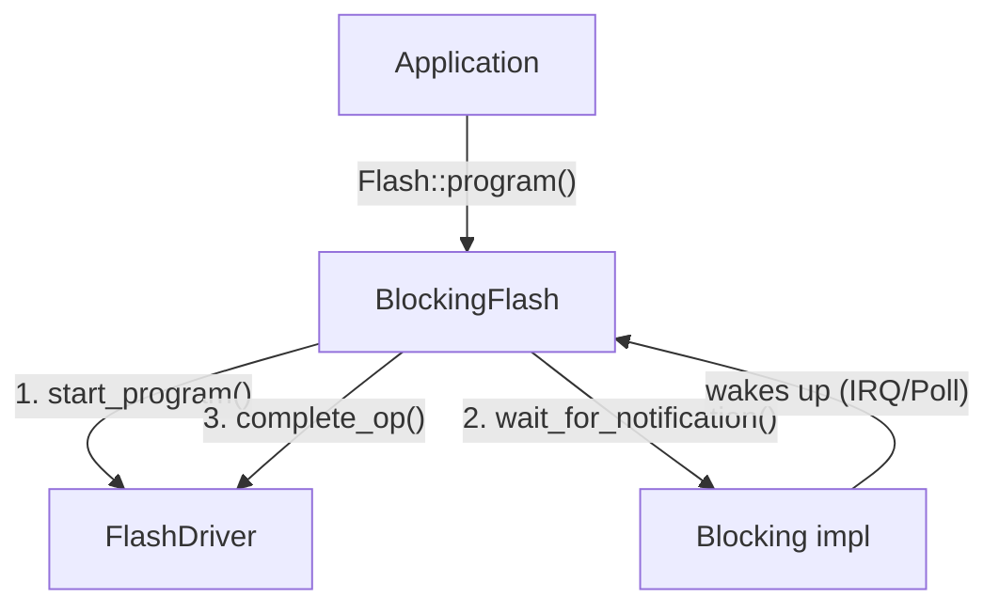

# Blocking Flash HAL

This HAL provides abstractions for interacting with flash memory. It defines traits for low-level drivers and high-level synchronous interfaces, along with a helper implementation to bridge them.

## Key Abstractions

### `FlashAddress`

A transparent wrapper around a 32-bit offset (`u32`) representing a location in flash memory. It supports basic arithmetic operations (`Add`, `AddAssign`, `BitAnd`, `BitAndAssign`) to facilitate address calculations.

Platform-specific extension traits (like `EarlgreyFlashAddress` in `earlgrey_util`) may use the offset bits to encode additional information (e.g., distinguishing between DATA and INFO partitions using the MSB).

### `FlashDriver` Trait

Defines the low-level interface for flash hardware. It is designed to support both synchronous and asynchronous hardware controllers using a start-poll-complete execution model for erase and program operations:

1.  **Start**: Initiated via `start_erase` or `start_program`.
2.  **Poll**: Check completion status via `is_busy`, or wait for a hardware interrupt.
3.  **Complete**: Finalize the operation and retrieve any execution errors via `complete_op`.

Read operations (`read`) are synchronous for simplicity.

Drivers also define hardware-specific constraints as constants:
*   `ERASABLE_SIZES_BITMAP`: A bitmap where bit `i` is set if erasing blocks of size `2^i` is supported.
*   `PROGRAM_WINDOW_SIZE`: The maximum size of a single write, and the boundary alignment constraint for writes.
*   `MAX_READ_SIZE`: The maximum size of a single read.
*   `READ_ALIGNMENT` / `PROGRAM_ALIGNMENT`: Address and size alignment requirements.

### `Flash` Trait

Provides a simplified, synchronous, blocking interface suitable for application use. It abstracts away the low-level start-poll-complete flow and hardware constraints (alignment, windows).

### `BlockingFlash`

A concrete implementation of the `Flash` trait that wraps a `FlashDriver` and a `Blocking` mechanism. It implements the blocking behavior and handles driver constraints automatically:

#### Read Alignment Handling

If a read request is not aligned to `TDriver::READ_ALIGNMENT`, `BlockingFlash::read` will:
1.  Read the aligned block containing the unaligned start address into a temporary buffer.
2.  Copy the requested bytes from the temporary buffer.
3.  Read the remaining data in aligned chunks directly into the destination buffer.

#### Program Window Handling

Hardware flash controllers often cannot program data that crosses a write window boundary (typically 64 bytes). `BlockingFlash::program` automatically detects these boundaries and splits a large or unaligned write into multiple smaller writes that fit within the program windows.
