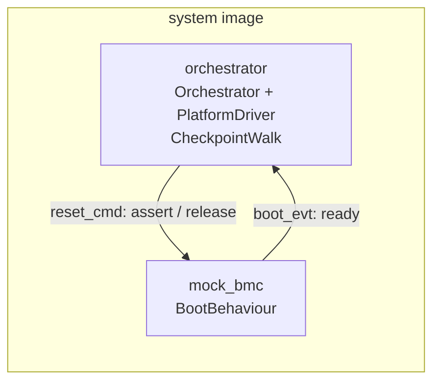
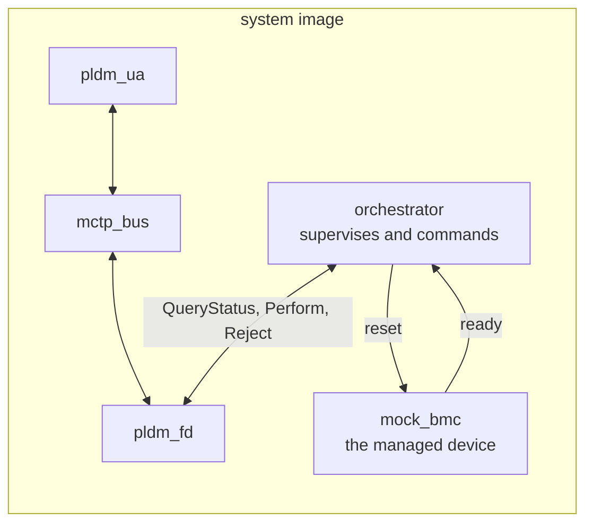
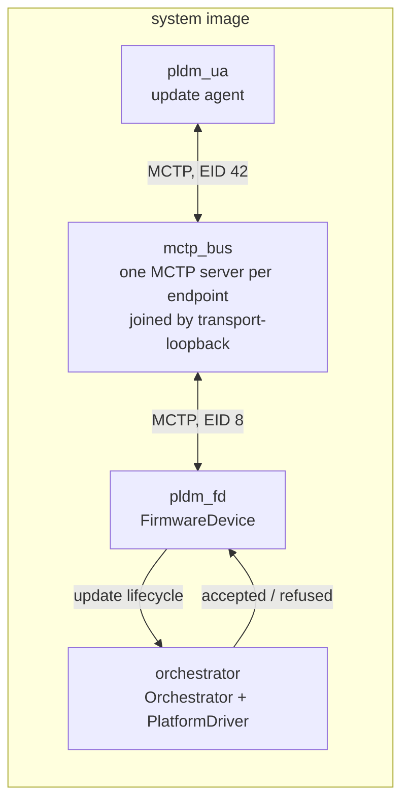
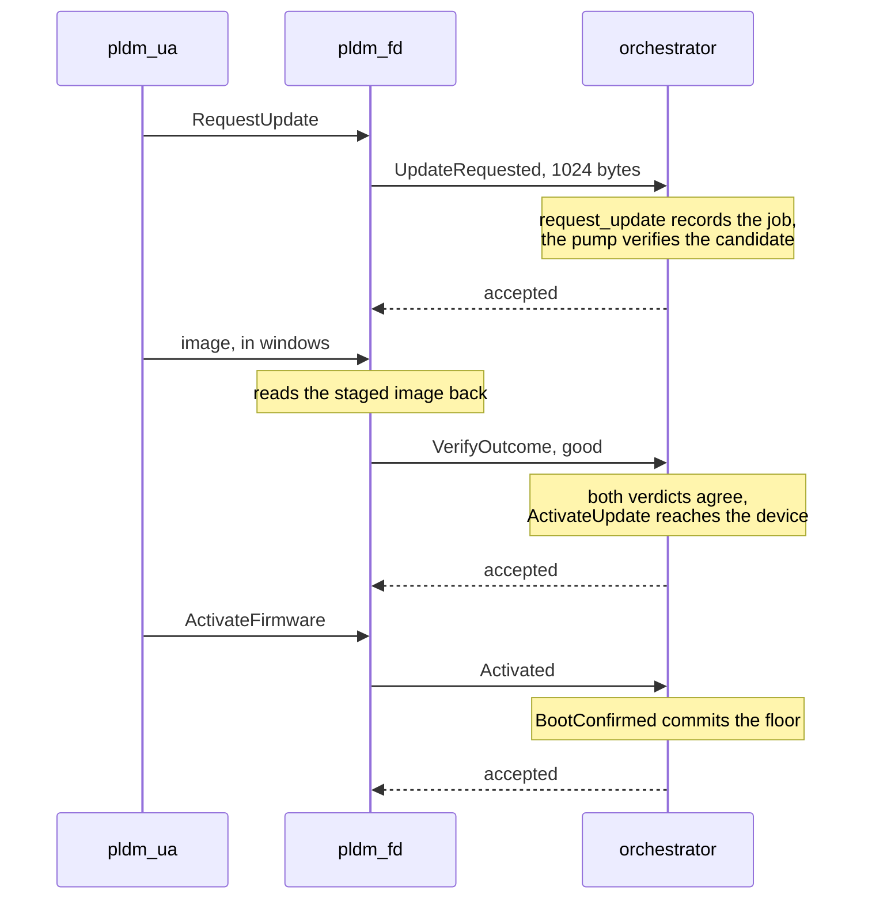

# QEMU integration tests

Eleven scenarios, each its own system image, all running under QEMU with no
hardware. The AST1030 is the black box; everything it talks to is another
app in the same image, reached through the same traits a real board wires.

The runner greps one pass/fail sentinel per run, so one scenario per image
is what lets a failure name itself.

Three of the eleven are the thing working. Seven are the thing
failing, and they pass when the failure is caught. The eleventh is the
agent withdrawing the update, which is neither: nothing failed and
nothing was installed. A scenario that only
ever passes proves nothing: the first version of the boot scenario passed
with the device wedged, because it asserted the wrong thing. Each negative
also names the failure it arranged, so a run that died of something else
fails rather than looking like the proof.

| Scenario | What it arranges | Passes when |
| --- | --- | --- |
| `mock_bmc` | the device boots | the walk completes |
| `mock_bmc/device_hangs` | the device never reports | the platform locks |
| `pldm_update` | a clean update | the update commits |
| `pldm_update/corrupt_image` | one byte of the image is flipped | the device catches it |
| `pldm_update/refused_update` | the RoT refuses the request | nothing is activated |
| `pldm_update/transfer_error` | the agent errors on one data request | the device aborts the transfer |
| `pldm_update/cancel_mid_transfer` | the agent withdraws two chunks in | the machine drops the update and the device is acknowledged |
| `pldm_update/offer_before_supervising` | the offer arrives before the RoT supervises anything | the RoT refuses it as busy |
| `full_update` | boot, update, reboot in one image | the device boots the image it was given |
| `full_update/device_hangs` | the device never comes up | no update is ever offered |
| `full_update/device_stays_down` | the device takes the update, then stays down | the RoT notices it never came back |

A negative scenario is a package of its own, built from the same sources
and the same system config with one `--cfg` added. `scenario.bzl` holds
the rules every scenario needs and `SCENARIO_CFGS` lists every flag, so
adding one is a BUILD file and a `#[cfg]`, not a copy of the image.

## Running them

    bazel test --config=virt_ast10x0 //target/ast10x0/tests/integration/...

One scenario at a time, with the console:

    bazel test --config=virt_ast10x0 --test_output=all \
        //target/ast10x0/tests/integration/mock_bmc:mock_bmc_qemu_test

    bazel test --config=virt_ast10x0 --test_output=all \
        //target/ast10x0/tests/integration/pldm_update:pldm_update_qemu_test

The negatives, same shape:

    //target/ast10x0/tests/integration/mock_bmc/device_hangs:device_hangs_qemu_test
    //target/ast10x0/tests/integration/pldm_update/corrupt_image:corrupt_image_qemu_test
    //target/ast10x0/tests/integration/pldm_update/refused_update:refused_update_qemu_test
    //target/ast10x0/tests/integration/pldm_update/transfer_error:transfer_error_qemu_test
    //target/ast10x0/tests/integration/pldm_update/cancel_mid_transfer:cancel_mid_transfer_qemu_test
    //target/ast10x0/tests/integration/pldm_update/offer_before_supervising:offer_before_supervising_qemu_test
    //target/ast10x0/tests/integration/full_update/device_hangs:device_hangs_qemu_test
    //target/ast10x0/tests/integration/full_update/device_stays_down:device_stays_down_qemu_test

Bazel caches a passing test, so add `--nocache_test_results` when you want
the run to actually happen. Checking for a flake:

    for i in $(seq 1 20); do
        bazel test --config=virt_ast10x0 --test_output=summary \
            --nocache_test_results \
            //target/ast10x0/tests/integration/... 2>&1 | grep 'tests pass'
    done

Each image also has a `no_panics_test`, which fails if any panic path
survives into the binary. It builds for the host and needs no QEMU.

## The boot scenario

`mock_bmc/` watches a managed device through a boot. The orchestrator app
runs the shipped state machine and platform driver; what the test supplies
is the board.

The two lines are IPC channels, not GPIO. Reset and ready are board traces
between two chips, QEMU models one chip, and the mock BMC is a process
inside it, so even a working GPIO block would connect to nothing. The
adapters in `board/src/bmc.rs` are swapped out at the trait seam rather
than exercised; the pin wiring is what the hardware tests are for.

Evidence arrives as a request on `boot_evt` and is latched in a static,
because `EvidenceReader::read` is synchronous and may not block. Both
directions of the reset line clear the latch, so a report from an earlier
attempt cannot satisfy the next walk.

Reaching `Ready` is not the pass condition. A passive component is
released speculatively, so the machine is `Ready` as soon as the last
component verifies, whether or not the device ever came up. The walk's own
verdict is what proves the boot.

`device_hangs` is the same image with the device set to never report. The
window closes, the walk names the checkpoint, recovery has no source and
the platform locks, which is what that scenario passes on:

    [ERR] device failed at checkpoint ready
    [INF] report: component 0 failed at ready
    [INF] report: component 0 out of recovery sources
    [INF] the device never came up and the platform locked
    TEST_RESULT:PASS

## The full update scenario

`full_update/` is the other two joined: five apps, one image, the agent and
the firmware device and the bus from `pldm_update`, the managed device from
`mock_bmc`, and a RoT that does both jobs.

The claim is an ordering, which is the one thing the other scenarios cannot
test apart: the device boots under supervision, an update arrives, the RoT
accepts it, the device stages and verifies it, the RoT activates it, the
device is reset into the new image, it reports ready a second time, and only
then does the floor commit.

    [INF] ORCH: the device reported ready, first boot
    [INF] ORCH: update accepted, 1024 bytes
    [INF] ORCH: both verdicts agree, activating
    [INF] ORCH: the device reported ready, second boot
    [INF] ORCH: update committed after the device booted it

The RoT declares this run rather than the firmware device, because the
device's own flow ends at activation and tells it nothing about the reset
that has to follow. The first version had the device declaring it, and the
run passed while the device never rebooted.

Two negatives, and the second is the one that matters.
`full_update/device_hangs` has the device never come up, so the first walk
fails and no update is ever offered: that says the supervision half is
live before the update half. `full_update/device_stays_down` lets the
update succeed and then keeps the device from coming back:

    [INF] ORCH: update accepted, 1024 bytes
    [INF] ORCH: both verdicts agree, activating
    [ERR] ORCH: the device failed at checkpoint ready
    [INF] ORCH: the device took the update and never came back
    TEST_RESULT:PASS

Every scenario that stops at activation passes that run. Only one that
waits for the device to boot what it was given can tell the difference,
which is the whole reason this scenario exists.

The RoT names which of the four outcomes it reached rather than returning
a bare failure, so a run that died somewhere else fails instead of looking
like the proof.

## The update scenario

`pldm_update/` runs a full DSP0267 update, update agent to firmware
device, with the RoT deciding whether it may go on.

PLDM reaches the wire the way it does on hardware: each endpoint is an
`IpcMctpClient` to an MCTP server. Only the bottom binding differs,
`transport-loopback` instead of `transport-i2c`, so EID routing,
fragmentation and reassembly are the shipped code.

The firmware device decides nothing. It reports what the update agent
asked for and what came of it, and the orchestrator says whether the
update may proceed:

The accepted `RequestUpdate` travels through an `FdEventSink`, so it is
sent while `run_terminus` is running rather than after it returns. That is
what lets the orchestrator be in `Updating` before the verdict arrives.
Verify and activation are reported from the `FdOps` calls that settle
them, because only those know the outcome.

The orchestrator is its own process rather than a core inside the firmware
device. The design has the RoT grant or refuse and the device obey, and
that means nothing when both are the same thread with the same state.

Two verdicts land on the same candidate. The device reads its staged image
back out of flash and checks it against the pattern the agent sent; the
RoT's own verifier reads the staging region and does the same. The update
goes through only when both say yes.

The device stages into real SPI NOR on chip select 1, at `0x10_0000`, not
into a RAM buffer. Both chip selects are attached, because with both
present the FMC aperture splits and CS1 moves to `0x88000000`, which is
the window the device maps. The kernel applies the FMC pinmux before any
process starts, so no app touches the SCU.

A third verdict comes from outside the guest. After QEMU exits, the runner
reads the CS1 backing file and compares it with the image the update was
supposed to write (`cs1_expect` and `cs1_expect_offset` on the test). Every
other check is the guest talking about its own memory; this one is the host
reading the device's flash, and it is the only one a confused guest cannot
talk its way past. Flipping a byte of the expected file gives:

    TEST_RESULT:PASS
    CS1 differs from the expected image at 0x10012c: got 0x31, want 0x30

with the test failing anyway, which is the point.

`corrupt_image` flips one byte of what the agent sends. The device catches
it at download, and the scenario passes on that rather than on the run
merely failing:

    [ERR] FD: byte 700 is wrong
    [INF] FD: the corrupt image was caught and the update refused
    TEST_RESULT:PASS

`refused_update` has the RoT refuse the request before looking at
anything. The update never reaches `Updating`, and the orchestrator
afterwards agrees to nothing else either:

    [ERR] ORCH: a verdict arrived with no update in flight
    [ERR] ORCH: a boot was reported for an update that never activated
    [INF] FD: the orchestrator withheld consent and the update did not happen
    TEST_RESULT:PASS

That second one also shows a gap rather than hiding it. The device
finishes the PLDM flow and activates, because a refusal is recorded and
not enforced yet.

## What is not proven yet

GAPS.md has the full list, including the arcs of the update state machine
with no scenario yet and the assertions that are looser than they look.
The short version:

Signature checking is stubbed until the crypto service exists, so all the
verifiers are content checks rather than signature checks. The driver's
`Updatable` stages nothing, because in DSP0267 the device pulls its own
chunks from the agent, so `activate` is the only side of that seam with a
real caller. And a refusal is recorded rather than enforced: the device
finishes the PLDM flow and fails the run at the end instead of answering
the agent with an error.

## Memory layout

Both images are tight. The AST1030 has 768 KB of SRAM and no XIP, so code
and data share it. Each `system.json5` carries its own map and the
reasoning. The rule both follow: an app's flash has to start at a multiple
of its own size. The pldm_update image runs four 64 KB apps from
`0x10000`; the mock_bmc image runs two 128 KB apps from `0x20000`.

That rule comes from the MPU. It protects memory in regions, and a region
has to be a power of two in size and start at a multiple of its size, so a
64 KB app has to start on a 64 KB boundary. The MPU also cuts each region
into eight subregions, which is how it covers a span that is not itself a
power of two.

So the apps cannot be packed end to end behind the kernel. Give the kernel
a round 64 KB and its flash runs to `0x10500`, past the vector table at the
bottom. An app placed there cannot have a region starting there, because
`0x10500` is not a multiple of 64 KB. The nearest legal start is `0x10000`,
and that region's last subregions then reach into the next app, so two apps
share subregions and neither is protected from the other. The sizes fit and
the addresses still do not.

That is why the kernel's flash is 64256 bytes rather than a round 64 KB:
`0x10000` minus the 1280-byte vector table, which puts the first app at
exactly `0x10000`. The mock_bmc image does the same thing one power of two
up, with 129792 bytes.

Getting a size wrong is quiet. The image still builds, and the only sign is
a PMSAv7 subregion overlap warning on the console, which means the
protection is wrong. Check for one after changing any size. A thread whose
stack is too small is quieter still: the app dies before its first log
line, with no panic and no warning.
