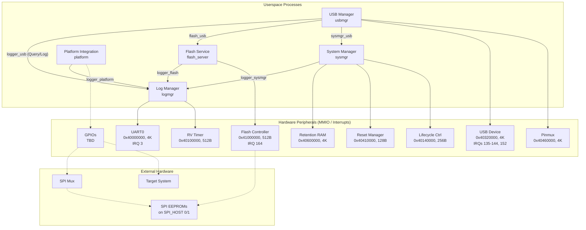

# Earlgrey Hardware Enablement (HWE) Firmware

This directory contains the source code and configuration for the Earlgrey Hardware Enablement (HWE) firmware. It is a multi-process application designed to run on the OpenTitan Earlgrey target, built on top of the Pigweed microkernel (`pw_kernel`) for OpenPRoT OTS Integrations.

The design assumes that the Earlgrey integration follows the Dual-Flash Side-by-Side hardware design guidance.

## Requirements

The primary role of the HWE firmware is to facilitate hardware development and low-level software development of the device in which Earlgrey is integrated. Its goal is to boot up and get out of the way of the target system.

Key requirements:
*   Configure Earlgrey GPIOs to control the side-by-side EEPROM multiplexer.
*   Configure Earlgrey GPIOs to ensure external EEPROMs are not write-protected or held in reset.
*   Configure Earlgrey GPIOs to avoid interfering with the platform reset (optional: manage reset sequencing for production hardware).
*   Facilitate updates of the Earlgrey firmware (in internal EFLASH or external SPI EEPROMs), ownership configuration, and target device firmware.

## File Structure

*   `BUILD.bazel`: Defines the Bazel build targets for the kernel, userspace processes, the combined system image, and tests.
*   `system.json5`: The system configuration file. Defines memory layout, processes, IPC channels, interrupts, and device memory mappings.
*   `target.rs`: The entry point for the kernel.
*   `sysmgr.rs`: The System Manager process.
*   `logmgr.rs`: The Log Manager process.
*   `usbmgr.rs`: The USB Manager process.
*   `platform.rs`: The Platform Integration process.
*   `flash_server.rs`: The Flash Service process.

## System Architecture

The HWE firmware runs as a single application `hwe` partitioned into five processes running on top of `pw_kernel`.

### Block Diagram



### Memory Layout Configuration

*   **Kernel**:
    *   Flash: `0xA0010000` (Size: 64 KiB)
    *   RAM: `0x10000000` (Size: 32 KiB)
*   **Application (`hwe`)**:
    *   Flash Size: 48 KiB
    *   Process RAM allocations:
        *   `logmgr`: 4 KiB (Stack: 2 KiB)
        *   `sysmgr`: 4 KiB (Stack: 2 KiB)
        *   `platform`: 4 KiB (Stack: 2 KiB)
        *   `flash_server`: 4 KiB (Stack: 2 KiB)
        *   `usbmgr`: 16 KiB (Stack: 2 KiB)

### Processes Detail

#### 1. System Manager (`sysmgr`)
*   **Role**: Manages overall system lifecycle. Handles bootup, Earlgrey reset, panics, and access to records in Retention RAM (panic records, `boot_log`, ROM_EXT boot service requests/responses). In HWE, it also scans external SPI EEPROMs for Earlgrey updates and writes them to internal EFLASH.
*   **Mappings**:
    *   `retram` (MMIO: `0x40600000`, Size: `0x1000`)
    *   `rstmgr` (MMIO: `0x40410000`, Size: `0x80`)
    *   `lc_ctrl` (MMIO: `0x40140000`, Size: `0x100`)
*   **IPC**: Initiator to `logmgr` (`logger_sysmgr`). Handler for `sysmgr_service` (from `usbmgr`).

#### 2. Log Manager (`logmgr`)
*   **Role**: Maintains a log buffer and coordinates output. Primarily emits logs via UART0, but can provide logs to other processes (like `usbmgr` for USB redirect). Built around the `zfmt` library.
*   **Mappings**:
    *   `uart0` (MMIO: `0x40000000`, Size: `0x1000`, Interrupt: `Uart0TxDone` PLIC IRQ 3)
    *   `rv_timer` (MMIO: `0x40100000`, Size: `0x200`)
*   **IPC**: Handlers for `logger_flash`, `logger_platform`, `logger_sysmgr`, and `logger_usb` to receive serialized logs.

#### 3. USB Manager (`usbmgr`)
*   **Role**: Manages the USB peripheral. Implements DFU protocol for firmware updates (EFLASH, external SPI EEPROMs) and CDC-ACM serial port for console logging.
*   **Mappings**:
    *   `usbdev` (MMIO: `0x40320000`, Size: `0x1000`, Interrupts: `usbdev_pkt_received` IRQ 135, `usbdev_pkt_sent` IRQ 136, etc.)
    *   `pinmux` (MMIO: `0x40460000`, Size: `0x1000` - *temporary mapping until platform task implements configuration*)
*   **IPC**: Initiator to `logmgr` (`logger_usb` for querying/sending logs), `flash_server` (`flash_usb` -> `flash_service`), and `sysmgr` (`sysmgr_usb` -> `sysmgr_service`).

#### 4. Platform Integration (`platform`)
*   **Role**: Manages integration into the target system. Controls GPIOs so Earlgrey won't interfere with target boot (SPI EEPROM WP/reset disable, SPI mux control, reset line isolation).
*   **Mappings**: None currently defined in `system.json5` (GPIO peripheral mapping is TBD).
*   **IPC**: Initiator to `logmgr` (`logger_platform`).

#### 5. Flash Service (`flash_server`)
*   **Role**: Manages internal EFLASH and external EEPROMs (on SPI_HOST 0/1). Handles access control to flash regions (e.g., preventing DFU from reading filesystem secrets).
*   **Mappings**:
    *   `flash_ctrl_core` (MMIO: `0x41000000`, Size: `0x200`, Interrupt: `flash_ctrl_op_done` IRQ 164)
*   **IPC**: Initiator to `logmgr` (`logger_flash`). Handler for `flash_service` (from `usbmgr`).

---

## Design Details & Constraints

### Space Optimization (`multi_process_app`)
To optimize code space, the HWE firmware is built using Pigweed's `multi_process_app` macro. This links all userspace processes into a single binary image, allowing them to share common library code (e.g., Pigweed libraries, `util_zfmt`) rather than duplicating them in each process's private memory space.

### Logging Channel Constraint
Due to the `multi_process_app` architecture, we cannot have per-process mutable global state (e.g., `.data` or `.bss` sections) for library configuration. Consequently, **every userspace process must configure IPC channel `0` as its logging channel** to communicate with `logmgr`. The client-side logging macros in `util_zfmt` are hardcoded to send log payloads over channel `0`.

### Structured Logging (zfmt)
Logging is built around the `zfmt` library, which supports both text and binary structured log events. HWE firmware aims to migrate towards structured event logging to allow external monitoring systems to consume events efficiently and to reduce firmware size by eliminating text strings (delegating formatting to host-side tools).

### Self-Update from SPI
The System Manager can perform self-updates by scanning external SPI flash (e.g., at 64K boundaries) looking for manifest headers (OTRE or OTB0). If a valid, newer update is found:
1.  It is written to the opposite EFLASH slot.
2.  Optional extensions (like owner blocks or config payloads) are copied to `OWNER_PAGE_1` or `INFO_PAGE_X`.
3.  The boot service configuration is updated, and the system reboots.

---

## Build and Test

The `BUILD.bazel` file defines the following key targets:
*   `//target/earlgrey/firmware/hwe:hwe_firmware`: The main system image target.
*   `//target/earlgrey/firmware/hwe:target`: The kernel binary.

### Tests
Run tests using `bazelisk test`:
*   `hwe_verilator_test`: Runs in the Verilator simulator.
    ```bash
    bazelisk test //target/earlgrey/firmware/hwe:hwe_verilator_test
    ```
*   `hwe_hyper310_test`: Runs on the CW310 FPGA board.
*   `hwe_hyper340_test`: Runs on the CW340 FPGA board.
*   `hwe_silicon_test`: Runs on silicon.

---

## Future Work / TODOs

*   **IPC Protocols**: Design interprocess communication protocols for all processes.
*   **GPIO Ownership**: Determine whether the Platform process or the Supervisor (System Manager) should own and manage the GPIO peripheral.
*   **Testing Strategy**:
    *   Implement unit testing for processes using IPC channel transaction fakes.
    *   Define strategy for unit testing driver processes that primarily perform register writes.
    *   Develop integration tests using platforms like CW340 and Teacup (handling hardware differences like SPI mux presence and GPIO limitations).
*   **Reset Sequencing**: Implement optional reset sequencing for proto hardware checkout.
*   **Interactive Console**: Define command processor ownership and IPC design for dev/debug interactive commands (disabled in production).
*   **`multi_process_app` Space Optimization**: To optimize code space, the HWE firmware is built using Pigweed's `multi_process_app` macro. This links all userspace processes into a single binary image, allowing them to share the code of common libraries (like Pigweed libraries and `util_zfmt`) instead of having duplicate copies in each process's private memory space.
*   **Logging Channel Constraint**: A consequence of the `multi_process_app` architecture is that we cannot have per-process mutable global state (e.g. `.data` or `.bss` sections) for library configuration. Therefore, it is a strict system requirement that **every userspace process must configure IPC channel `0` as its logging channel** to communicate with `logmgr`. The client-side logging macros in `util_zfmt` are hardcoded to send log payloads over channel `0`.
    * TODO: discuss this contraint with the pigweed team and determine if there is a better solution.
