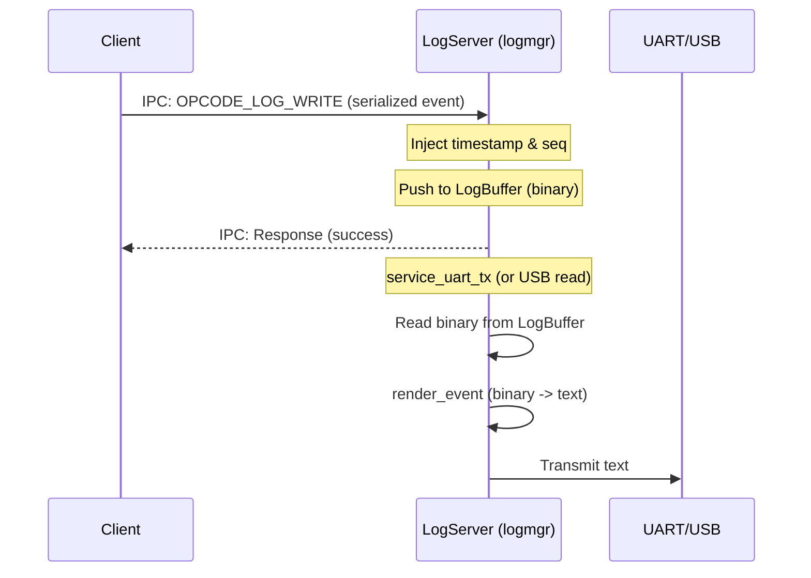

# `util_zfmt`

`util_zfmt` is a utility crate that implements a client-server logging system using the `zfmt` structured logging library over Pigweed Maize IPC channels.

It allows userspace processes (clients) to log structured events efficiently by sending them as serialized binary payloads over IPC. The logging server (`logmgr`) buffers these events in memory and handles rendering them to text (e.g., for UART output) or exposing them to other readers (e.g., USB).

## Architecture

The logging system uses a deferred-rendering, client-server architecture:

1.  **Client Logging**: Clients use `zfmt` macros (wrapped by `util_zfmt` macros) to serialize log arguments into a compact binary format at the log site. This binary payload is sent over an IPC channel to the log server.
2.  **Server Buffering**: The log server receives the binary payload, injects a 64-bit timestamp and a sequence number, and stores it in a circular ring buffer (`LogBuffer`).
3.  **Deferred Rendering**: Logs are kept in binary format in the buffer. They are only rendered to human-readable text when requested by a consumer (e.g., when `logmgr` prints them to UART, or when a USB manager reads them). This keeps the client-side logging latency extremely low.

NOTE: Future work will enable binary log streams with client-side decoding.



## Key Components

### Client Side

*   **`IpcLogger`**: Implements the `zfmt::Logger` trait. It wraps an `IpcChannel` (conventionally channel `0` in multi-process apps) and sends serialized log packets using `OPCODE_LOG_WRITE`.
*   **Logging Macros**: `info!`, `warn!`, and `error!` are provided for convenience. They use a global `IpcLogger` instance bound to channel 0.

### Server Side

*   **`LogBuffer<const N: usize>`**: A circular byte buffer that stores variable-length serialized `zfmt` frames. If the buffer is full, it automatically evicts the oldest frames to make room. It is designed to support cursors for multiple independent readers.
*   **`LogServer<const N: usize>`**: Wraps `LogBuffer` and processes incoming IPC requests. It handles:
    *   Injecting 64-bit microsecond-resolution timestamps (via target-specific clocks) and 24-bit sequence numbers into the `EventHeader` of incoming logs.
    *   Handling read requests from external log consumers (like `usbmgr`) using client-provided cursors.
*   **`render` Module**: Provides `render_event` which parses the binary format (detecting `StreamStart`, `EventHeader`, and `DebugMessage` tags) and formats the output into a `zfmt::FixedBuf` as a human-readable ASCII string.

## IPC Protocol

The log server listens for requests with the following opcodes:

*   **`OPCODE_LOG_WRITE` (`"WLOG"`)**:
    *   **Request**: `[OPCODE (4B) | Serialized Event Payload]`
    *   **Response**: Empty on success.
*   **`OPCODE_LOG_READ` (`"RLOG"`)**:
    *   **Request**: `[OPCODE (4B) | Cursor (8B)]`
    *   **Response**: `[Status (4B) | Actual Cursor Used (8B) | Log Frame ]`
*   **`OPCODE_CLEAR_NOTIFIER` (`"CLRN"`)**:
    *   Used by consumers to acknowledge wakeups.
    *   **Request**: `[OPCODE (4B)]`
    *   **Response**: Empty.

## Configuration & Feature Flags

*   **`clock-earlgrey`**: Enables querying the hardware timer on the Earlgrey platform to inject real timestamps. If disabled, timestamps default to `0`.

## Usage Examples

### 1. Logging from a Client Process

```rust
use util_zfmt::{info, warn};
use zfmt::Zfmt;

#[derive(Zfmt)]
#[zfmt(format = "Hello, user {}! Status code: {}")]
struct UserLoginEvent<'a> {
    username: &'a str,
    status: u32,
}

fn handle_login(username: &str) {
    // ...
    info!(UserLoginEvent { username, status: 0 });
}
```

### 2. Reading and Rendering Logs (Server/Consumer Side)

```rust
use util_zfmt::{LogServer, render::render_event, FixedBuf};

fn print_logs<const N: usize>(server: &LogServer<N>, cursor: &mut u64) {
    let actual_cursor = if *cursor < server.buffer.read {
        server.buffer.read
    } else {
        *cursor
    };
    *cursor = actual_cursor;

    if let Some((_tag, s1, s2)) = server.buffer.next_frame_slice(actual_cursor) {
        let mut temp_frame = [0u8; 260];
        let frame_len = s1.len() + s2.len();

        // Reconstruct contiguous frame if it wrapped around
        temp_frame[..s1.len()].copy_from_slice(s1);
        temp_frame[s1.len()..frame_len].copy_from_slice(s2);

        let mut buf = FixedBuf::<512>::new();
        if let Some(consumed) = render_event(&temp_frame[..frame_len], &mut buf) {
            // Print the rendered ASCII string
            print_to_uart(buf.as_slice());
            print_to_uart(b"\r\n");
            *cursor += consumed as u64;
        } else {
            // Skip corrupted frame
            *cursor += frame_len as u64;
        }
    }
}
```
